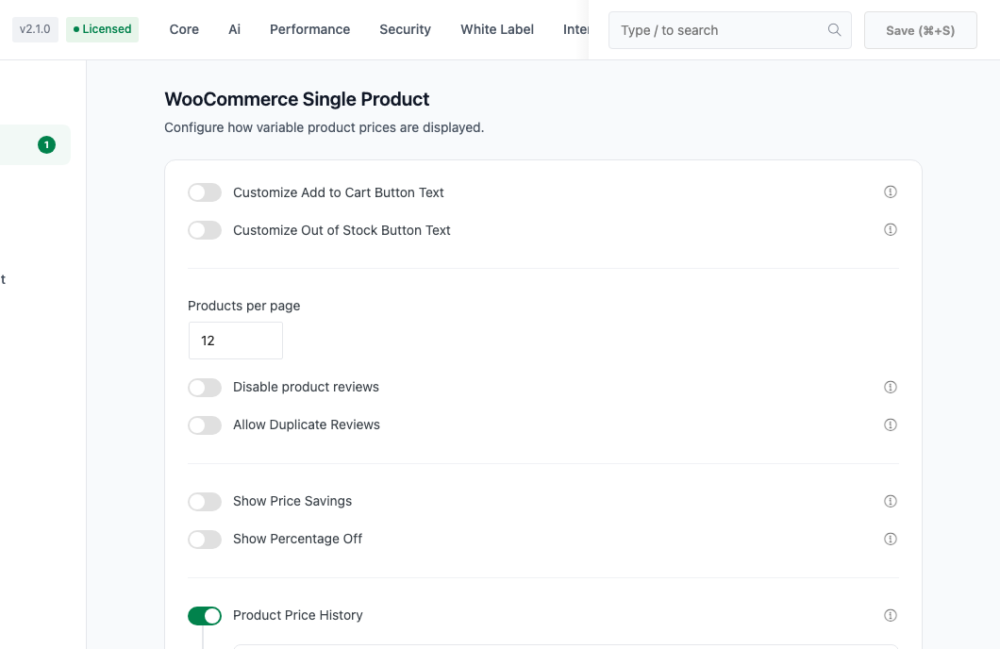
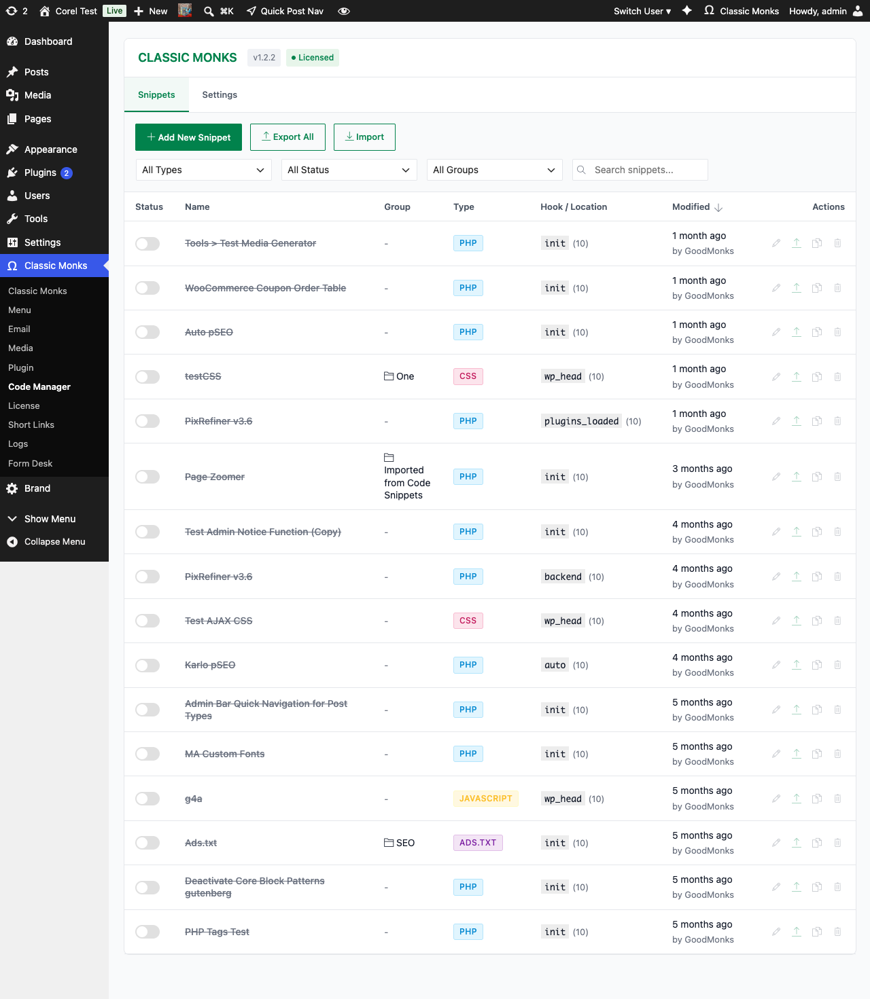
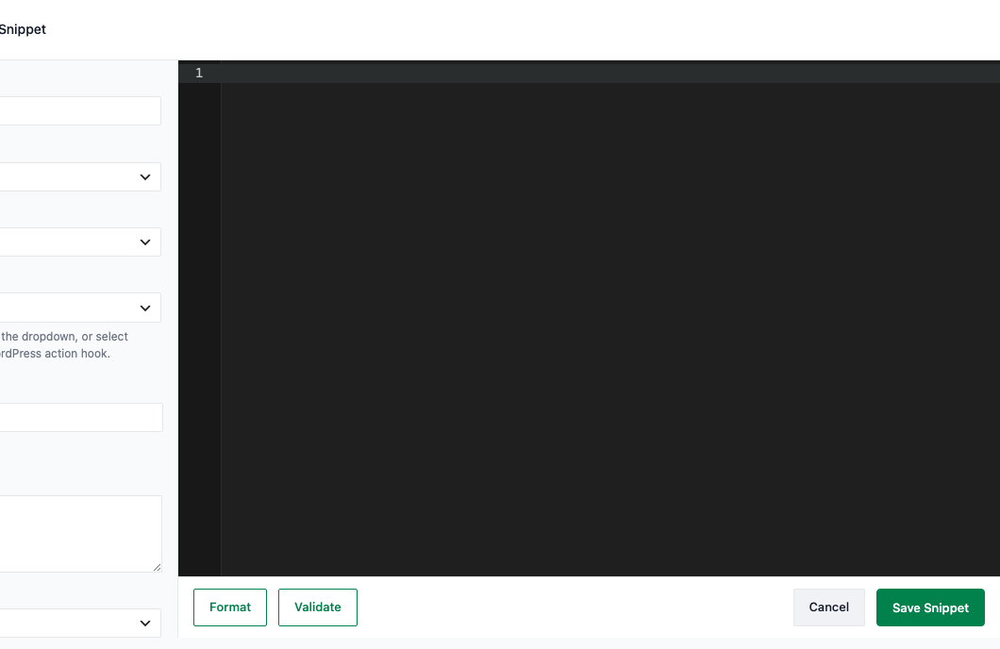
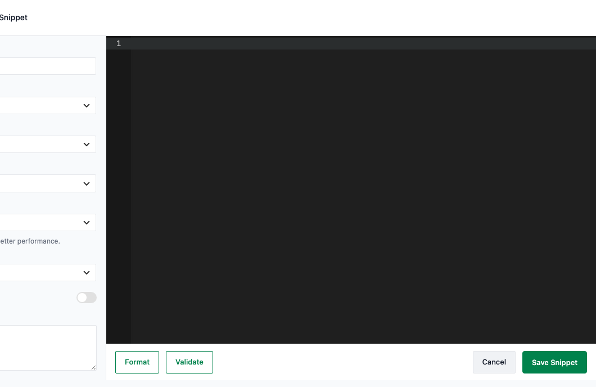
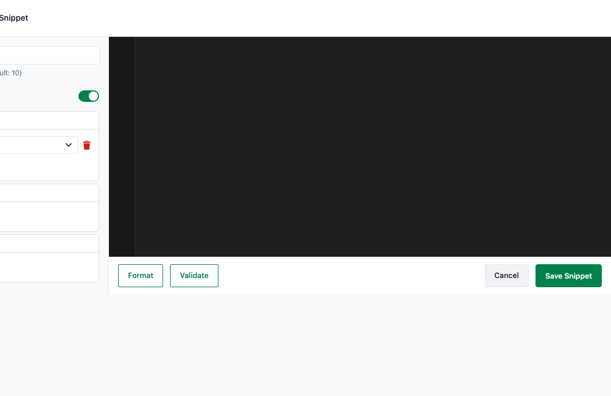
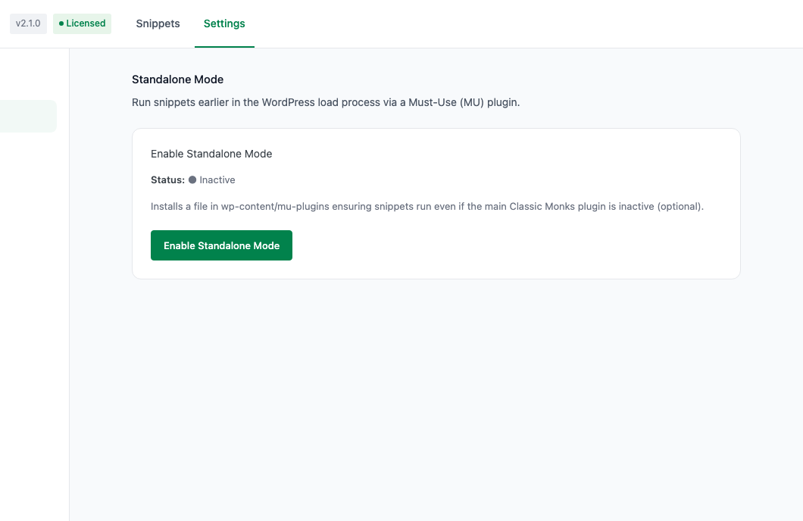
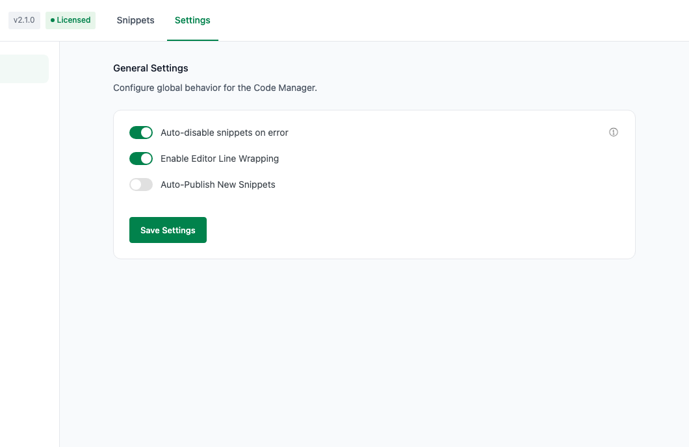

# How to Add Code Snippets in WordPress (PHP, CSS, JS, HTML)

> The Code Manager lets you add, organize, and conditionally load PHP, CSS, JavaScript, HTML, ads.txt, and robots.txt code snippets directly from the WordPress admin, without editing theme files.

## Key Takeaways

- Manage PHP, CSS, JS, HTML, PHP Content, ads.txt, app-ads.txt, and robots.txt snippets from one dashboard
- Each snippet runs on a chosen hook or location, with priority, conditions, and output optimization
- Snippets are stored as files in `wp-content/cm-code-manager/`, so they survive theme updates and site migrations
- Built-in syntax validation, fatal error auto-disable, and a Safe Mode that turns everything off instantly
- Export and import snippets as JSON, including JSON exported by the Code Snippets plugin

---

## What Is the Code Manager?

The Code Manager is a built-in snippet manager in Classic Monks that adds a dedicated **Code Manager** submenu under the Classic Monks dashboard. It lets you write and organize code snippets in a syntax-highlighted editor, then activate or deactivate each one with a toggle.

Instead of editing `functions.php`, creating custom plugin files, or pasting `<script>` tags into your theme, you manage everything from one admin interface. Each snippet executes on a WordPress hook you choose, and you can control exactly where and when it runs with a conditions builder.

Because snippets are stored as physical files in `wp-content/cm-code-manager/`, they are never overwritten by WordPress, theme, or plugin updates. Your custom code survives theme switches and can be copied to a new site with FTP or the built-in export.

## Why You Need It

Most WordPress sites accumulate custom code scattered across `functions.php`, child theme files, and inline `<script>` tags. When your theme updates, that code disappears. When you switch themes, it is gone entirely.

The Code Manager keeps all your custom code in one place, independent of your theme. Every snippet is toggleable, so you can test changes without deleting code. It also adds safety features that raw `functions.php` editing does not give you: syntax validation before saving, automatic disabling of a snippet that causes a fatal error, and a one-click Safe Mode that stops every snippet at once.

---

## Recommendations Before Enabling

- **Disable other snippet plugins first.** If you already use WPCode, Code Snippets, or another snippet manager, snippets from those plugins and from the Code Manager could both run and conflict. Code Manager imports Code Snippets JSON, but you should not run duplicate snippets in two managers.
- **Back up your site** before enabling, especially if you are migrating existing snippets in.
- **Start snippets as drafts.** New snippets default to Draft unless you turn on Auto-Publish, so you can test before going live.
- **Check the `DISALLOW_FILE_MODS` constant.** If your site has file modifications disabled, the Code Manager runs in read-only mode and you cannot create, edit, import, or delete snippets.

---

## How to Enable Code Manager

### Step 1: Open Classic Monks Settings

Click into the **Classic Monks** plugin settings in your WordPress dashboard.

### Step 2: Go to the Core Tab

Click the **Core** tab.

### Step 3: Open the Setup Subtab

Under the Core tab, click **Setup**.

### Step 4: Toggle on Code Manager

Scroll to the **Code Manager** toggle and switch it on. The toggle has a submenu indicator (the `«` icon) that signals it adds a new submenu to the admin sidebar.



### Step 5: Save and Reload

Click **Save (⌘+S)**, then reload the page. A new **Code Manager** submenu appears under **Classic Monks** in the admin sidebar, and a **Code Manager** link is added to the admin toolbar.

---

## Understand the Code Manager Interface

The Code Manager page has two tabs: **Snippets** and **Settings**.



- **Snippets** is the default view. It shows all saved snippets in a table with their status, name, group, type, hook or location, and last modified date, plus filters and actions.
- **Settings** holds the global behavior options and the Standalone Mode (Must-Use plugin) controls.

The Snippets table columns are:

| Column | What it shows |
|--------|--------------|
| Status | A toggle to switch each snippet active or inactive |
| Name | The snippet name, its description, and a "Read more" toggle for long descriptions |
| Group | The group badge the snippet belongs to, or `-` if none |
| Type | The snippet type badge (PHP, CSS, JS, HTML, etc.) |
| Hook / Location | The hook or location the snippet runs at, with its priority in parentheses |
| Modified | How long ago the snippet was last changed, and by whom |
| Actions | Edit, Export, Duplicate, and Delete buttons |

Snippets that hit a fatal error show a warning line in the Name column: "Snippet paused due to fatal error."

---

## How to Add a Code Snippet

### Step 1: Open Code Manager

Click **Classic Monks > Code Manager** in the admin sidebar.

### Step 2: Click Add New Snippet

Click the **Add New Snippet** button at the top of the snippets list.

### Step 3: Configure the Snippet

The Add New Snippet page has a sidebar of settings on the left and the code editor on the right.



### Step 4: Write the Code

Write or paste your code into the syntax-highlighted editor. The editor uses CodeMirror with autocomplete for WordPress, PHP, and WooCommerce functions.

### Step 5: Validate and Format

Click **Validate** to check PHP syntax before saving. Click **Format** to auto-format and beautify the code.

### Step 6: Save the Snippet

Click **Save Snippet**. The snippet is saved to `wp-content/cm-code-manager/` and runs immediately if its status is Active.

---

## Snippet Types

The Code Manager supports eight snippet types. The type you choose determines which location and optimization options are available.

| Type | Runs as | Typical use |
|------|---------|-------------|
| **PHP** | Executed on a WordPress action hook | Functions, hooks, filters, custom logic |
| **JavaScript** | Emitted as a script or enqueued file | Frontend or admin interactions, tracking code |
| **CSS** | Emitted as a style or enqueued file | Style overrides, layout tweaks |
| **HTML** | Output as HTML, injected at a location | Tracking scripts, analytics, custom markup |
| **PHP Content** | Output as HTML with embedded PHP, injected at a location | Content blocks with PHP logic |
| **ads.txt** | Serves an ads.txt file | Authorized digital sellers declaration |
| **app-ads.txt** | Serves an app-ads.txt file | In-app advertising authorization |
| **robots.txt** | Serves a robots.txt file | Crawler access rules |

**PHP Content and HTML** are related but distinct. **PHP Content** evaluates embedded PHP before output; **HTML** outputs the code exactly as written. HTML snippets run without sanitization, so only use them for code you trust, such as tracking scripts and analytics from reliable sources. When you select HTML, the editor shows a security notice to that effect.

**ads.txt, app-ads.txt, and robots.txt** snippets are plain text files that the Code Manager serves at the expected URL. Use them to manage your advertising authorization and search-engine crawl rules without touching the filesystem.

---

## How to Configure Snippet Options

Each snippet has a set of options that controls how it runs. The options available depend on the snippet type.

### Name

The name is required and identifies the snippet in the list. Use a descriptive name such as "Remove jQuery Migrate" so you can find it later.

### Status

Controls whether the snippet runs:

- **Active**: The snippet executes.
- **Inactive (Draft)**: The snippet is saved but does not execute.

The default status is Draft unless you enable **Auto-Publish New Snippets** in Settings. You can also toggle a snippet's status from the list page without opening it.

### Type

Selects the snippet type, as described in the Snippet Types section above.

### Run at Hook (PHP)

For PHP snippets, choose the WordPress action hook the snippet runs on. The dropdown offers common hooks:

| Hook | When it runs |
|------|--------------|
| `init` | After WordPress is fully loaded |
| `admin_menu` | When the admin menu is built (admin pages only) |
| `wp` | After WordPress is fully loaded (frontend) |
| `admin_init` | Admin only |
| `wp_loaded` | After all plugins are loaded |
| `template_redirect` | Before the template is determined |
| `plugins_loaded` | Early, after plugins are loaded |
| `after_setup_theme` | After the theme is set up |
| `setup_theme` | Very early in the load order |
| `rest_api_init` | When the REST API initializes |
| `widgets_init` | When widgets are registered |

You can also select **Custom Hook** to enter any WordPress action hook name.

### Location (JavaScript)

For JavaScript snippets, choose where the script is output:

- **Header (wp_head)**
- **Footer (wp_footer)**
- **Admin Header**
- **Admin Footer**
- **Login (login_enqueue_scripts)**

### Location (CSS)

For CSS snippets, choose where the styles are output:

- **Frontend (wp_head)**
- **Admin (admin_head)**
- **Login Header (login_enqueue_scripts)**
- **Block Assets (enqueue_block_assets)**
- **Block Editor (enqueue_block_editor_assets)**
- **Everywhere (frontend + admin)**

### Inject At (PHP Content and HTML)

For PHP Content and HTML snippets, choose where the content is injected:

- **Header (wp_head)**
- **Footer (wp_footer)**
- **After Body Open (wp_body_open)**
- **Before Post Content**
- **After Post Content**
- **Login Message (login_message)**
- **Login Footer (login_footer)**

### Print Method (JavaScript and CSS)

Controls whether the snippet is loaded inline or as an external file:

- **Inline Code**: The code is output directly in the page. Fast for small snippets, but it adds to HTML size and relies on edge cache.
- **External File**: The snippet is written to a cached file and enqueued. External files are cached for better performance, and cache plugins and CDNs can cache them more effectively.



### Load Behavior (JavaScript and CSS)

Controls how the snippet loads for performance:

- **Default**: Normal loading.
- **Defer (JS)**: The script downloads during parsing and executes after the page finishes loading. Not render-blocking.
- **Async**: The script loads asynchronously as the page loads. Not render-blocking.
- **Preload (CSS)**: Adds a `rel="preload"` link so the stylesheet loads early.
- **Delay/Lazy Load (JS)**: Defers the script until user interaction.

### Minify (JavaScript and CSS)

When enabled, the snippet is minified to remove whitespace and comments, reducing file size and parse time.

### Shortcode Tag (Optional)

For PHP, PHP Content, and HTML snippets, you can enter a shortcode tag such as `my_shortcode`. The snippet then runs anywhere you place `[my_shortcode]` in your content, in addition to (or instead of) its hook location.

### Description

An optional internal note that identifies the snippet's purpose. It appears under the snippet name in the list and is included in search.

### Group

Organize snippets into groups such as "Marketing" or "SEO". You can pick an existing group, enter a **Custom Group**, or leave it as **No Group**. Groups act as a filter on the list page.

### Priority

Controls execution order. The default is 10, and lower numbers run first. Use this when you have multiple PHP snippets that depend on each other.

---

## How to Use Conditions

The **Enable Conditions** toggle reveals a conditions builder with three panels: **Include**, **Exclude**, and **Users**. Conditions let you run a snippet only where it is needed.



### Include

Add rules that specify where the snippet should run. The snippet runs only when an Include rule matches.

### Exclude

Add rules that specify where the snippet should not run. Excludes override includes.

### Users

Add rules for who should see the snippet: **Logged In**, **Logged Out**, or a specific user role such as Administrator, Editor, or Subscriber.

### Add Rules

Click **+ Add Condition** in each panel to add a rule. Each rule has a condition type and, for most types, a value. You can add multiple rules per panel.

The available condition types are:

**General**
- Front Page
- Blog Index
- All Singular
- All Archives
- Author Archives
- Date Archives
- Search Results
- No Search Results
- 404 Page
- Paged Results

**URL Path**
- Path Contains (e.g. `/shop/` or `shop`)
- Path Equals (e.g. `/about-us/`)
- Path Regex (e.g. `^/products/.*`)

**Content and Post Types**
- Post, Page, and any public custom post type (Agent Test, Event, Legal, Product, and so on)
- Post Category, Post Tag, and custom taxonomies
- Post Archive, Post Category Archive, Post Tag Archive, and custom post type archives

### How Rules Combine

The Include, Exclude, and Users panels are evaluated together. A snippet runs only when all its conditions pass: the Include rules must match, the Exclude rules must not match, and the Users rules must match. The condition engine is evaluated on every request, so conditions work for both the frontend and the admin area.

---

## How to Manage Existing Snippets

### Filter and Search

Above the snippet list, use the dropdowns to filter by **Type**, **Status**, and **Group**, and the search box to find snippets by name, description, or group.

### Edit, Duplicate, Export, and Delete

Each row has action buttons:

- **Edit**: Opens the snippet in the editor.
- **Export**: Downloads the snippet as a JSON file.
- **Duplicate**: Creates a copy of the snippet.
- **Delete**: Removes the snippet (with a confirmation prompt).

### Toggle Status

The status switch in each row activates or deactivates the snippet without opening it.

### Load More

The list shows 20 snippets per page. When there are more, a **Load More** button appears at the bottom.

---

## How to Export Code Snippets

You can export your snippets as JSON to move them to another site or back them up.


### Export All Snippets

Click **Export All** at the top of the snippets list. This downloads every snippet as a JSON file named `cm-code-manager-export-YYYY-MM-DD.json`.

### Export a Single Snippet

Click the **Export** action icon on a snippet's row. This downloads that snippet as a JSON file named `cm-code-snippet-{name}-YYYY-MM-DD.json`.

---

## How to Import Code Snippets

Click **Import** at the top of the snippets list, then choose a JSON file to upload.

The Code Manager imports:

- **Its own export format** (JSON exported by Classic Monks Code Manager).
- **Code Snippets plugin exports** (JSON with `name`, `desc`, `code`, and `active` fields). These are imported as PHP snippets, grouped under "Imported from Code Snippets", and set to Draft.

When a snippet being imported has the same name as an existing snippet, you can choose how to handle the conflict. The imported snippets are set to Draft (not Active) so they do not run until you review and activate them. After importing, the group and status defaults apply, and you can edit each snippet to set its hook, type, and conditions.

---

## How to Use Safe Mode

Safe Mode disables all snippet execution at once, regardless of each snippet's active status. Use it when a snippet is causing a problem and you need to stop everything immediately.

### Enable Safe Mode via the Constant

Add the following to your `wp-config.php` file:

```php
define('CM_CODE_MANAGER_SAFE_MODE', true);
```

While this constant is set, no snippets run. Remove it to re-enable them.

### Enable Safe Mode via the URL Parameter

Every Code Manager install generates a secret key stored in `wp-content/cm-code-manager/index.php`. Visit the Safe Mode URL with your secret key to disable snippets:

```text
https://yoursite.com/?cm_safe_mode=YOUR_SECRET_KEY
```

The key is the `secret_key` value in the `meta` section of the index file. Keep it private; anyone who knows it can disable all your snippets.

### Safe Mode Notice

When Safe Mode is active, the Code Manager shows a warning banner: "Safe Mode Active: Snippets are currently disabled via safe mode flag. Remove `CM_CODE_MANAGER_SAFE_MODE` constant to enable execution."

---

## How to Enable Standalone Mode

Standalone Mode installs a Must-Use (MU) plugin at `wp-content/mu-plugins/code-manager-mu.php`. It lets your snippets run even if the main Classic Monks plugin is deactivated, and it runs them earlier in the WordPress load process.



### Enable Standalone Mode

1. Open the Code Manager **Settings** tab.
2. Click the **Mode** subtab.
3. Click **Enable Standalone Mode**.

The Status shows whether the MU plugin is **Active** or **Inactive**. If a newer MU-plugin version is available, an **Update Now** button appears.

### Disable Standalone Mode

Return to the Mode subtab and click **Disable Standalone Mode**. This removes the MU plugin file.

### How It Coordinates

The MU plugin defines `CM_CODE_MANAGER_RUNNING_MU`. When the main plugin detects this constant, it does not run its own snippet runner, avoiding double execution. The MU plugin is kept in sync automatically when you save snippets.

---

## How to Configure Code Manager Settings

Open the Code Manager **Settings** tab and use the **General** subtab.



### Auto-disable Snippets on Error

When enabled (default), a snippet that causes a PHP error is automatically disabled to prevent site crashes. On the next request, the snippet is paused and shows "Snippet paused due to fatal error" in the list.

### Enable Editor Line Wrapping

When enabled (default), long lines wrap in the code editor instead of scrolling horizontally.

### Auto-Publish New Snippets

When enabled, new snippets are saved as Active instead of Draft. Default is off, so new snippets start as Draft.

---

## How Snippets Are Stored

Snippets are stored as physical files in `wp-content/cm-code-manager/`:

```text
wp-content/
└── cm-code-manager/
    ├── index.php           # Compiled cache of all snippets and their settings
    ├── cached/             # Generated CSS/JS files for external-file loading
    │   └── [id].css
    └── [unique-id]-[slug].php  # Each snippet's source file
```

The `index.php` file holds a compiled array of all active snippets, their settings, and the meta configuration (secret key, auto-disable, line wrap, auto-publish, and force-disabled state). The runner reads this index at runtime for speed, so it does not scan the directory on every page load.

Because the source of truth is physical files, your snippets survive plugin and theme updates. When migrating a site, copy the `wp-content/cm-code-manager/` folder, or use the built-in Export and Import.

---

## Troubleshooting

### Snippets Are Not Running

**Cause:** Safe Mode is active, the feature toggle is off, the snippet is set to Draft, or a condition is not matching.

**Fix:** Check the Safe Mode banner at the top of the Code Manager page. Verify the snippet status is Active. Review the snippet's conditions (Include, Exclude, Users) to confirm the current page matches them.

### Snippet Somewhere Was Disabled Automatically

**Cause:** The snippet caused a fatal PHP error and Auto-disable Snippets on Error turned it off.

**Fix:** Open the snippet, fix the error, and set it back to Active. The snippet shows "Snippet paused due to fatal error" in the list until then.

### A Snippet Crashes the Site

**Cause:** A snippet has a fatal error that the auto-disable did not catch.

**Fix:** Use Safe Mode to stop all snippets immediately, either with the `CM_CODE_MANAGER_SAFE_MODE` constant or the `?cm_safe_mode=YOUR_SECRET_KEY` URL parameter. Then edit or delete the offending snippet and disable Safe Mode.

### PHP Syntax Error

**Cause:** A syntax error in the PHP snippet, such as a missing semicolon or unclosed bracket.

**Fix:** Click **Validate** before saving to catch syntax errors. If a snippet is already broken, deactivate it, fix the code, and reactivate it.

### CSS Is Not Applying

**Cause:** The CSS is overridden by theme or plugin styles with higher specificity.

**Fix:** Increase selector specificity or add `!important`. Check the browser inspector to confirm the styles are loaded.

### JavaScript Console Error

**Cause:** The script depends on a variable or function that loads after the snippet.

**Fix:** Wrap the code in a `DOMContentLoaded` listener or ensure the dependency loads first. Consider loading the snippet in the Footer location.

### File Modifications Are Disabled

**Cause:** The `DISALLOW_FILE_MODS` constant is active on the site.

**Fix:** The Code Manager runs in read-only mode. Remove or adjust the constant to enable creating, editing, importing, and deleting snippets.

### Messages "Cannot Redeclare Function" on Save

**Cause:** The snippet defines a function or class that already exists in WordPress or another snippet.

**Fix:** Rename the function or class, or wrap it in a `function_exists()` or `class_exists()` check. The validator allows identifiers wrapped in those checks.

---

## Frequently Asked Questions

### Is the code stored in the database?

No. Snippets are stored as physical files in `wp-content/cm-code-manager/`. The `index.php` file caches metadata for performance, but the source of truth is the snippet files.

### Do snippets survive theme updates?

Yes. Because snippets are stored outside the theme, theme updates and theme switches do not overwrite them.

### Can I use the Code Manager to add tracking scripts?

Yes. Add Google Analytics, GTM, or other tracking scripts as **HTML** snippets (they support embedded PHP) or as **JavaScript** snippets. For scripts with multiple sections and comments, HTML is usually the easiest.

### What happens to snippets if I deactivate Classic Monks?

Snippets stop running when the main plugin is deactivated. If you enable **Standalone Mode**, the MU plugin keeps your snippets running even while the main plugin is inactive.

### Can I import snippets from the Code Snippets plugin?

Yes. The Code Manager imports Code Snippets plugin JSON exports. Imported snippets become PHP drafts grouped under "Imported from Code Snippets".

### Can I use shortcodes in snippets?

Yes. For PHP, PHP Content, and HTML snippets, enter a **Shortcode Tag** and use `[tag]` in your content to run the snippet at that point.

---

## Related Articles

- [How to Manage WordPress Performance Settings](performance.md)
- [How to Create Short Links with Click Tracking](short-links-tracking.md)
- [How to Set Up the AI Agent in Classic Monks](ai/ai-agent.md)