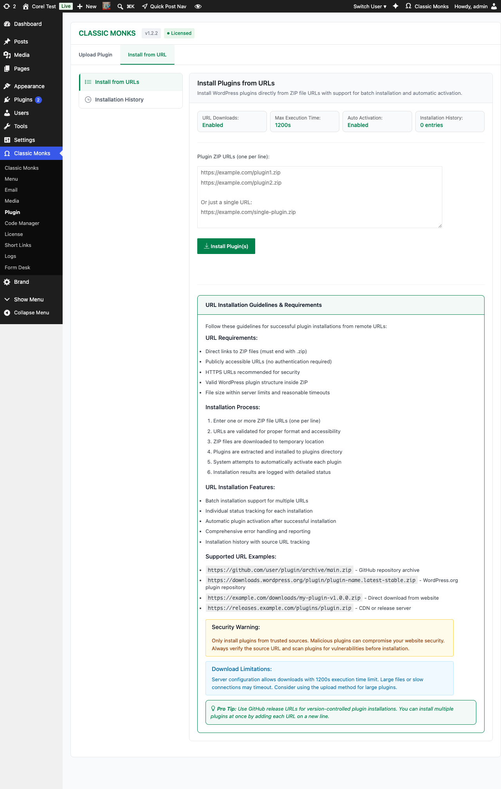

# How to Use the Plugin Manager in WordPress

> The Advanced Plugin Manager in Classic Monks provides four installation methods: Install from URL, Local Upload, Google Drive Repository, and WordPress.org Author Search. One unified interface for all plugin installation workflows.

## Key Takeaways

- Four installation methods in one unified Plugin Manager
- Install from URL: paste a ZIP link, install remotely
- Local Upload: enhanced version of the default WordPress uploader
- Google Drive: browse and install from a shared Drive folder
- Author Search: find and bulk-install all plugins by a WordPress.org author
- All methods disabled when `DISALLOW_FILE_MODS` is set

---

## Prerequisites

All four installation methods require the **Enable Advanced Plugin Manager** master toggle to be on. In the Classic Monks Core tab, Plugins subtab:

1. Toggle on **Enable Advanced Plugin Manager** (the `«` submenu indicator shows it adds the Plugin Manager submenu)
2. Toggle on the specific installation method you want
3. Reload the admin page for the Plugin Manager submenu to appear

Click **Classic Monks > Plugin** in the WordPress admin menu to open the Plugin Manager.

---

## Method 1: Install from URL

Install plugins directly from a ZIP file URL without downloading to your local computer first.

### Step 1: Enable Install Plugin from URL

In the Classic Monks Core tab, Plugins subtab, enable:

- **Enable Advanced Plugin Manager** (master toggle)
- **Install Plugin from URL** (sub-toggle)

### Step 2: Open the URL Install Tab

Click **Classic Monks > Plugin**, then click the **Install from URL** tab.

### Step 3: Enter the ZIP URL

Paste the full URL to the plugin ZIP file. The URL must be:

- Publicly accessible (or accessible to your server's IP)
- A direct link to a ZIP file (not a landing page or HTML wrapper)
- Served over HTTPS for security (HTTP works but is not recommended)

### Step 4: Install

Click **Install**. The Plugin Manager downloads the ZIP, validates the structure, extracts to the plugins directory, and optionally activates the plugin.

### Supported URL Types

| URL Type | Supported | Notes |
|----------|-----------|-------|
| WordPress.org plugin ZIPs | Yes | Direct link to a plugin's ZIP |
| GitHub release ZIPs | Yes | Use the direct download link from a release |
| S3 / GCS / Azure Blob URLs | Yes | Public bucket URLs work |
| Private CDN with auth headers | No | Auth header support is not built in |
| Landing pages or HTML pages | No | Must be a direct link to a ZIP file |
| Password-protected URLs | No | No UI for password input |

### Security Considerations

- The Plugin Manager validates the ZIP structure before extraction, but cannot verify the contents are safe
- Install only from trusted sources
- The download happens server-to-server; your server's IP may be logged by the URL host
- HTTPS is recommended to prevent MITM tampering

---

## Method 2: Local Plugin Upload

Enhanced version of the default WordPress plugin uploader with better progress tracking, error handling, and ZIP validation.

### Step 1: Enable Local Plugin Upload

In the Classic Monks Core tab, Plugins subtab, enable:

- **Enable Advanced Plugin Manager** (master toggle)
- **Enable Local Plugin Upload** (sub-toggle)

### Step 2: Open the Local Upload Tab

Click **Classic Monks > Plugin**, then click the **Local Upload** tab.

### Step 3: Choose the Plugin ZIP

Click **Choose File** (or drag and drop). Select the plugin ZIP file from your computer.

### Step 4: Upload and Install

Click **Install Now**. The Plugin Manager uploads the ZIP with progress tracking, validates the structure, extracts to the plugins directory, and shows a success or error message.

### Improvements Over Default WordPress Uploader

| Feature | Default WordPress | Classic Monks Enhanced |
|---------|-------------------|------------------------|
| Progress tracking | Basic | Real-time upload progress |
| Error messages | Generic | Specific (file too large, invalid ZIP, etc.) |
| Large file handling | Limited by PHP settings | Better timeout handling |
| ZIP validation | After upload | Before extraction |
| Drag-and-drop | No | Yes (in supported browsers) |

### Supported File Types

| File Type | Supported | Notes |
|-----------|-----------|-------|
| `.zip` | Yes | Standard WordPress plugin ZIPs |
| `.tar.gz` | No | WordPress does not support tar.gz plugins |
| Password-protected ZIPs | No | No UI for password input |
| Multi-folder ZIPs | Yes | As long as the top level is a valid plugin |

---

## Method 3: Google Drive Plugin Repository

Use Google Drive as a centralized plugin distribution source. Authenticate with Google API, browse your Drive folder, and install plugins.

### Step 1: Enable Private Plugin Repository

In the Classic Monks Core tab, Plugins subtab, enable:

- **Enable Advanced Plugin Manager** (master toggle)
- **Enable Private Plugin Repository** (sub-toggle)

### Step 2: Open the Private Repository Tab

Click **Classic Monks > Plugin**, then click the **Private Plugin** tab.

### Step 3: Set Up Google API Credentials

You will need:

1. A Google Cloud project with the Google Drive API enabled
2. OAuth 2.0 credentials (Client ID and Client Secret)
3. A configured OAuth consent screen

The Plugin Manager walks you through creating these credentials in the Google Cloud Console.

### Step 4: Authenticate with Google

Click **Connect to Google Drive**. You will be redirected to Google's OAuth flow. Sign in with the Google account that has access to the Drive folder containing your plugins.

### Step 5: Select the Drive Folder

After authentication, browse your Drive folders. Select the folder that contains the plugin ZIPs you want to make available.

### Step 6: Save Settings

Click **Save Settings**. The Drive folder is now linked.

### Step 7: Install Plugins

Open the Plugin Manager's **Private Repository** tab. The Plugin Manager lists all plugin ZIPs in the selected Drive folder. Click **Install** next to the plugin you want.

---

## Method 4: WordPress.org Author Search

Find all plugins by a specific WordPress.org author and install multiple at once.

### Step 1: Enable WP Bulk Install

In the Classic Monks Core tab, Plugins subtab, enable:

- **Enable Advanced Plugin Manager** (master toggle)
- **Enable WP Bulk Install** (sub-toggle)

### Step 2: Open the Author Search Tab

Click **Classic Monks > Plugin**, then click the **WP Bulk Install** tab.

### Step 3: Enter an Author Slug

Enter the WordPress.org author slug (the username portion of the author's profile URL, e.g., `developer-name` from `wordpress.org/developers/developer-name`).

### Step 4: Search and Install

Click **Search**. The Plugin Manager queries the WordPress.org API and lists all plugins by that author. Select the plugins you want and click **Install**.

---

## Configuration Options

| Option | Description | Default |
|--------|-------------|---------|
| **Enable Advanced Plugin Manager** | Master toggle for the entire feature set. | Off |
| **Install Plugin from URL** | Enables URL-based installation. | Off |
| **Enable Local Plugin Upload** | Enables enhanced local upload. | Off |
| **Enable Private Plugin Repository** | Enables Google Drive integration. | Off |
| **Enable WP Bulk Install** | Enables WordPress.org author search. | Off |

---

## Common Use Cases

### Installing a Plugin from a Private Mirror

You maintain a private S3 bucket with your custom plugins. Generate a signed URL, paste it in the Plugin Manager, install.

### Installing from a Client's CDN

The client provides a URL to a custom plugin hosted on their CDN. Install directly without downloading.

### Installing Pre-Releases from GitHub

The plugin author publishes pre-release ZIPs on GitHub. Use the GitHub release's direct download URL.

### Installing a Custom Plugin You Developed

You built a custom plugin for a client. ZIP the plugin directory, upload through the Plugin Manager.

### Installing a Premium Plugin

You purchased a premium plugin from a marketplace. Download the ZIP from your account, upload through the Plugin Manager.

### Agency Plugin Distribution

Use Google Drive as a centralized plugin repository. Share one Drive folder across all client sites. Each site authenticates and installs from the same source.

### Bulk-Installing Author Plugins

Find a WordPress.org author whose plugins you use across multiple sites. Search by author slug, select all their plugins, and install in one batch.

---

## Troubleshooting

### "File modifications are disabled" Warning

**Cause:** `DISALLOW_FILE_MODS` is set to `true` in wp-config.php, or a Classic Monks Security setting enforces it.
**Fix:** Remove the constant from wp-config.php or disable the corresponding Security setting. Understand the security implications before disabling.

### Download Fails with cURL Error (URL Install)

**Cause:** The URL host blocks your server's IP, the file is too large, or the connection times out.
**Fix:** Verify the URL in a browser. Increase PHP's `max_execution_time` and `memory_limit`. Try downloading the URL from the server command line.

### Upload Fails at 100% (Local Upload)

**Cause:** PHP's `upload_max_filesize` or `post_max_size` is smaller than the plugin file.
**Fix:** Increase the PHP limits in php.ini or .htaccess. Contact your hosting provider if you do not have access.

### "Invalid ZIP File" Error

**Cause:** The file is not a valid ZIP archive, or the URL does not point to a valid WordPress plugin ZIP.
**Fix:** Re-download or re-create the ZIP. Verify the URL in a browser; it should download a ZIP.

### "Destination Folder Already Exists" Error

**Cause:** A plugin with the same slug is already installed.
**Fix:** Deactivate and delete the existing plugin first, or use a different version with a renamed directory.

### Google Drive Authentication Fails

**Cause:** OAuth credentials are incorrect, or the consent screen is not configured.
**Fix:** Verify the Client ID and Client Secret in the Google Cloud Console. Ensure the Drive API is enabled.

### Author Search Returns No Results

**Cause:** The author slug is incorrect, or the author has no published plugins.
**Fix:** Verify the author slug by visiting their WordPress.org profile. The slug is the username portion of the URL.

---

## Developer Notes

Each installation method adds its own input field to the Plugin Manager. No developer hooks are currently exposed for the installation methods.

**Options used:**

| Option | Type | Default |
|--------|------|---------|
| `enable_plugin_manager` | Boolean | `false` |
| `enable_plugin_install_from_url` | Boolean | `false` |
| `enable_local_plugin_upload` | Boolean | `false` |
| `enable_private_plugin_repo` | Boolean | `false` |
| `enable_wp_bulk_install` | Boolean | `false` |

The Plugin Manager implementation is in `functions/plugin-manager/` with separate files for each method: `install-from-url.php`, `upload-plugin.php`, `private-plugin-repo.php`, `wp-bulk-install.php`.

---

## Related Articles

- [How to Manage Plugins in Classic Monks (WordPress)](core-plugins.md)
- [How to Use Content Management in WordPress](../core/core-content-management.md)
