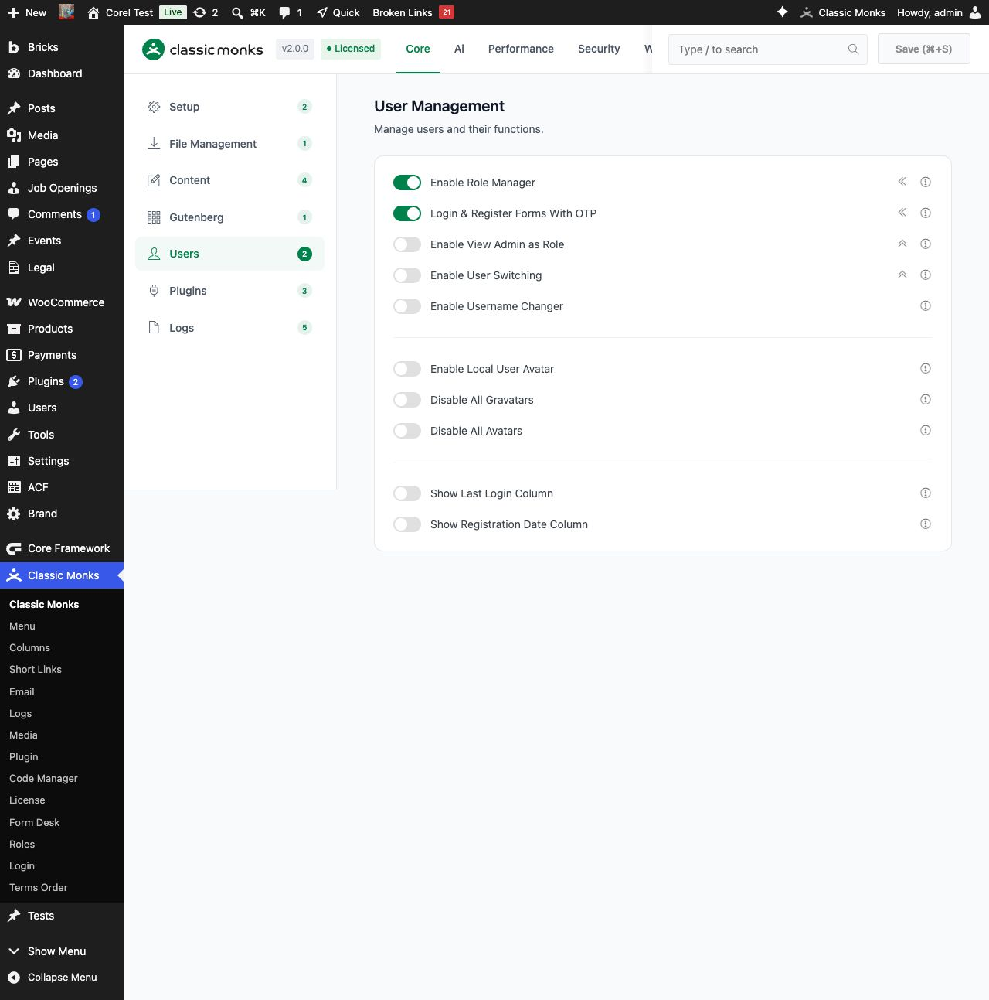
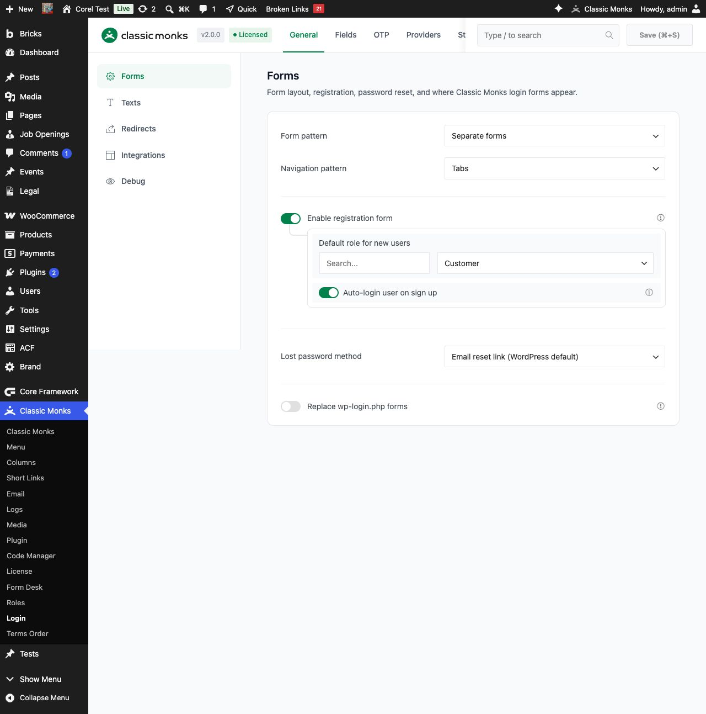
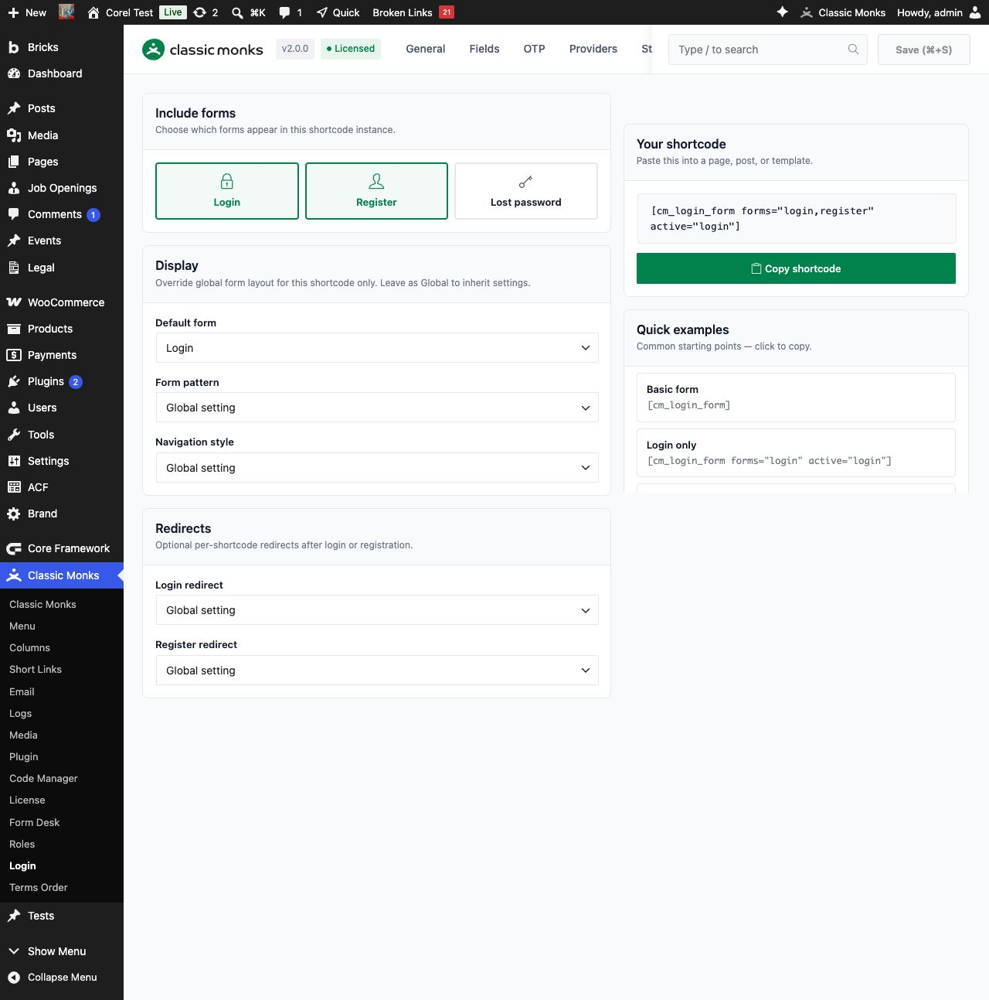

# How to Add Login & Register Forms With OTP in WordPress

> Classic Monks includes a complete login and registration system with one-time password (OTP) verification, replacing the default WordPress login with inline shortcode-based forms.

## Key Takeaways

- Add login, register, and lost-password forms anywhere with the `[cm_login_form]` shortcode
- Verify users with phone OTP (Twilio, Firebase, or a custom HTTP gateway) or email OTP
- Replace the default `wp-login.php` and the WooCommerce My Account login with OTP-powered forms
- Verify a customer's phone during WooCommerce checkout and save it to the order
- Style every part of the form, from tab colors to input fields, without touching a theme

---

## What Is Login & Register Forms With OTP?

Login & Register Forms With OTP is a complete authentication system inside Classic Monks. It adds a dedicated **Classic Monks > Login** submenu where you configure every aspect of the inline forms, OTP delivery, and integration options.

The system generates frontend login, registration, and password-reset forms that you can place anywhere with a shortcode, or configure to replace the default WordPress `wp-login.php` and the WooCommerce My Account login. OTP codes are delivered by phone through Twilio, Firebase Authentication, or a custom SMS endpoint, or by email using the WordPress or WooCommerce email template engine. Users can also sign in with a password, and the system hands off to the Classic Monks 2FA challenge when that security feature is enabled for the user.

---

## Why You Need It

The default WordPress login screen works for basic sites but falls short for modern use cases:

- **Passwordless login**: users prefer a one-time code sent to their phone or email over remembering complex passwords
- **Registration verification**: OTP confirms the phone number or email is real before creating an account, which reduces spam registrations
- **WooCommerce checkout**: verify a customer's phone during checkout for delivery confirmation and fraud prevention
- **Custom branding**: match the login experience to your site's look and feel instead of the standard WordPress login page

With Classic Monks you get all of this in one feature, with no third-party plugin dependency beyond the OTP provider itself.

---

## Recommendations Before Enabling

- **Have an SMS provider ready.** Phone OTP needs a Twilio account (SID, Auth Token, and a verified sender number), a Firebase project (API key and web config), or a custom HTTP gateway you can point at. Store the credentials before you enable the feature.
- **Decide the email path.** Email OTP uses either the WordPress or WooCommerce email template engine. If your site depends on reliable email delivery, configure an SMTP plugin first.
- **Check WordPress registration.** The registration form only works when WordPress allows registration. Confirm **Settings > General > Membership > Anyone can register** is enabled.
- **Check for conflicts.** The **Custom Login URL** security feature can rewrite or redirect `wp-login.php` independently. If you plan to replace the default login, decide which feature owns the `wp-login.php` surface to avoid a conflict.

---

## How to Enable Login & Register Forms With OTP

### Step 1: Open the Classic Monks Settings

Click **Classic Monks** in your WordPress admin sidebar.

### Step 2: Go to the Core Tab

Click the **Core** menu.

### Step 3: Open the Users Subtab

Click the **Users** subtab in the left sub-navigation.

### Step 4: Enable the Feature

Toggle on **Login & Register Forms With OTP**. The toggle shows a submenu indicator (the `«` icon) that signals it adds a new submenu to the admin sidebar.



### Step 5: Save and Reload

Click **Save Changes**, then reload the page. A new **Login** submenu appears under **Classic Monks** in the admin sidebar.

### Step 6: Open the Login Settings

Click **Classic Monks > Login** to open the settings page. Six tabs are available: **General**, **Fields**, **OTP**, **Providers**, **Style**, and **Shortcodes**.



---

## Configure Options

### General Tab

The General tab has five subtabs: **Forms**, **Texts**, **Redirects**, **Integrations**, and **Debug**.

**Forms** controls the layout, registration, and surfaces:

| Option | Description | Default |
|--------|-------------|---------|
| Form Pattern | Display login and register as separate forms or a single field (email first) | Separate |
| Navigation Pattern | Tabs, footer links, or no navigation between forms | Tabs |
| Enable Registration Form | Allow new users to register via the form | On |
| Default Role for New Users | Role assigned to new registrations | Subscriber (Customer if WooCommerce active) |
| Auto-Login User on Sign Up | Log the user in right after registration | On |
| Lost Password Method | Email reset link, email verification code + set new password, or disable | Email reset link |
| Replace wp-login.php Forms | Use the Classic Monks form instead of the default WordPress login screen | Off |

**Texts** customizes every button label and form heading, including the Login and Register tab labels, the Sign in and Sign Up buttons, the reset password button, and the intro text above each form. You can use `{icon}` in a tab label to show a default icon.

**Redirects** sets custom redirect URLs after login, registration, and logout. Leave them blank to send users to the site home. The **Success endpoint** toggle appends `login=success` or `register=success` to the redirect URL after a successful action.

**Integrations** controls the WooCommerce surfaces. It appears only when WooCommerce is active. You can replace the My Account login form, show a guest login form on checkout, and edit the shortcodes used on those pages.

**Debug** enables developer helpers for troubleshooting the frontend forms. It is visible only to administrators.

### Fields Tab

The Fields tab is a drag-and-drop field builder. Choose a form (**Login**, **Register**, or **Lost password**), then drag fields between the **Active** and **Available** lists. You can add text, email, password, phone, and other field types, mark fields required, set labels and placeholders, and add CSS classes. Core fields such as the username and password are marked as core and should not be removed.

### OTP Tab

The OTP tab has five subtabs: **Login Methods**, **Limits & Templates**, **Phone & Countries**, **Email OTP**, and, when WooCommerce is active, **WooCommerce Checkout**.

**Login Methods** controls how users sign in:

| Option | Description | Default |
|--------|-------------|---------|
| Password Login | Allow sign-in with a username and password; hands off to Classic Monks 2FA when enabled | On |
| Phone OTP Login | Send a one-time code by SMS or WhatsApp | On |
| Email OTP Login | Send a one-time code to the account email | On |
| Initial Login Method | Show password first, or show OTP first (phone, else email) | Show password first |
| Show Country Code on Login | Display the country code selector on the login form | On |
| Allow Password Login Using Phone Number | Let users sign in with their phone number as the username | On |

**Limits & Templates** controls the OTP code itself:

| Option | Description | Default |
|--------|-------------|---------|
| OTP Digits | Code length (4 to 8) | 6 |
| OTP Expiry | Seconds a code stays valid | 600 (10 minutes) |
| Resend Limit | Max sends before a temporary ban | 8 |
| Incorrect Attempt Limit | Max bad verifies before a temporary ban | 10 |
| Ban Duration | Seconds a banned phone or email stays blocked | 600 |
| Resend Wait | Seconds between sends | 30 |

This subtab also defines the SMS body templates for login and registration, using the `[otp]` placeholder. When Firebase is the primary provider, the code is always 6 digits and the length and character type cannot be changed.

**Phone & Countries** configures the country code selector, the default country (based on geolocation or a fixed choice), the allowed countries list, and whether to strip a leading zero from local numbers.

**Email OTP** customizes the email subject, body, sender name and address, and the template engine (WordPress or WooCommerce). It also supports optional branding with a logo and footer.

**WooCommerce Checkout** (when WooCommerce is active) enables phone OTP verification at checkout, sets the checkout priority, and controls how the OTP phone relates to the billing phone field.

### Providers Tab

The Providers tab has five subtabs: **Providers**, **Twilio**, **Firebase**, **Custom**, and **Test SMS**.

**Providers** is the routing surface. It shows the primary SMS provider selector (Twilio, Google Firebase, or Custom HTTP gateway) and the **Dual SMS Operator** settings, which let you route selected countries through a secondary provider. Set the secondary operator to off, use it for selected countries, or use it except for selected countries. This is where dual-operator routing is configured, not in the OTP tab.

**Twilio** holds the Account SID, Auth Token, and verified sender number, plus optional WhatsApp fields.

**Firebase** holds the Firebase API key and the web SDK config JSON for Firebase Authentication.

**Custom** points at any SMS HTTP endpoint. You configure the URL, HTTP method (POST or GET), request format (form or JSON), phone format, default country code, custom request body, and auth type (none, bearer, or basic).

**Test SMS** sends a test OTP to verify your provider configuration works before you rely on it.

### Style Tab

The Style tab has four subtabs: **Tabs & Method Options**, **Card & Buttons**, **Inputs**, and **Custom CSS**.

- **Tabs & Method Options**: colors for the form tabs and the method selection (active and inactive tab backgrounds and text, tab font size and padding), plus tab icon toggles
- **Card & Buttons**: form background, accent color, border radius and color, padding, max width, shadow, and the button colors
- **Inputs**: input height, background and text colors, border width and color, focus colors, field bottom margin, label and placeholder colors, icon color, and the OTP button colors
- **Custom CSS**: add any custom CSS for advanced styling

---

## Place the Forms With a Shortcode

Use the `[cm_login_form]` shortcode to place forms anywhere on your site.

```markdown
[cm_login_form active="login" forms="login,register,lostpw"]
```

**Attributes:**

| Attribute | Values | Default | Description |
|-----------|--------|---------|-------------|
| `active` | `login`, `register`, `lostpw` | `login` | Which form is active on load |
| `forms` | Comma-separated: `login,register,lostpw` | All enabled | Which forms to show |
| `pattern` | `separate`, `single` | Global setting | Override the form pattern |
| `navstyle` | `tabs`, `links`, `disable` | Global setting | Override the navigation style |
| `login_redirect` | URL or `same` | Global setting | Redirect after login |
| `register_redirect` | URL or `same` | Global setting | Redirect after registration |

**Examples:**

```markdown
<!-- Basic form -->
[cm_login_form]

<!-- Login only -->
[cm_login_form forms="login" active="login"]

<!-- Login and register with tabs -->
[cm_login_form forms="login,register" active="register" navstyle="tabs"]

<!-- Full set with custom redirects -->
[cm_login_form active="login" forms="login,register,lostpw" login_redirect="/dashboard" register_redirect="/welcome"]
```

### Use the Shortcodes Tab to Generate One

The **Shortcodes** tab builds the shortcode visually so you do not have to remember the attributes.



1. Under **Include forms**, check the boxes for the forms you want in this instance: **Login**, **Register**, or **Lost password**.
2. Under **Display**, set the default form, the form pattern, and the navigation style. Leave any option on **Global setting** to inherit from the General tab.
3. Under **Redirects**, set optional per-shortcode login and register redirects to **Same page** or a **Custom URL**.
4. Click **Copy shortcode** to copy the generated code, then paste it into any page, post, or widget area.

The generator also lists quick examples, such as **Basic form**, **Login only**, and **Login + register tabs**, that you can click to copy.

---

## Verify It Works

- **Place the shortcode.** Add `[cm_login_form]` to a page and confirm the login form renders.
- **Test phone OTP.** Open the **Test SMS** tab under **Classic Monks > Login > Providers**, send a test code, and confirm it arrives.
- **Test email OTP.** Confirm the email OTP is delivered and not blocked or sent to spam.
- **Test a full registration.** Register a new user and confirm the OTP is required (if configured) and the auto-login works.
- **Test checkout (if WooCommerce).** Add a product, go to checkout, and verify the phone OTP step before the order completes.

---

## WooCommerce Integration

When WooCommerce is active, the feature integrates with:

- **My Account Page**: replaces the default WooCommerce login form with the OTP form. Configure the shortcode under **General > Integrations**.
- **Checkout**: adds a guest login form and optional phone OTP verification. A verified phone is saved to the order's billing info.
- **Registration Default Role**: automatically switches to the `customer` role instead of `subscriber` when WooCommerce is detected.

Configure these under **General > Integrations** and **OTP > WooCommerce Checkout**.

---

## Replace the Default WordPress Login

To replace the default login screen, enable **Replace wp-login.php Forms** under **General > Forms**. When enabled:

- Visitors to `wp-login.php` see the Classic Monks form instead of the default WordPress login
- The password reset flow uses the feature's email-based reset (link or code)
- Administrators can still reach the original login screen by appending `?action=login` to `wp-login.php`

If you also use the **Custom Login URL** security feature, confirm which one owns the `wp-login.php` surface, because both can rewrite it.

---

## Troubleshooting

### OTP Not Being Sent

**Cause:** The SMS provider is not configured correctly or the credentials are invalid.
**Fix:** Go to **Classic Monks > Login > Providers**, verify your Twilio SID and Auth Token, Firebase API key, or custom gateway URL, then use the **Test SMS** tab to send a test OTP. Check the debug log if enabled.

### OTP Email Not Arriving

**Cause:** The email is blocked by the server or landing in spam.
**Fix:** Check your server's email delivery logs. Configure a dedicated SMTP provider using the Classic Monks Email tab to improve deliverability, and verify the email OTP template under **OTP > Email OTP**.

### Phone Number Format Not Accepted

**Cause:** The country code is missing or the format does not match the provider's expectations.
**Fix:** Ensure the country code selector is showing. If using a **Custom** provider, verify the phone format under **OTP > Phone & Countries** and **Providers > Custom**.

### Firebase Login or Verification Fails

**Cause:** The Firebase API key or web config is missing, or the user's phone does not match the E.164 format.
**Fix:** Confirm the API key and config JSON under **Providers > Firebase**, and make sure the phone number matches the E.164 format Firebase expects.

### Form Not Showing on the Frontend

**Cause:** The shortcode is misspelled or the admin page was not reloaded after enabling the feature.
**Fix:** Verify the shortcode is `[cm_login_form]` (with underscores). Reload the admin page after enabling the feature, and confirm the user has the correct role to view the form.

### WooCommerce Checkout Phone Verification Not Working

**Cause:** Checkout OTP is disabled or the billing phone field conflicts with the OTP phone field.
**Fix:** Enable the checkout OTP under **OTP > WooCommerce Checkout**. Set the billing phone behavior to merge the OTP phone with the billing address or keep them separate.

### User Cannot Register

**Cause:** Registration is disabled in the feature or in WordPress itself.
**Fix:** Confirm **Enable Registration Form** is on under **General > Forms**, and verify **Settings > General > Membership > Anyone can register** is enabled.

### wp-login.php Is Not Being Replaced

**Cause:** The replace toggle is off, or the **Custom Login URL** security feature is rewriting the same URL.
**Fix:** Enable **Replace wp-login.php Forms** under **General > Forms**, and resolve which feature owns the `wp-login.php` surface if Custom Login URL is active.

---

## Related Articles

- [How to Manage Users in Classic Monks (WordPress)](../core/core-users.md)
- [How to Enable Two-Factor Authentication in Classic Monks](../security/security-2fa-totp.md)
- [How to Set Up Email Logging and SMTP in Classic Monks](../email/email-logging.md)