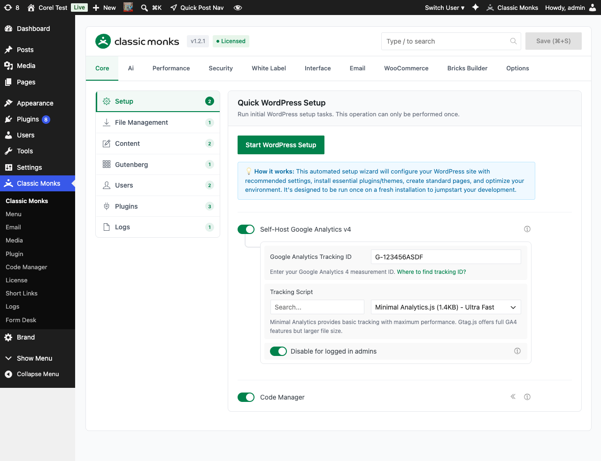

# How to Use Self-Hosted Google Analytics v4 in WordPress

> Self-host Google Analytics v4 tracking on your own server instead of loading the script from Google's servers, with a choice between a 1.4KB minimal tracker and the full 90KB gtag.js.

## Key Takeaways

- Two tracker options: Minimal Analytics (1.4KB) or Gtag.js (90KB)
- Eliminates third-party requests to Google's servers
- Built-in option to exclude logged-in administrators from tracking
- Compatible with Google Analytics 4 measurement IDs (G-XXXXXXXXXX)

---

## What Is Self-Hosted Google Analytics v4?

Self-Hosted Google Analytics v4 is a performance-focused alternative to the standard Google Analytics tracking setup. Instead of loading the analytics script from `www.googletagmanager.com` on every page, you self-host the tracking script on your own server. The analytics data still flows to Google Analytics; only the script delivery changes.

The feature offers two trackers:

- **Minimal Analytics (1.4KB)**: A custom lightweight script that tracks pageviews only. Fastest possible load.
- **Gtag.js (90KB)**: The standard Google Analytics library, self-hosted. Full feature parity with the standard implementation.

## Why You Need It

Loading Google Analytics the standard way means a third-party request to Google's servers on every page view. This has three costs:

- **Performance**: A blocking or render-delaying request to a third-party domain, often flagged by PageSpeed Insights
- **Privacy**: Ad blockers and privacy-focused browsers can block the request, leading to incomplete analytics data
- **GDPR concerns**: Loading scripts from US-based servers triggers consent requirements under some privacy frameworks

Self-hosting eliminates the third-party request, keeps the analytics data flowing, and lets you choose the size tradeoff.

---

## How to Enable Self-Hosted Google Analytics v4 in Classic Monks

### Step 1: Navigate to Settings

Click into the **Classic Monks** plugin settings in your WordPress dashboard.

### Step 2: Go to the Core Tab

Click on the **Core** menu. The Setup subtab opens by default.

### Step 3: Toggle On "Self-Host Google Analytics v4"

Find the **Self-Host Google Analytics v4** toggle and turn it on. The configuration panel expands.

### Step 4: Enter Your Google Analytics 4 Measurement ID

In the expanded panel, enter your GA4 measurement ID. The format is `G-XXXXXXXXXX` (10 characters after the G- prefix). Get the ID from your Google Analytics admin under Admin > Data Streams > Web.

### Step 5: Choose a Tracking Script

Select either:

- **Minimal Analytics.js (1.4KB)** for ultra-fast pageview tracking
- **Gtag.js (90KB)** for full GA4 features (events, conversions, custom dimensions)

For most content sites, Minimal Analytics is sufficient. For e-commerce or sites that need event tracking, choose Gtag.js.

### Step 6: Decide on Admin Exclusion

The **Disable for logged in admins** toggle is on by default. When enabled, administrators browsing the site do not trigger analytics events, keeping your analytics data clean of internal traffic.

### Step 7: Save Changes

Click **Save Changes**. The tracking script loads on the frontend, and analytics data starts flowing to your Google Analytics property.

---

## Configuration Options

| Option | Description | Default |
|--------|-------------|---------|
| **Self-Host Google Analytics v4** | Master toggle for self-hosted tracking. | Off |
| **Google Analytics Tracking ID** | Your GA4 measurement ID (G-XXXXXXXXXX). | Empty |
| **Tracking Script** | Minimal Analytics (1.4KB) or Gtag.js (90KB). | Minimal Analytics |
| **Disable for logged in admins** | Exclude administrators from tracking. | On |

---

## Minimal Analytics vs Gtag.js

| Feature | Minimal Analytics (1.4KB) | Gtag.js (90KB) |
|---------|---------------------------|----------------|
| Pageview tracking | Yes | Yes |
| Event tracking | No | Yes |
| Custom dimensions | No | Yes |
| E-commerce tracking | No | Yes |
| Cross-domain tracking | No | Yes |
| Load time impact | Negligible | ~90KB download, parse time |
| Ad blocker resistance | Higher (custom script) | Lower (well-known gtag.js) |
| PageSpeed Insights score | Minimal impact | Slight impact |

**Recommendation:**

- **Content sites, blogs, portfolios**: Minimal Analytics is enough. You need pageviews; you do not need events.
- **E-commerce, SaaS, lead-gen sites**: Gtag.js. You need conversion tracking, enhanced e-commerce, and custom events.
- **Mixed sites**: Start with Minimal Analytics, upgrade to Gtag.js if you need features it lacks.

---

## Developer Notes

The self-hosted analytics feature is loaded conditionally via `cm_initialize_self_hosted_analytics()` in `functions/core/analytics/self-hosted-analytics.php`. The script is enqueued only when `enable_self_hosted_analytics` is on.

**Options used:**
| Option | Type | Default |
|--------|------|---------|
| `enable_self_hosted_analytics` | Boolean | `false` |
| `analytics_tracking_id` | String | Empty |
| `analytics_script_type` | String | `minimal-analytics` |
| `analytics_disable_for_admins` | Boolean | `true` |

The tracking script is loaded via a standard WordPress `wp_enqueue_script()` call. The Minimal Analytics script is an inline script; Gtag.js is loaded from a local copy.

---

## Troubleshooting

### Tracking Not Showing in Google Analytics

**Cause:** Measurement ID is wrong, tracking script is not loading, or caching is serving stale pages.
**Fix:** Verify the ID in the GA4 admin. Clear all caching layers. Test in incognito mode with dev tools open and look for the analytics request in the Network tab.

### Self-Hosted Script Still Loading from Google

**Cause:** The browser cached the original gtag.js from Google's servers.
**Fix:** Clear browser cache. The script is served from your own domain, but the URL is different from googletagmanager.com, so cached requests to the old URL will not transfer.

### PageSpeed Score Did Not Improve

**Cause:** Other resources (images, CSS, JS) are still the bottleneck.
**Fix:** Self-hosting GA is one of many optimizations. Check the PageSpeed report for the largest items and address those.

### Minimal Analytics Not Tracking Events

**Cause:** Minimal Analytics tracks pageviews only, not events.
**Fix:** Switch to Gtag.js if you need event tracking, or implement custom event tracking via Minimal Analytics's JavaScript API.

---

## Related Articles

- [How to Use Quick WordPress Setup in Classic Monks](core-quick-wp-setup.md)
- [How to Add Code Snippets in WordPress (PHP, CSS, JS)](../code-manager.md)
