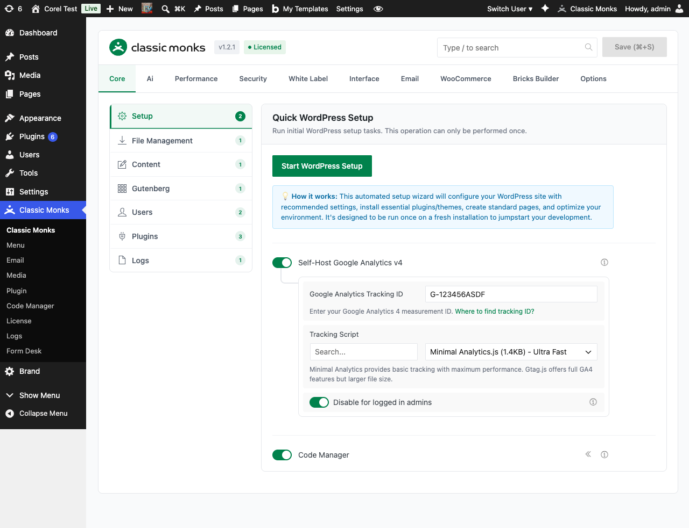

# How to Log WordPress Emails in Classic Monks

> Email Logging intercepts every email WordPress sends and stores detailed records in the Logs submenu. View email history, resend failed emails, and audit all communications site-wide.

## Key Takeaways

- Captures every email WordPress sends, including admin notifications, user registration emails, and WooCommerce transactional emails
- Records include sender, recipient, subject, content, headers, and delivery status
- Failed emails can be resent from the Logs submenu
- Adds a new Email Logs tab to the Logs submenu (page reload required)
- Useful for auditing, debugging email delivery issues, and recovering lost emails

## What Is Email Logging?

Email Logging is a Classic Monks feature that intercepts WordPress's `wp_mail()` function (the core function all WordPress emails go through) and stores a copy of every email before it is sent. The stored copy includes all email metadata and content, so you can see exactly what was sent, to whom, and whether delivery succeeded.

The logs are accessible from **Classic Monks > Logs** in a new **Email Logs** tab that appears when the feature is enabled.

## Why You Need It

WordPress does not provide email logs by default. Once an email is sent (or fails to send), it's gone. Email Logging addresses several common problems:

- **Lost password emails that didn't arrive**: A user says they never got the password reset email. With logging, you can see whether it was sent, to which address, and resend if needed.
- **Audit trail for compliance**: GDPR, HIPAA, and other regulations require proof of what was communicated to users. Email logs provide that audit trail.
- **Debug WooCommerce transactional emails**: Order confirmations, shipping notices, refund emails, if a customer says they didn't get one, the log shows whether it was sent.
- **Catch silent failures**: Some hosting providers silently drop emails. The log shows the email was sent but never reached the recipient, so you know the issue is at the SMTP or hosting level.

Without email logging, diagnosing email issues requires digging into server logs, which most WordPress users don't have access to.

---

## How to Use Email Logging in Classic Monks

### Step 1: Navigate to Settings

Click into the **Classic Monks** plugin settings in your WordPress dashboard.

### Step 2: Go to the Email Tab

Click on the **Email** menu. The Email Settings subtab opens by default.

### Step 3: Enable Email Logging

Toggle on **Enable Email Logging**. A notice appears indicating that the Logs submenu tab will be added and a page reload is required.



### Step 4: Save Changes

Click **Save Changes**.

### Step 5: Reload the Admin

Reload the WordPress admin page. The **Logs** submenu now has a new **Email Logs** tab.

### Step 6: Trigger a Test Email

To verify logging is working, trigger a WordPress email. For example:
- Reset your admin password (triggers a password reset email)
- Comment on a post (triggers a comment notification)
- Place a test WooCommerce order (triggers order confirmation)

### Step 7: View the Log

Go to **Classic Monks > Logs > Email Logs**. The triggered email appears with:
- Sender (From address and name)
- Recipient (To address)
- Subject
- Content (full email body)
- Headers (Reply-To, CC, BCC, content-type, etc.)
- Delivery status (sent, failed)
- Timestamp

---

## Configuration Options

| Option | Description | Default |
|--------|-------------|---------|
| **Enable Email Logging** | Master toggle. | Off |

No nested options.

---

## What Gets Logged

| Email type | Logged? | Notes |
|-----------|---------|-------|
| Password reset emails | Yes | Triggered by wp_lostpassword_url() |
| New user registration emails | Yes | Sent when a new user is created |
| Admin notification emails | Yes | Comment notifications, plugin updates, etc. |
| WooCommerce transactional emails | Yes | Order confirmation, shipping, refund, etc. |
| Contact form emails (Contact Form 7, WPForms, etc.) | Yes | Any plugin using `wp_mail()` |
| SMTP-relayed emails | Yes | Captured before SMTP sends them |
| Failed `wp_mail()` calls | Yes | Logged with the failure reason |
| Cron-scheduled emails | Yes | Captured at the time wp_mail() is called |

---

## What Does NOT Get Logged

- **Emails sent via raw SMTP outside WordPress**: If a plugin uses a custom SMTP library that bypasses `wp_mail()`, the email is not intercepted
- **Emails sent by the server's mail transfer agent (MTA) directly**: WordPress never sees them; Classic Monks can't log them
- **Emails sent before the feature was enabled**: The log only captures emails sent after the toggle was turned on
- **Replies to comments via email**: WordPress doesn't send these natively; they require a plugin (e.g., Subscribe to Comments Reloaded)

---

## Resending Failed Emails

When an email fails to send (e.g., SMTP connection error, recipient rejected), the log entry shows the failure status with the error reason. To resend:

1. Go to **Classic Monks > Logs > Email Logs**
2. Find the failed email in the list
3. Click **Resend** in the row actions

The resend action uses the same email content (same recipient, subject, body) but attempts a fresh SMTP delivery. If the resend succeeds, the log entry is updated with the new delivery status. If it fails again, the new error is recorded.

## Retention and Cleanup

Email logs accumulate over time. To manage the table size:

- Use the **Logs** page's built-in cleanup tools (delete individual entries, bulk delete, or truncate)
- Configure automatic cleanup in the plugin settings under Email > Logging
- Use WordPress CLI: `wp cm-email-log delete --before="2026-01-01"`

Default behavior: logs are kept indefinitely until manually cleaned. For high-traffic sites, configure a retention policy of 30-90 days to keep the table manageable.

---

## Advanced Options (Developers)

This feature registers 7 WordPress hooks in `submenu/email-logging.php`:

**Actions:**

- `wp_mail_failed` calls `CM_Email_Logger::log_email_failure()` (Logs failed email attempts)
- `phpmailer_init` calls `CM_Email_Logger::sync_sender_from_phpmailer()` (Syncs sender info from PHPMailer (priority PHP_INT_MAX))
- `init` calls `cm_email_logger_init()` (Initializes email logger)
- `wp_ajax_cm_clear_email_logs` calls `CM_Email_Logger::ajax_clear_email_logs()` (AJAX handler for clearing logs)
- `wp_ajax_cm_get_email_details` calls `CM_Email_Logger::ajax_get_email_details()` (AJAX handler for viewing email details)
- `wp_ajax_cm_retry_send_email` calls `CM_Email_Logger::ajax_retry_send_email()` (AJAX handler for retrying emails)

**Filters:**

- `wp_mail` calls `CM_Email_Logger::log_email()` (Intercepts wp_mail to log all emails (priority 10))

```php
// Hooked in submenu/email-logging.php
add_filter( 'wp_mail', 'CM_Email_Logger::log_email' );
```

The feature modifies WordPress behavior by registering or removing hooks. Disabling it reverses those changes.

## Troubleshooting

### Emails are not appearing in the log

**Cause:** The toggle is off, or a caching plugin is interfering with the `wp_mail` filter.
**Fix:** Verify the toggle is on. Disable caching plugins on the WordPress side (server-side caching usually doesn't affect this). Trigger a test email (e.g., password reset) and check again.

### The log table is growing too fast

**Cause:** High-traffic site with many automated emails (WooCommerce orders, form submissions, etc.).
**Fix:** Configure log retention in the plugin settings under Email > Logging. Old entries are cleaned up automatically. Or use WordPress CLI to bulk-delete.

### The resend action fails

**Cause:** The original failure cause is still present (e.g., SMTP server is down, recipient address is invalid).
**Fix:** Check your SMTP settings in Classic Monks > Email > SMTP Settings. Verify the recipient address is correct.

### The log shows the email was sent but the recipient says they didn't get it

**Cause:** The email left WordPress successfully but was dropped by the SMTP server, recipient's mail server, or filtered as spam.
**Fix:** This is not a WordPress issue. Check the SMTP server logs, ask the recipient to check their spam folder, and verify the recipient's mail server is not blocking your sending IP.

### The log entry is missing the email content

**Cause:** The email was sent via a method that doesn't pass the full content (some SMTP libraries strip content for performance).
**Fix:** Use a different SMTP library that passes the full content. The default WordPress `wp_mail()` function includes the full content; third-party SMTP libraries may not.

### The Email Logs tab is not appearing after enabling

**Cause:** Page reload didn't trigger the submenu registration.
**Fix:** Hard-refresh the admin page (Ctrl+Shift+R or Cmd+Shift+R). If still missing, deactivate and reactivate Classic Monks to trigger a full re-registration of the submenus.

---

## Related Articles

- [How to Configure SMTP Settings in WordPress](email-smtp-settings.md)
- [How to Use Logs in WordPress](../core/core-logs.md)
- [How to Configure Notifications in WordPress](email-notifications.md)
