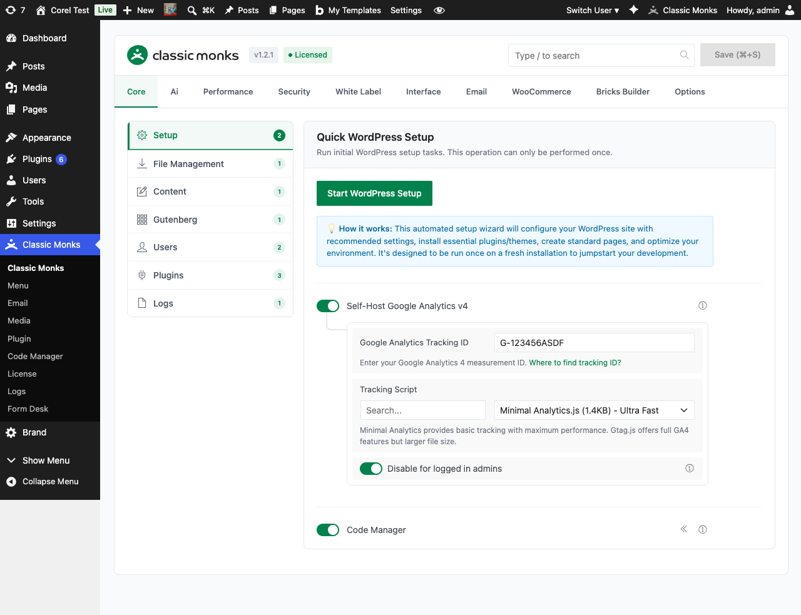

# How to Configure AI Advanced Settings in WordPress

> AI Advanced Settings control how Classic Monks logs AI requests, retries failed calls, and manages conversation history. Use these to troubleshoot integrations and balance context quality with API cost.

## Key Takeaways

- Three settings: Debug Mode, Max Retries, Chat History Limit
- Debug Mode logs full request/response payloads for troubleshooting
- Max Retries (0-5) handles transient API failures
- Chat History Limit (5-50 messages) controls agent context window

---

## What Are AI Advanced Settings?

AI Advanced Settings are the three configuration fields on the **Advanced** subtab of the AI tab. They fine-tune how the AI Provider integration behaves: how much it logs, how aggressively it retries failed calls, and how much conversation history it retains for context.

These settings affect every AI feature in Classic Monks: the AI Agent, AI Tools, and Bricks AI Builder.

## Why You Need It

The default values work for most sites, but real-world integrations hit edge cases:

- **Transient failures**: AI provider APIs occasionally return 429 (rate limit) or 5xx (server error) errors. Max Retries handles these without surfacing an error to the user.
- **Troubleshooting**: When AI features misbehave, you need to see the full request and response to diagnose. Debug Mode captures everything.
- **Cost vs. context**: More conversation history means the AI agent has more context, but each request costs more tokens. Chat History Limit lets you tune the tradeoff.

The Advanced subtab also exposes these knobs to developers who need fine-grained control over API behavior.

---

## How to Configure AI Advanced Settings in Classic Monks

### Step 1: Navigate to the AI Tab

Click into the **Classic Monks** plugin settings, then click **AI**.

### Step 2: Switch to the Advanced Subtab

Click the **Advanced** subtab in the AI tab navigation.



### Step 3: Configure Each Setting

Toggle on **Debug Mode** if you need to log AI traffic. Set **Max Retries** to the number of retry attempts (0-5). Set **Chat History Limit** to the maximum number of messages retained in conversation history (5-50).

### Step 4: Save Changes

Click **Save Changes** to persist the settings.

---

## Configuration Options

| Option | Description | Default | Range |
|--------|-------------|---------|-------|
| **Debug Mode** | Enables detailed logging of AI API requests and responses. Captures full request/response data including headers, payloads, and error details. | Off | On / Off |
| **Max Retries** | Number of retry attempts for failed AI API requests. | 3 | 0-5 |
| **Chat History Limit** | Maximum number of messages to keep in conversation history. | 20 | 5-50 |

---

## Debug Mode in Detail

When Debug Mode is on, Classic Monks logs every AI request and response to the WordPress debug log (when `WP_DEBUG_LOG` is enabled in `wp-config.php`). Each log entry includes:

- Timestamp
- Provider slug and model identifier
- Full request payload (messages, parameters, tool definitions)
- HTTP status code and response headers
- Response body (truncated for large responses)
- Error details when a request fails

To enable logging output, add these lines to your `wp-config.php`:

```php
define( 'WP_DEBUG', true );
define( 'WP_DEBUG_LOG', true );
define( 'WP_DEBUG_DISPLAY', false );
```

Log entries appear in `wp-content/debug.log`. Each line is prefixed with the provider slug for easy filtering:

```
[CM-AI] [openrouter] Request to anthropic/claude-4.5-sonnet: 1234 tokens
[CM-AI] [openrouter] Response: 200 OK in 1243ms
[CM-AI] [openrouter] Error: 429 Rate limit exceeded (retry 1/3)
```

**When to use Debug Mode:**

- Diagnosing "API Key Invalid" or "Provider Issue" warnings
- Tracking token usage per request
- Confirming the right model is being called
- Verifying tool definitions are being sent correctly

**When to turn Debug Mode off:**

- Production sites with high traffic (logs grow fast)
- Sites handling sensitive data (request payloads may contain user input)
- After the integration is verified working

## Max Retries in Detail

When an AI API request fails, Classic Monks retries the request up to **Max Retries** times before surfacing an error. Retries use exponential backoff (1s, 2s, 4s, 8s, 16s) to avoid hammering the provider.

Retries are triggered for:

- HTTP 429 (rate limit)
- HTTP 500, 502, 503, 504 (server errors)
- Network timeouts
- Connection errors

Retries are NOT triggered for:

- HTTP 400 (bad request): indicates a config issue
- HTTP 401, 403 (auth): indicates a key issue
- HTTP 404 (not found): indicates a wrong endpoint or model

For these non-retryable errors, the user sees the error immediately.

**Recommended values:**

- **0 retries**: Only for testing where you want to see failures immediately
- **1-2 retries**: For high-volume sites where you want fast feedback
- **3 retries (default)**: Balanced for most sites
- **4-5 retries**: For sites where reliability matters more than latency

## Chat History Limit in Detail

The AI Agent maintains a rolling window of the last N messages in each user's conversation. The default is 20 messages (10 user + 10 assistant). When a new message is sent, the oldest messages drop off.

**Tradeoffs:**

- **More history** (closer to 50): The agent has more context. Better for long-running conversations about the same topic. Higher token cost per request.
- **Less history** (closer to 5): The agent "forgets" faster. Lower token cost. Better for one-off questions where you don't want old context to bias the answer.

**Recommended values:**

- **5-10 messages**: For sites where the agent handles one-off queries
- **20 messages (default)**: Balanced for most sites
- **30-50 messages**: For sites where the agent is used as a long-running assistant

The history is per-user, stored in the WordPress database, and cleared when the AI Agent toggle is turned off.

---

## Developer Notes

The advanced settings are stored as WordPress options:

| Option | Type | Default | Description |
|--------|------|---------|-------------|
| `cm_ai_debug_mode` | Boolean | `false` | Logs API requests/responses to the browser console |
| `cm_ai_max_retries` | Integer | `3` | Number of retry attempts on provider failure (0-5) |
| `cm_ai_max_history` | Integer | `20` | Maximum conversation messages stored per user (5-50) |

Read them with `cm_get_option()`:

```php
$debug_mode  = (bool) cm_get_option( 'cm_ai_debug_mode', false );
$max_retries = (int) cm_get_option( 'cm_ai_max_retries', 3 );
$max_history = (int) cm_get_option( 'cm_ai_max_history', 20 );
```

The retry logic is handled internally by `cm_ai_should_retry_with_responses_endpoint()` in `functions/ai/ai-tools.php`.
---

## Troubleshooting

### "API Request Failed After 3 Retries"

**Cause:** Persistent API failure (wrong key, no credits, persistent 5xx, network issue).
**Fix:** Turn on **Debug Mode** and check the debug log. The log entry shows the exact error returned by the provider.

### Agent "Forgets" What We Were Talking About

**Cause:** Chat History Limit is set too low, or the conversation has been running long enough to push earlier messages out of the window.
**Fix:** Increase **Chat History Limit** in the Advanced subtab. Note that higher values increase API cost per request.

### Debug Log Is Huge

**Cause:** Debug Mode is on and the site handles high AI traffic.
**Fix:** Turn off Debug Mode after troubleshooting. Optionally, log to a separate file by adding a custom log handler.

### Retries Not Happening on 429

**Cause:** Some providers return 429 as a permanent "quota exceeded" response, not a transient rate limit.
**Fix:** Check the response body in the debug log. If it says "quota exceeded" or "billing", the issue is account-level and retries will not help. If it says "rate limit", retries are working as expected.

### Chat History Not Persisting Between Sessions

**Cause:** The `cm_ai_agent_history_{user_id}` option is being cleared by a database cleanup, or the AI Agent toggle was toggled off (which clears history).
**Fix:** Verify the AI Agent toggle is on. Check whether another plugin is purging options on a schedule.

---

## Related Articles

- [How to Enable AI Features in Classic Monks](ai-features-master.md)
- [How to Configure the AI Provider in Classic Monks](ai-provider.md)
- [How to Use the AI Agent in Classic Monks](ai-agent.md)
- [How to Use AI Tools in Classic Monks](ai-tools.md)
