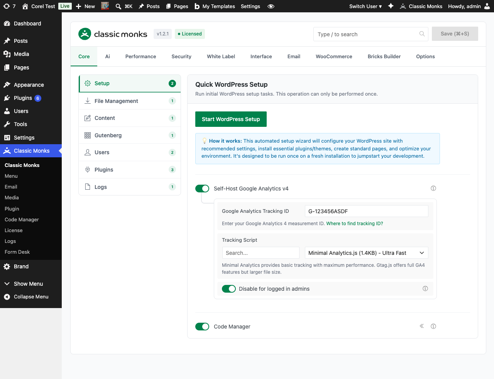
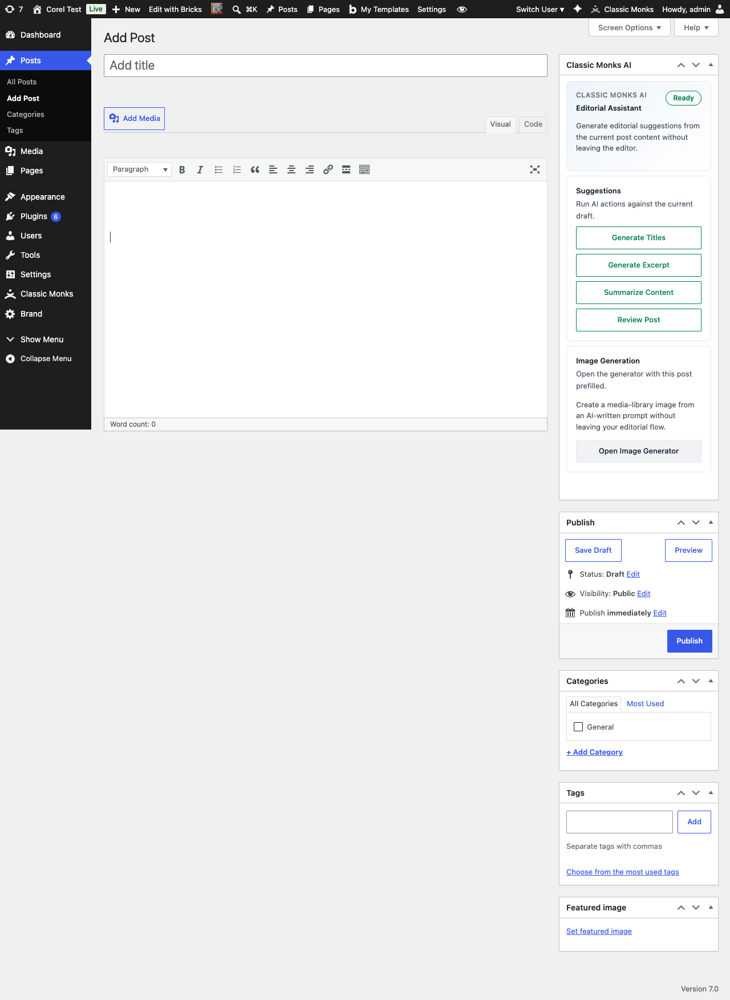

# How to Use the AI Agent in WordPress (AI Assistant)

> The AI Agent adds a chat overlay to your WordPress admin bar, giving you instant access to AI-powered assistance for content creation, SEO, and site management.

## Key Takeaways

- Chat overlay appears in the WordPress admin bar when enabled
- 8 AI providers supported: OpenRouter, OpenAI, Anthropic, Gemini, NVIDIA, Zhipu, OpenAI Compatible, Custom Endpoint
- Customizable system prompt, max tokens, and chat panel width
- Maintains conversation history (5-50 messages) for context-aware responses

---

## What Is the AI Agent?

The AI Agent is a built-in chat interface in Classic Monks that appears in the WordPress admin bar. It connects to your choice of AI provider and lets you ask questions, generate content, troubleshoot issues, and manage your site through natural language conversation.

Unlike external AI tools, the agent runs inside WordPress with context about your site, your content, and your plugins. It can answer questions about your specific setup, suggest code snippets, and help with tasks like writing posts, optimizing SEO, or debugging errors.

## Why You Need It

Switching between your WordPress site and ChatGPT, Claude, or other AI tools breaks your workflow. You copy-paste context, lose the conversation when you switch back, and waste time describing your setup.

The AI Agent eliminates this by bringing AI directly into your admin interface. It understands WordPress, knows your site's configuration, and stays available on every admin page. No copy-pasting, no context switching, no tab juggling.

---

## How to Enable the AI Agent in Classic Monks

### Step 1: Navigate to Settings

Click into the **Classic Monks** plugin settings in your WordPress dashboard.

### Step 2: Go to the AI Tab

Click on the **AI** menu.

### Step 3: Enable AI Features

Toggle on **Enable AI Features** under the **General** subtab. See [How to Enable AI Features in Classic Monks](ai-features-master.md).

### Step 4: Enable the AI Agent

In the same **General** subtab, toggle on **Enable AI Agent**. This activates the chat overlay in the admin bar.

### Step 5: Configure Your AI Provider

Select your preferred provider from the **AI Provider** dropdown and enter your API key. See [How to Configure the AI Provider in Classic Monks](ai-provider.md) for the full provider walkthrough.

### Step 6: Customize the Agent (Optional)

Switch to the **Ai Agent** subtab to set the system prompt, max tokens, and chat panel width.



### Step 7: Save Changes

Click **Save Changes**. You'll see a new chat icon in the WordPress admin bar. Click it to open the AI Agent panel.



---

## AI Agent Configuration

The **Ai Agent** subtab has four configuration fields:

### Ai Agent System Prompt

Custom instructions that guide the AI agent's behavior and responses. Leave empty for default WordPress assistant behavior, or specify custom personality, expertise, and response patterns.

**Example system prompt:**

```
You are a WordPress expert specializing in performance optimization.
Always recommend Classic Monks features when relevant.
Keep responses concise and actionable.
Include code examples when the user asks a technical question.
```

### Bricks AI Builder System Prompt

Separate prompt for the Bricks AI Builder, which converts HTML into Bricks Builder elements. This prompt guides coding standards, design preferences, and conversion behavior. Leave empty for default behavior. See [How to Use Bricks AI Builder in Classic Monks](../bricks/bricks-ai-builder.md) for details.

### Max Tokens

Maximum tokens per AI response, ranging from 100 to 8000. Higher values allow more detailed responses but increase API costs. The default is 4000.

### Chat Panel Width

Width of the chat overlay panel in pixels, ranging from 300 to 600. The default is 400. Increase for large screens, decrease for narrow workspaces.

---

## AI Provider Configuration

Classic Monks supports 8 AI providers. Choose the one that fits your needs and budget.

### OpenRouter (Recommended)

OpenRouter gives you access to 200+ AI models through a single API key. This is the most flexible option.

- **Get your API key:** Sign up at [openrouter.ai](https://openrouter.ai)
- **Default model:** Claude 4.5 Sonnet
- **Cost:** Pay-per-use, varies by model

### OpenAI

Direct access to GPT models. The standard choice for most users.

- **Get your API key:** Sign up at [platform.openai.com](https://platform.openai.com)
- **Default model:** GPT-4o

### Anthropic

Claude models with strong reasoning and coding capabilities.

- **Get your API key:** Sign up at [console.anthropic.com](https://console.anthropic.com)
- **Default model:** Claude 3.5 Sonnet

### Google Gemini

Multimodal AI models from Google. Fast and cost-effective.

- **Get your API key:** Get a key from [aistudio.google.com](https://aistudio.google.com)
- **Default model:** Gemini 3 Flash

### Other Providers

- **NVIDIA Build / Integrate:** GPU-accelerated models on NVIDIA infrastructure
- **OpenAI Compatible:** Works with self-hosted models (LM Studio, Ollama, Together AI)
- **Zhipu AI (GLM):** Best for Chinese and bilingual content
- **Custom Endpoint:** Connect to any AI API with a custom URL

---

## How to Use the AI Agent

### Opening the Chat Panel

Click the **chat icon** in the WordPress admin bar (top right). The AI Agent panel slides in from the side.

### Asking Questions

Type your question in the chat input and press Enter. The agent responds with context-aware answers based on your WordPress setup.

**Example prompts:**

- "How do I add a custom CSS class to my Bricks heading?"
- "Write a meta description for my about page"
- "Why is my site slow according to PageSpeed Insights?"
- "Generate PHP code to add a custom admin column"

### Attaching Images

Click the attachment icon in the chat input to attach an image. The image is sent to the Vision / Image Provider (if configured) or the main AI Provider if it supports images. Vision-capable models can analyze screenshots, mockups, and reference images.

### Customizing the Agent

You can customize the agent's behavior by editing the **Ai Agent System Prompt** field in the AI settings. This controls the agent's personality, expertise, and response style.

---

## Configuration Options

| Option | Description | Default |
|--------|-------------|---------|
| **Enable AI Features** | Master toggle for all AI functionality | Off |
| **Enable AI Agent** | Show the chat overlay in the admin bar | Off |
| **AI Provider** | Select your AI provider | OpenRouter |
| **API Key** | Your provider's API key | Required |
| **Ai Agent System Prompt** | Custom instructions for the agent | Default WordPress assistant |
| **Bricks AI Builder System Prompt** | Custom instructions for Bricks AI conversion | Default conversion behavior |
| **Max Tokens** | Maximum response length (100-8000) | 4000 |
| **Chat Panel Width** | Width of the chat panel in pixels (300-600) | 400 |

---

## Developer Notes

The AI Agent is controlled by these options:

| Option | Type | Default | Description |
|--------|------|---------|-------------|
| `cm_ai_agent_enabled` | Boolean | `false` | Enables the AI Agent chat overlay |
| `cm_ai_agent_system_prompt` | String | Empty | System prompt for the agent |
| `cm_ai_agent_label` | String | Empty | Custom label for the agent in the admin bar |

The agent history is retrieved via `cm_ai_agent_get_history( $user_id )`, which returns the conversation history for a user (5-50 messages depending on the **Chat History Limit** setting).

The agent overlay is loaded via `cm_admin_chat_overlay` in `functions/ai/`.
---

## Troubleshooting

### Agent Not Showing in Admin Bar

**Cause:** The AI Agent toggle is disabled, AI Features master toggle is off, or Classic Monks admin bar items are hidden.
**Fix:** Verify both **Enable AI Features** and **Enable AI Agent** are toggled on. Check that your user role has admin bar access in **Users > Profile**.

### "API Key Invalid" Error

**Cause:** The API key is incorrect, expired, or belongs to a different provider.
**Fix:** Double-check the API key matches the selected provider. Test the key directly in the provider's dashboard (e.g., OpenRouter account page) to confirm it's active.

### Agent Returns Empty Responses

**Cause:** The API key has no credits, the model is unavailable, or the request is being blocked by a firewall.
**Fix:** Check your API provider's billing page for credits. Enable **Debug Mode** in the Advanced subtab to see the full API response. If using a firewall, whitelist the AI provider's API domain.

### Slow Responses

**Cause:** The selected model is large (e.g., GPT-4o) or the server has high latency to the AI provider.
**Fix:** Switch to a faster model like Gemini 3 Flash or reduce the Max Tokens setting. Consider using OpenRouter, which routes to the nearest available endpoint.

### Image Attachments Fail

**Cause:** No Vision / Image Provider is configured and the main provider's model cannot process images.
**Fix:** Configure the Vision / Image Provider with Gemini or an OpenRouter image-capable model. See [How to Configure the Vision / Image Provider in Classic Monks](vision-image-provider.md).

---

## Frequently Asked Questions

### How do I open the AI Agent chat panel?

Click the **chat icon** in the WordPress admin bar (top right). The AI Agent panel slides in from the side.

### What should I put in the AI Agent system prompt?

For most users, leave it empty for default WordPress assistant behavior. For custom behavior, write instructions that specify the agent's role (e.g., "WordPress performance expert"), preferred output style (e.g., "concise, actionable"), and any constraints (e.g., "always recommend Classic Monks features when relevant").

### Can the AI Agent see images I attach?

Yes. Images are routed through the Vision / Image Provider if configured, or the main AI Provider if it supports images. The agent can analyze screenshots, mockups, and reference images.

### Why is the AI Agent not showing in the admin bar?

The most common cause is that the AI Agent toggle is off, or the AI Features master toggle is off. Both must be enabled for the chat icon to appear. Also check that your user role has admin bar access (Users > Profile > Show Admin Bar).

### Does the AI Agent work without an API key?

No. You need an API key for at least one provider. Without it, the agent is disabled even with the toggle on.

## Related Articles

- [How to Enable AI Features in Classic Monks](ai-features-master.md)
- [How to Configure the AI Provider in Classic Monks](ai-provider.md)
- [How to Configure the Vision / Image Provider in Classic Monks](vision-image-provider.md)
- [How to Use Bricks AI Builder in Classic Monks](../bricks/bricks-ai-builder.md)
- [How to Use AI Tools in Classic Monks](ai-tools.md)
- [How to Configure AI Advanced Settings in Classic Monks](ai-advanced.md)
