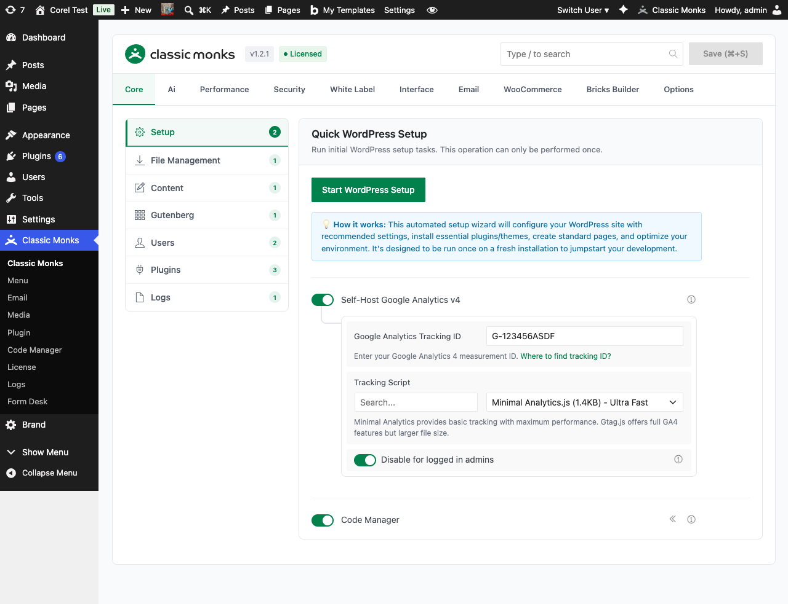

# How to Enable AI Features in WordPress (Master Toggle)

> The AI Features master toggle unlocks every AI-powered capability in Classic Monks, from the admin bar chat agent to image generation and Bricks AI Builder.

## Key Takeaways

- Master switch for the entire AI tab and all AI features
- Requires WordPress 6.9 or newer for the full feature set
- Disabling it instantly hides every AI tool, provider field, and sub-option
- You can enable AI Features without enabling the AI Agent or Bricks AI Builder

---

## What Is the AI Features Master Toggle?

The AI Features master toggle is a single switch in the Classic Monks AI tab that controls whether any AI-powered functionality runs on your site. When it is on, Classic Monks loads the AI Provider configuration, the Vision / Image Provider, AI Tools, AI Agent, and Bricks AI Builder. When it is off, all of those features are hidden and disabled, regardless of their individual toggle states.

This is the gate that decides whether the plugin talks to an AI provider at all. Turn it on once and you can selectively enable the sub-features you actually need.

## Why You Need It

Without a master toggle, leaving AI features on by default would mean every site ships with API calls, secret keys, and provider connections active. That creates surprise costs and unwanted data flowing to third-party services.

The master toggle gives you one place to:

- Turn off all AI processing during client work or compliance reviews
- Stop the AI Agent from appearing in the admin bar without losing the configuration
- Bulk-disable AI when migrating to a new provider or testing performance
- Comply with privacy policies that require AI to be opt-in

---

## How to Enable AI Features in Classic Monks

### Step 1: Navigate to Settings

Click into the **Classic Monks** plugin settings in your WordPress dashboard.

### Step 2: Go to the AI Tab

Click on the **AI** menu. The Status subtab opens first.

### Step 3: Confirm WordPress Version

The Status subtab shows whether your site meets the **WordPress 6.9** requirement. If you see a green "Ai Features are enabled" notice after toggling, you are good to go. If you see a red notice, the WordPress version on the site is too old and AI features cannot run regardless of the toggle state.

### Step 4: Toggle On "Enable AI Features"

Under the **General** subtab, flip the **Enable AI Features** switch. The configuration panel below it expands to show the AI Agent toggle, Bricks AI Builder toggle, AI Provider selector, and Vision / Image Provider.

### Step 5: Save Changes

Click **Save Changes**. The save action persists the toggle and loads the rest of the AI tab UI.

---

## Configuration Options

| Option | Description | Default |
|--------|-------------|---------|
| **Enable AI Features** | Master switch for all AI functionality in Classic Monks. Required for AI Agent, Bricks AI Builder, AI Tools, AI Provider, and Vision / Image Provider. | Off |
| **WordPress Version Check** | The Status subtab reports whether the running WordPress version (must be 6.9+) supports the Abilities API. | informational only |
| **Abilities API Check** | The Status subtab reports whether the WordPress Abilities API is available. Required for AI Tools. | informational only |

---

## What Happens When You Turn It On

Enabling **Enable AI Features** reveals the following features and their configuration panels:

- **AI Agent** toggle (and its sub-options: system prompt, max tokens, chat width on the Agent subtab)
- **Bricks AI Builder** toggle (and its dependency warning if Live Code Sync is off)
- **AI Provider** selector with 8 supported providers
- **Vision / Image Provider** selector with 2 supported providers
- **AI Tools** subtab with 7 individual tools and a shared system prompt
- **Advanced** subtab with debug mode, max retries, and chat history limit

Each of these has its own dedicated doc linked in the Related Articles section.

## What Happens When You Turn It Off

Flipping the master toggle off:

- Hides the AI Agent chat icon from the WordPress admin bar
- Disables Bricks AI Builder even if its own toggle is on
- Hides all AI Tools toggles and disables the tools
- Stops all AI Provider API calls
- Stops all Vision / Image Provider API calls
- Preserves your API keys, model selections, and system prompts so re-enabling is instant

You do not lose your configuration. The provider keys and system prompts stay saved.

---

## Developer Notes

The master toggle controls whether AI features are available site-wide. The function `cm_is_ai_enabled()` returns `true` only when the master toggle is on and the site is running WordPress 6.9 or newer.

**Options used:**
| Option | Type | Default |
|--------|------|---------|
| `enable_cm_ai` | Boolean | `false` |
---

## Troubleshooting

### AI Tab Shows "Ai Features Are Currently Disabled" Notice

**Cause:** The master toggle is off, or WordPress is below 6.9.
**Fix:** Toggle on **Enable AI Features** in the General subtab. If the toggle is on but the notice still shows, check the WordPress version on the Status subtab.

### Sub-options Are Greyed Out

**Cause:** Some sub-options (provider fields, AI Tools) require the master toggle on. They are visible but disabled when the master is off.
**Fix:** Enable **Enable AI Features** first, then configure the sub-options.

### Toggling On Does Nothing

**Cause:** A plugin or theme is forcibly disabling AI through a filter, or the WordPress Abilities API is missing.
**Fix:** Check the Status subtab for the Abilities API notice. If it shows a warning, the site is missing a required WordPress capability and AI Tools will not load even with the master on.

---

## Frequently Asked Questions

### What does the AI Features master toggle actually do?

It's a single switch that controls whether ANY AI functionality runs on your site. When on, the AI Agent toggle, AI Tools toggles, provider fields, and Bricks AI Builder toggle all become functional. When off, every AI feature is hidden and disabled, regardless of their individual toggle states.

### Does the master toggle need WordPress 6.9+?

Yes. AI features require WordPress 6.9 or newer for the Abilities API. The Status subtab shows a red notice on older WordPress versions, and the entire AI tab is disabled regardless of the toggle state. Upgrade WordPress to use any AI feature.

### Can I enable the master toggle without enabling the AI Agent or AI Tools?

Yes. The master toggle reveals the configuration options, but each sub-feature (AI Agent, AI Tools, Bricks AI Builder) has its own independent toggle. You can have AI Features on with everything else off, or turn on only the AI Tools you actually need.

### What happens when I disable the master toggle?

The AI Agent chat icon disappears from the admin bar. Bricks AI Builder stops working inside the Live HTML to Bricks panel. AI Tools buttons vanish from the post editor and Media Library. Provider fields are hidden. Your configuration (API keys, model selections, system prompts) is preserved, so re-enabling is instant.

## Related Articles

- [How to Configure the AI Provider in Classic Monks](ai-provider.md)
- [How to Use the AI Agent in Classic Monks](ai-agent.md)
- [How to Use Bricks AI Builder in Classic Monks](../bricks/bricks-ai-builder.md)
- [How to Use AI Tools in Classic Monks](ai-tools.md)
- [How to Configure the Vision / Image Provider in Classic Monks](vision-image-provider.md)
- [How to Configure AI Advanced Settings in Classic Monks](ai-advanced.md)
