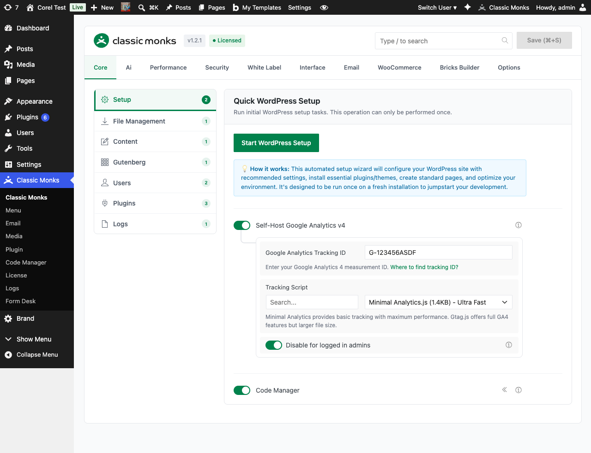
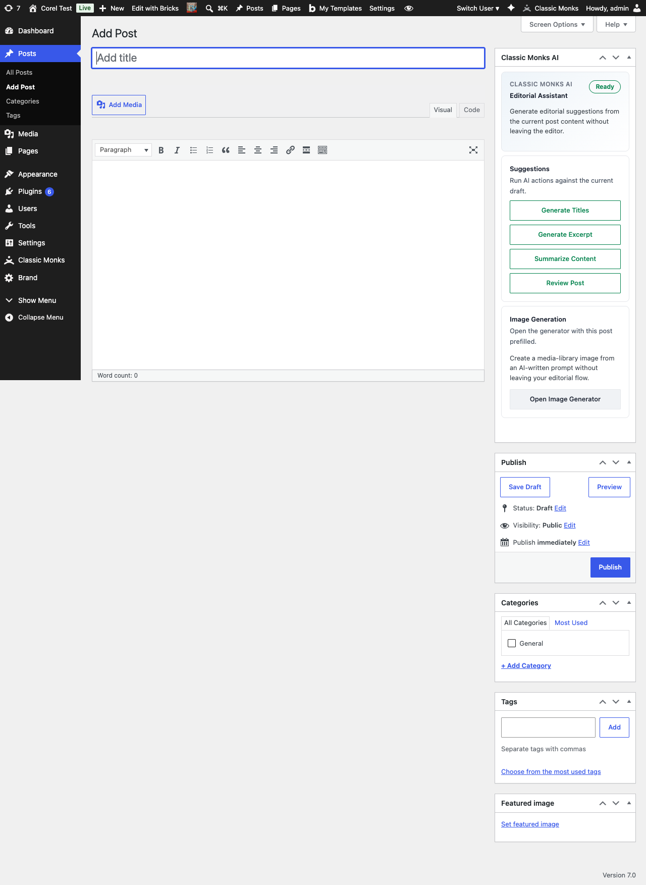
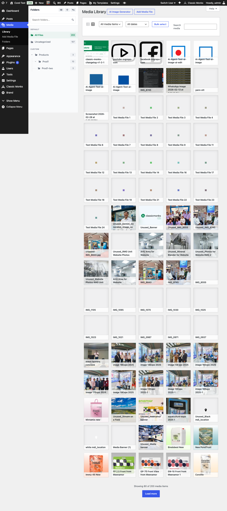

# How to Use AI Tools in WordPress

> AI Tools are seven focused AI capabilities that integrate directly into the post editor and Media Library: Title Generation, Excerpt Generation, Summarization, Review Post, Alt Text Generation, Image Generation, and Image Editing.

## Key Takeaways

- 7 individual tools, each toggleable on the AI Tools subtab
- Post editor tools: Title, Excerpt, Summarization, Review Post
- Media tools: Alt Text Generation, Image Generation, Image Editing
- Requires WordPress 6.9+ with the Abilities API for tool execution
- Image tools need a Vision / Image Provider or vision-capable main model

---

## What Are AI Tools?

AI Tools are focused AI capabilities built into Classic Monks that run inside the WordPress post editor and Media Library. Each tool does one specific job (generate a title, write an excerpt, review a post for SEO issues, generate alt text, create an image, edit an image) and can be enabled or disabled independently.

The tools appear as buttons and panels in their respective locations: a meta box in the classic post editor, a sidebar in the block editor, and dedicated tabs in the Media Library. You click, the tool runs against the current post or image, and the result is inserted into the editor or saved back to the media item.

## Why You Need It

AI Tools bring AI capabilities into the workflows where you actually create content. Instead of opening ChatGPT in another tab, copying your draft, prompting for a title, copying the result back, and pasting it into WordPress, you stay in the editor and run the tool with one click.

For agencies and content teams, this means:

- **Faster turnaround**: Title, excerpt, and review tools cut editing time on every post
- **Consistent quality**: The Review Post tool catches readability, grammar, accessibility, and SEO issues before publish
- **No alt text debt**: Alt Text Generation runs against every image you upload, eliminating the manual alt text backlog
- **Image creation in the editor**: Image Generation creates images that import directly to the Media Library with proper metadata
- **No context switching**: Everything happens inside WordPress

---

## How to Enable AI Tools in Classic Monks

### Step 1: Confirm WordPress 6.9+

AI Tools require WordPress 6.9 or newer with the Abilities API. Check the **Status** subtab. A green notice confirms support; a yellow notice means the site is below 6.9 or the Abilities API is unavailable.

### Step 2: Enable AI Features

Open the **General** subtab. Toggle on **Enable AI Features**. See [How to Enable AI Features in Classic Monks](ai-features-master.md).

### Step 3: Configure the AI Provider

The tools use the main AI Provider for text tasks and the Vision / Image Provider for image tasks. Configure at least the main provider. See [How to Configure the AI Provider in Classic Monks](ai-provider.md) and [How to Configure the Vision / Image Provider in Classic Monks](vision-image-provider.md).

### Step 4: Open the AI Tools Subtab

Switch to the **Ai Tools** subtab. You'll see all 7 tools listed with their toggle, description, and a status pill.

### Step 5: Enable the Tools You Want

Toggle on each tool you want to use. The status pill next to each tool reports whether the tool is **Ready**, needs a **Provider**, has a **Provider Issue**, requires **WP 6.9+**, or has a model-specific issue like **Select Model** or **No Vision**.

### Step 6: Set a Shared AI Tools System Prompt (Optional)

At the bottom of the AI Tools subtab, edit the **Ai Tools System Prompt** field. This prompt applies to all text-generation tools (Title, Excerpt, Summarization, Review Post, Alt Text). Use it to set tone guidelines, output length, language style, or any rules that should apply across tools.

### Step 7: Configure Alt Text Language

If you enabled **Alt Text Generation**, expand the tool's nested options to pick the **Target Language** for the generated alt text. The default is WordPress Default (uses the site's language), with 30+ specific languages available.

### Step 8: Save Changes

Click **Save Changes**. The tools become available in their respective locations.

---

## The 7 AI Tools

### 1. Title Generation

**Location:** Post editor (classic meta box + block editor sidebar)
**Purpose:** Generate multiple post title suggestions from the current post content.
**Provider needed:** Main text provider.
**Output:** A list of 3-5 title suggestions inserted as a picker; you pick one to apply.

### 2. Excerpt Generation

**Location:** Post editor (classic meta box + block editor sidebar)
**Purpose:** Create excerpt suggestions for posts and pages that support excerpts.
**Provider needed:** Main text provider.
**Output:** A list of 2-4 excerpt candidates; you pick one to apply.

### 3. Summarization

**Location:** Post editor (classic meta box + block editor sidebar)
**Purpose:** Summarize long-form content into a digestible overview.
**Provider needed:** Main text provider.
**Output:** A summary paragraph you can paste into the excerpt, an email newsletter, or a meta description.

### 4. Review Post

**Location:** Post editor (classic meta box + block editor sidebar)
**Purpose:** Run an AI review pass for readability, accessibility, grammar, and SEO.
**Provider needed:** Main text provider.
**Output:** A structured report with categorized findings (Critical, Recommended, Optional) and line-level suggestions.

### 5. Alt Text Generation

**Location:** Media library and attachment edit screen
**Purpose:** Generate provider-backed alt text suggestions for media attachments.
**Provider needed:** Vision / Image Provider (Gemini or OpenRouter with image-capable model), or main provider with image support.
**Output:** A list of 1-3 alt text suggestions; you pick one to save to the attachment's `alt` field.
**Sub-option:** **Target Language** dropdown with 30+ languages (WordPress Default, French, German, Spanish, Italian, Portuguese, Dutch, Polish, Swedish, Danish, Norwegian, Finnish, Czech, Romanian, Hungarian, Bulgarian, Greek, Turkish, Arabic, Hebrew, Japanese, Korean, Chinese Simplified, Chinese Traditional, Thai, Vietnamese, Indonesian, Malay, Hindi, Russian, Ukrainian).

### 6. Image Generation

**Location:** Media library and post editor
**Purpose:** Generate images from text prompts and import them into the WordPress Media Library.
**Provider needed:** Vision / Image Provider with image-generation capability (Gemini image models, or OpenRouter with FLUX, GPT-Image).
**Output:** One or more generated images saved to the Media Library with title, alt text, and metadata auto-populated.

### 7. Image Editing

**Location:** Media library, attachment edit, and image editor
**Purpose:** Edit existing images with the configured AI provider and save the result back to WordPress.
**Provider needed:** Vision / Image Provider with image-editing capability (Gemini image models).
**Output:** An edited version of the original image with the original preserved as a media attachment.

---

## AI Tools Subtab Reference

| Tool | Subtab Location | Provider Required | Sub-options |
|------|-----------------|-------------------|-------------|
| Title Generation | Post editor | Main text provider | None |
| Excerpt Generation | Post editor | Main text provider | None |
| Summarization | Post editor | Main text provider | None |
| Review Post | Post editor | Main text provider | None |
| Alt Text Generation | Media library, attachment edit | Vision / Image Provider | Target Language (30+ options) |
| Image Generation | Media library, post editor | Vision / Image Provider | None |
| Image Editing | Media library, attachment edit, image editor | Vision / Image Provider | None |

---

## Where AI Tools Appear in WordPress

### Post Editor (Classic)

The Classic Monks AI meta box appears in the right sidebar of the classic post editor. It shows a "Ready" status pill and four action buttons for the post editor tools: Generate Titles, Generate Excerpt, Summarize Content, Review Post.

### Media Library

AI Tools that work on media (Alt Text Generation, Image Generation, Image Editing) integrate with the Media Library and the Classic Monks Media Manager. The Media Library loads the Classic Monks AI tools script, which powers the alt text and image generation workflows on attachment edit screens.

---

## Configuration Options

| Option | Description | Default |
|--------|-------------|---------|
| **Title Generation** | Enable/disable the title suggestion tool. | Off |
| **Excerpt Generation** | Enable/disable the excerpt suggestion tool. | Off |
| **Summarization** | Enable/disable the content summary tool. | Off |
| **Review Post** | Enable/disable the post review tool. | Off |
| **Alt Text Generation** | Enable/disable the media alt text tool. | Off |
| **Image Generation** | Enable/disable the AI image generation tool. | Off |
| **Image Editing** | Enable/disable the AI image editing tool. | Off |
| **Target Language** (Alt Text sub-option) | Language for generated alt text. | WordPress Default |
| **Ai Tools System Prompt** | Shared system prompt for all text-generation tools. | Empty (default behavior) |

---

## Status Pills and What They Mean

Each tool on the AI Tools subtab shows a status pill next to its toggle:

| Pill | Meaning | Fix |
|------|---------|-----|
| **Ready** | Tool is fully functional. | None needed. |
| **Needs Provider** | No AI Provider is configured. | Configure the main AI Provider. |
| **Provider Issue** | Provider is configured but has a runtime error. | Check API key, credits, and model availability. Enable Debug Mode for details. |
| **WP 6.9+** | Site is below WordPress 6.9 or the Abilities API is unavailable. | Upgrade WordPress. |
| **Select Model** | A Gemini image model is required but not selected. | Pick a Gemini image model in the Vision / Image Provider settings. |
| **No Vision** | No vision capability available. | Configure the Vision / Image Provider or use a vision-capable main model. |
| **No Images** | Provider does not support image generation. | Switch to Gemini or an OpenRouter model with image-generation support. |
| **No Editing** | Provider does not support image editing. | Use Gemini image models. |

Tools with a non-Ready status are disabled (toggle is greyed out) until the underlying issue is resolved.

---

## Developer Notes

AI Tools are defined internally by the plugin. Each tool has an enable option and is loaded conditionally.

**Options used:**
| Option | Type | Default |
|--------|------|---------|
| `cm_ai_feature_alt_text_enabled` | Boolean | `false` |
| `cm_ai_feature_content_generator_enabled` | Boolean | `false` |
| `cm_ai_feature_image_generator_enabled` | Boolean | `false` |
| `cm_ai_feature_seo_analyzer_enabled` | Boolean | `false` |
| `cm_ai_feature_tag_generator_enabled` | Boolean | `false` |
| `cm_ai_feature_title_generator_enabled` | Boolean | `false` |
| `cm_ai_feature_readability_enabled` | Boolean | `false` |

The shared system prompt is stored in `cm_ai_tools_system_prompt` and prepended to all text-generation tool requests.
---

## Troubleshooting

### Tools Show "WP 6.9+" Status

**Cause:** The site is running WordPress below 6.9 or the Abilities API plugin is not active.
**Fix:** Upgrade WordPress to 6.9 or newer. The Abilities API ships with WordPress core in 6.9+.

### Alt Text Generation Shows "No Vision"

**Cause:** No Vision / Image Provider is configured and the main provider's model cannot analyze images.
**Fix:** Configure the Vision / Image Provider with Gemini or an OpenRouter image-capable model. See [How to Configure the Vision / Image Provider in Classic Monks](vision-image-provider.md).

### Image Generation Shows "No Images"

**Cause:** The configured vision model does not support image generation.
**Fix:** For Gemini, select a Gemini image model. For OpenRouter, switch to a model that supports output images (FLUX, GPT-Image).

### Tool Button Missing in Post Editor

**Cause:** The tool is disabled in the AI Tools subtab, or AI Features is off.
**Fix:** Open the AI Tools subtab and verify the tool is toggled on. Verify AI Features is also on.

### "Provider Issue" Warning on All Tools

**Cause:** Provider API key is wrong, expired, or has no credits.
**Fix:** Verify the key in the provider's dashboard. Check the billing page. Enable **Debug Mode** in the Advanced subtab to see the full API response.

### Alt Text Generated in Wrong Language

**Cause:** Target Language is set to a different language than expected.
**Fix:** Open the AI Tools subtab, expand the **Alt Text Generation** nested options, and change **Target Language** to the desired language. The default is WordPress Default (matches the site language).

---

## Frequently Asked Questions

### Which AI Tools run inside the post editor?

Four tools appear in the classic post editor's right sidebar as the **Classic Monks AI** meta box: **Generate Titles**, **Generate Excerpt**, **Summarize Content**, and **Review Post**. Each tool runs against the current post content and shows a picker with multiple options to apply.

### Which AI Tools run inside the Media Library?

Three tools integrate with the Media Library and attachment edit screens: **Alt Text Generation** (for any image attachment), **Image Generation** (creates a new image and imports it), and **Image Editing** (modifies an existing image and saves the result). These require a configured Vision / Image Provider.

### Do the AI Tools work without a Vision / Image Provider?

Alt Text Generation, Image Generation, and Image Editing require a configured Vision / Image Provider or a vision-capable main provider. The four post editor tools (Title, Excerpt, Summarize, Review) only need the main AI Provider.

### What does the Target Language setting do for Alt Text Generation?

It sets the language the AI uses when generating alt text. The default is **WordPress Default** (uses the site's locale), with 30+ specific languages available (French, German, Spanish, Japanese, etc.). Set this to your target audience's language, not the editor's language.

### Why is one of my tools showing a "No Vision" warning?

The tool needs image capability, but no vision-capable provider is configured. Either enable the Vision / Image Provider in the General subtab, or switch your main AI Provider to a vision-capable model (Gemini 2.0+, GPT-4o, Claude 3.5+, or any OpenRouter model with image support).

## Related Articles

- [How to Enable AI Features in Classic Monks](ai-features-master.md)
- [How to Configure the AI Provider in Classic Monks](ai-provider.md)
- [How to Configure the Vision / Image Provider in Classic Monks](vision-image-provider.md)
- [How to Configure AI Advanced Settings in Classic Monks](ai-advanced.md)
- [How to Use the AI Agent in Classic Monks](ai-agent.md)
- [How to Use Bricks AI Builder in Classic Monks](../bricks/bricks-ai-builder.md)
