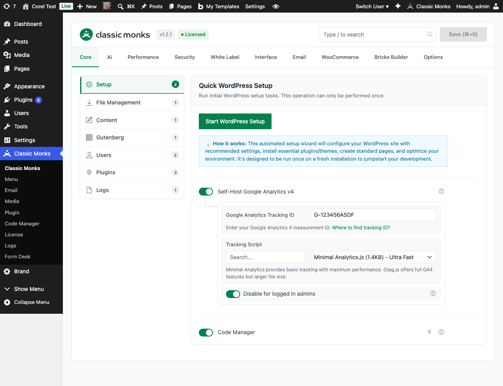

# How to Configure the Vision / Image Provider in WordPress

> The Vision / Image Provider is a separate AI connection dedicated to image-aware workflows, including alt text generation, image generation, image editing, and Bricks AI image attachments.

## Key Takeaways

- Separate from the main AI Provider; uses a different API key and model if configured
- Supports Google Gemini and OpenRouter as vision providers
- Falls back to the main AI Provider when the vision provider cannot handle a workflow
- Required for alt text generation, image generation, and image editing

---

## What Is the Vision / Image Provider?

The Vision / Image Provider is an optional second AI connection in Classic Monks that handles image-aware workflows. When you generate alt text, create an AI image, edit an image with AI, or attach an image to the Bricks AI Builder, the plugin prefers this provider. If the vision provider is not configured, or the selected vision model cannot handle the specific workflow, Classic Monks falls back to the main AI Provider if the main model's capabilities allow it.

## Why You Need It

Image-aware tasks (vision analysis, image generation, image editing) need models that can either see images or produce them. Most text-focused models cannot do both. Configuring a dedicated vision provider:

- **Saves cost**: Use a cheap, fast vision model for image tasks while reserving expensive reasoning models for text
- **Improves quality**: Models like Gemini 3.1 Flash are tuned for multimodal tasks and outperform general text models on image analysis
- **Enables features**: AI Tools like Alt Text Generation, Image Generation, and Image Editing require a vision-capable model; without a vision provider or vision-capable main model, those tools stay disabled
- **Separates billing**: Keep vision costs on one provider and text costs on another

---

## How to Configure the Vision / Image Provider in Classic Monks

### Step 1: Enable AI Features

The Vision / Image Provider is hidden until you turn on **Enable AI Features** in the General subtab. See [How to Enable AI Features in Classic Monks](ai-features-master.md).

### Step 2: Open the General Subtab

Stay on the **General** subtab. Scroll past the AI Provider section to **Vision / Image Provider**.

### Step 3: Pick a Vision Provider

Click the **Vision / Image Provider** dropdown. You have three effective options:



- **Empty (default)**: No separate vision provider. Classic Monks uses the main AI Provider for image workflows when the main model supports them.
- **Google Gemini**: Dedicated Gemini vision configuration with a separate API key and image model.
- **OpenRouter**: Dedicated OpenRouter vision configuration with a separate API key and image-capable model.

A status notice below the dropdown tells you which mode is active. The notice color changes:

- **Blue (info)**: No separate vision provider; main provider will be used if capable
- **Yellow (warning)**: Vision provider is configured but has issues; will fall back to main
- **Blue (info, success)**: Vision provider is configured and working

### Step 4: Enter the Vision API Key

For the chosen vision provider, enter its API key in the password field. The field works the same as the main provider: leave blank to keep the saved key, enter a new value to replace it.

For OpenRouter, you can leave the field blank to **reuse the main OpenRouter key**. A dedicated key is useful if you want to bill vision calls separately.

### Step 5: Pick a Vision / Image Model

The vision provider exposes a model selector. For Gemini, the dropdown is populated with a curated list of Gemini image models. For OpenRouter, the field accepts any image-capable model identifier. The plugin pre-fills the main OpenRouter model as the default.

For image generation, use a model that supports output images (FLUX, GPT-Image, or Gemini image models). For vision analysis, any image-input-capable model works.

### Step 6: Save Changes

Click **Save Changes**. The Status subtab will report whether the vision provider is valid, has runtime errors, or is missing a model.

---

## Supported Vision Providers

| Provider | Default Model | Image Generation | Image Editing | Notes |
|----------|---------------|------------------|---------------|-------|
| **Google Gemini** | `gemini-3.1-flash` | Yes | Yes | Best balance of cost, speed, and multimodal quality |
| **OpenRouter** | Main OpenRouter model | Depends on model (FLUX, GPT-Image work) | Depends on model | Maximum flexibility; reuse main key or set a dedicated one |

---

## Configuration Options

| Option | Description | Default |
|--------|-------------|---------|
| **Vision / Image Provider** | Selects which provider handles image-aware workflows. | Empty (use main provider) |
| **Vision / Image API Key** | Provider-specific key. For OpenRouter, blank reuses the main key. | Empty |
| **Vision / Image Model** | The model used for alt text, image generation, image editing, and Bricks AI image attachments. | Provider default |
| **Fetch Models** | For OpenRouter, populates the model dropdown with image-capable models from the account. | Button |

---

## Fallback Behavior

The Vision / Image Provider is preferred but not required. When image workflows run, Classic Monks checks in this order:

1. Is the Vision / Image Provider configured and valid?
2. Can the vision provider's model handle this specific workflow (vision analysis, generation, or editing)?
3. If yes, route the request to the vision provider.
4. If no, fall back to the main AI Provider.
5. If the main provider's model also cannot handle it, the workflow fails with a clear notice.

This means you can leave the vision provider unconfigured and still get image workflows if your main model supports them. Configuring a vision provider just gives you a faster, cheaper, more specialized path for those tasks.

## Bricks AI Image Attachments

When **Bricks AI Builder** is enabled and you attach an image in the Bricks chat, the attachment is routed through the Vision / Image Provider (or the main provider as a fallback). A status notice under the Bricks AI Builder toggle tells you which path is active:

- "Bricks Ai image attachments are enabled through the Vision / Image provider (Gemini)" when the vision provider is configured
- "Bricks Ai image attachments are enabled directly through the active text model" when the main provider handles them
- An error message when neither path is supported

---

## Advanced Options (Developers)

The vision provider is resolved by `cm_get_ai_vision_provider()`. You can override it via the `cm_ai_vision_provider` filter:

```php
add_filter( 'cm_ai_vision_provider', function( $provider, $workflow ) {
    // Force OpenRouter for image generation, Gemini for everything else
    if ( $workflow === 'image_generation' ) {
        return 'openrouter';
    }
    return $provider;
}, 10, 2 );
```

The `cm_ai_vision_provider` filter receives the current provider slug and the workflow identifier (`image_analysis`, `image_generation`, `image_editing`).

---

## Troubleshooting

### Alt Text Generation Tool Shows "No Vision" Warning

**Cause:** No vision provider is configured, and the main AI Provider's model does not support image analysis.
**Fix:** Configure the Vision / Image Provider with Gemini or an OpenRouter image-capable model. The warning clears on the next page load.

### Image Generation Tool Shows "Select Model"

**Cause:** Gemini vision provider is selected but no Gemini image model is set.
**Fix:** Open the Vision / Image Provider section, pick a Gemini image model from the dropdown, and save.

### Vision Provider Returns 401 or 403

**Cause:** API key is wrong, revoked, or lacks vision API access.
**Fix:** Generate a new key in the provider's dashboard. For OpenRouter, ensure the account has credits. For Gemini, ensure the key has access to the Gemini API (not just older PaLM endpoints).

### Fallback to Main Provider Not Working

**Cause:** Main provider's model does not support the requested workflow.
**Fix:** Switch the main AI Provider to a model that supports images (any Gemini 2.0+ model, GPT-4o, Claude 3.5+), or configure the Vision / Image Provider explicitly.

---

## Frequently Asked Questions

### When do I need a separate Vision / Image Provider?

Only for image-aware workflows: Alt Text Generation, Image Generation, Image Editing, and Bricks AI Builder image attachments. If you only use text AI (Agent, Title, Excerpt, Summarize, Review), the main AI Provider is enough.

### Should I use Gemini or OpenRouter as the Vision Provider?

**Gemini** is the recommended choice for most users. It has native image understanding and generation, fast inference, and a generous free tier. **OpenRouter** is more flexible: you can pick any image-capable model, including FLUX for image generation or any multimodal model for vision. Use OpenRouter when you need a specific model that Gemini doesn't offer.

### Can I use the same API key for the Vision Provider and the main AI Provider?

Yes. For OpenRouter, you can leave the Vision Provider API key blank to reuse the main OpenRouter key. For Gemini, the Vision Provider has its own key field, but you can paste the same key. The only reason to use different keys is to bill image workflows separately.

### What happens if I don't configure a Vision Provider?

The AI Tools that need image capability (Alt Text, Image Generation, Image Editing) show a "No Vision" status pill and are disabled. Text AI tools continue to work. The Bricks AI Builder image attachment feature falls back to the main AI Provider if it supports images, otherwise the attachment is disabled.

## Related Articles

- [How to Enable AI Features in Classic Monks](ai-features-master.md)
- [How to Configure the AI Provider in Classic Monks](ai-provider.md)
- [How to Use AI Tools in Classic Monks](ai-tools.md)
- [How to Use Bricks AI Builder in Classic Monks](../bricks/bricks-ai-builder.md)
