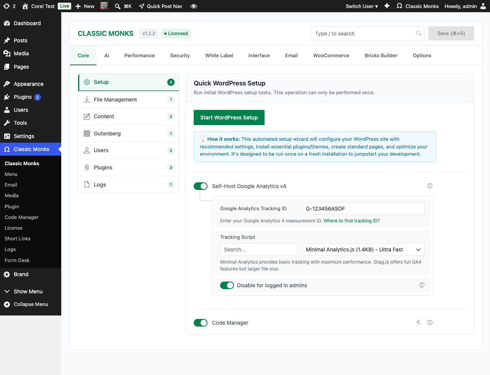
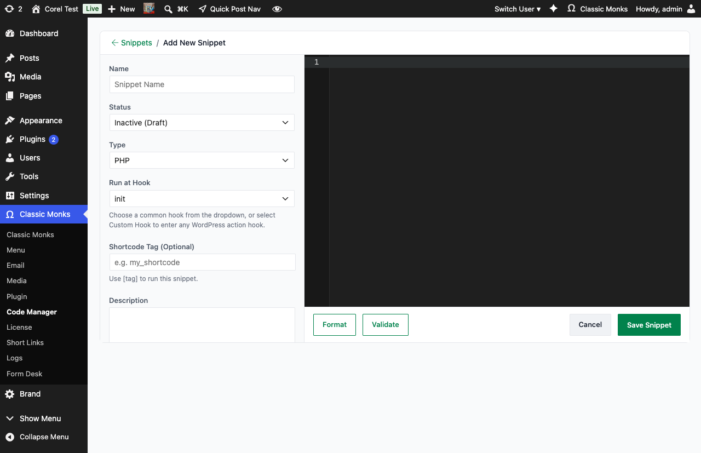

# How to Add Code Snippets in WordPress (PHP, CSS, JS)

> The Code Manager lets you add PHP, CSS, and JavaScript snippets directly from the WordPress admin without touching theme files or FTP.

## Key Takeaways

- Add, edit, and manage PHP, CSS, and JS code snippets from one dashboard
- No theme file editing required, so updates won't overwrite your changes
- Supports conditional loading so snippets only run where you need them

---

## What Is the Code Manager?

The Code Manager is a built-in snippet manager in Classic Monks that adds a dedicated submenu under the Classic Monks dashboard. It lets you write and organize PHP, CSS, and JavaScript code snippets, then activate or deactivate them with a single toggle.

Instead of editing `functions.php` or creating custom plugin files, you manage everything from a clean admin interface with syntax highlighting and error handling.

## Why You Need It

Most WordPress sites accumulate custom code scattered across theme files, child theme functions, and inline `<script>` tags. When your theme updates, that code disappears. When you switch themes, it's gone entirely.

The Code Manager solves this by keeping your custom code in the database, independent of your theme. Every snippet is toggleable, so you can test changes without deleting code, and your customizations survive theme switches and updates.

---

## How to Enable Code Manager in Classic Monks

### Step 1: Navigate to Classic Monks Settings

Click into the **Classic Monks** plugin settings in your WordPress dashboard.

### Step 2: Go to the Core Tab

Click on the **Core** menu.

### Step 3: Enable Code Manager

Under the **Setup** subtab, scroll to the bottom and toggle on **Code Manager**. The toggle has a submenu indicator (the `«` icon) that signals it adds a new submenu to the admin sidebar.



### Step 4: Save and Reload

Click **Save Changes**, then reload the page. A new **Code Manager** submenu appears under **Classic Monks** in the admin sidebar.

---

## How to Add a Code Snippet

### Step 1: Open Code Manager

Click **Classic Monks > Code Manager** in the admin sidebar. The Snippets list loads, showing all saved snippets with their status, type, hook, and last modified date.


### Step 2: Add New Snippet

Click the **Add New Snippet** button at the top of the page.

### Step 3: Configure Your Snippet

The Add New Snippet page has two columns: metadata on the left, code editor on the right.



- **Title:** Give your snippet a descriptive name (e.g., "Remove jQuery Migrate")
- **Status:** Choose **Active** to run the snippet or **Inactive (Draft)** to save it without executing
- **Type:** Select **PHP**, **CSS**, **JavaScript**, or another supported type
- **Run at Hook:** Pick a common WordPress action hook from the dropdown (or select Custom Hook to enter any hook)
- **Shortcode Tag (Optional):** If you want to run the snippet via a shortcode, enter a tag like `my_shortcode` and use `[my_shortcode]` in your content
- **Description:** Internal notes for documentation
- **Code:** Paste or write your code in the syntax-highlighted editor

### Step 4: Validate and Format

Click **Validate** to check the code for syntax errors before saving. Click **Format** to auto-format the code using the bundled JS Beautify library.

### Step 5: Save and Test

Click **Save Snippet**. Your snippet is now active (if Status is Active). Test it on the frontend to confirm it works as expected.

### Step 6: Manage Existing Snippets

Back on the Snippets list, you can:

- Toggle a snippet's status on or off without deleting it
- Filter by **Type**, **Status**, or **Group** using the dropdowns above the table
- Search by name using the search field
- Edit, export, duplicate, or delete individual snippets using the action icons in the Actions column

---

## Configuration Options

| Option | Description | Default |
|--------|-------------|---------|
| **Snippet Title** | Descriptive name for identification | Required |
| **Snippet Type** | PHP, CSS, or JavaScript | PHP |
| **Active/Inactive Toggle** | Enable or disable the snippet without deleting it | Active |
| **Conditions** | Restrict where the snippet loads (page, post type, URL) | None (runs everywhere) |
| **Priority** | Execution order for PHP snippets | 10 |

---

## Tips for Writing Snippets

### PHP Snippets

PHP snippets run in the WordPress execution context. You have access to all WordPress functions, hooks, and APIs.

```php
// Example: Remove the WordPress version number from the head
add_action('wp_head', function() {
    remove_action('wp_head', 'wp_generator');
});
```

**Important:** Do not include opening `<?php` or closing `?>` tags. The Code Manager handles these automatically.

### CSS Snippets

CSS snippets are injected into the `<head>` of your pages. Use them for quick style overrides without editing theme files.

```css
/* Example: Hide the admin bar on the frontend for all users */
body {
    margin-top: 0 !important;
}
```

### JavaScript Snippets

JavaScript snippets are loaded in the footer by default. Use them for custom interactions, analytics events, or DOM manipulation.

```javascript
// Example: Log page load time to console
window.addEventListener('load', function() {
    console.log('Page loaded in ' + performance.timing.loadEventEnd + 'ms');
});
```

---

## Advanced Options (Developers)

### Conditional Loading

The Code Manager supports WordPress conditional tags for targeting snippets:

- **Page:** Load only on specific pages by ID or slug
- **Post Type:** Load only on posts, pages, or custom post types
- **URL Match:** Load only when the current URL contains a specific string
- **Logged In:** Load only for logged-in users or guests

### Snippet Priority

PHP snippets have a priority setting (default: 10) that controls execution order. Lower numbers run first. Use this when you have multiple snippets that depend on each other.

### Programmatic Snippet Management

You can register snippets programmatically in a custom plugin or theme:

```php
// Register a snippet via code
add_action('cm_code_manager_snippets', function($snippets) {
    $snippets[] = [
        'title' => 'My Custom Snippet',
        'type' => 'php',
        'code' => 'add_action("wp_head", function() { echo "<meta name=\"custom\" content=\"value\">"; });',
        'active' => true,
    ];
    return $snippets;
});
```

---

## Troubleshooting

### Snippet Not Loading

**Cause:** The Code Manager was enabled but the page wasn't reloaded, or the snippet is set to inactive.
**Fix:** Reload the admin page after enabling Code Manager. Check that the snippet toggle is set to active.

### PHP Parse Error

**Cause:** A syntax error in the PHP snippet (missing semicolon, unclosed bracket, or incorrect function call).
**Fix:** Deactivate the snippet from the Code Manager list, fix the syntax error, then reactivate it. The Code Manager will show the error line number if available.

### CSS Not Applying

**Cause:** The CSS is being overridden by theme styles or another plugin with higher specificity.
**Fix:** Increase selector specificity or add `!important` to your CSS rules. Check the browser inspector to see if your styles are loaded but overridden.

### JavaScript Console Error

**Cause:** The script references a variable or function that hasn't loaded yet (dependency issue).
**Fix:** Check that the script doesn't depend on plugins or libraries that load after your snippet. Consider wrapping the code in a DOMContentLoaded event listener.

---

## Related Articles

- [How to Set Up the AI Agent in Classic Monks](ai/ai-agent.md)
- [How to Manage WordPress Performance Settings](performance.md)
- [How to Create Short Links with Click Tracking](short-links-tracking.md)
