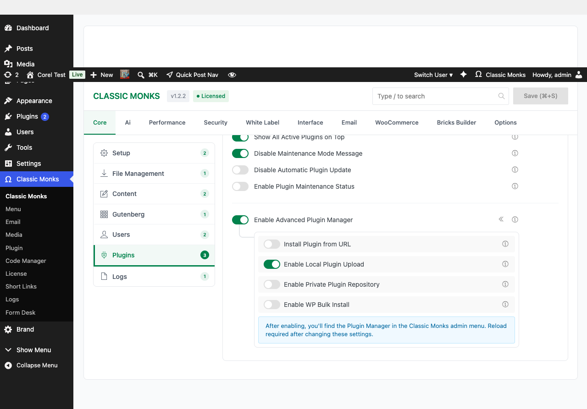
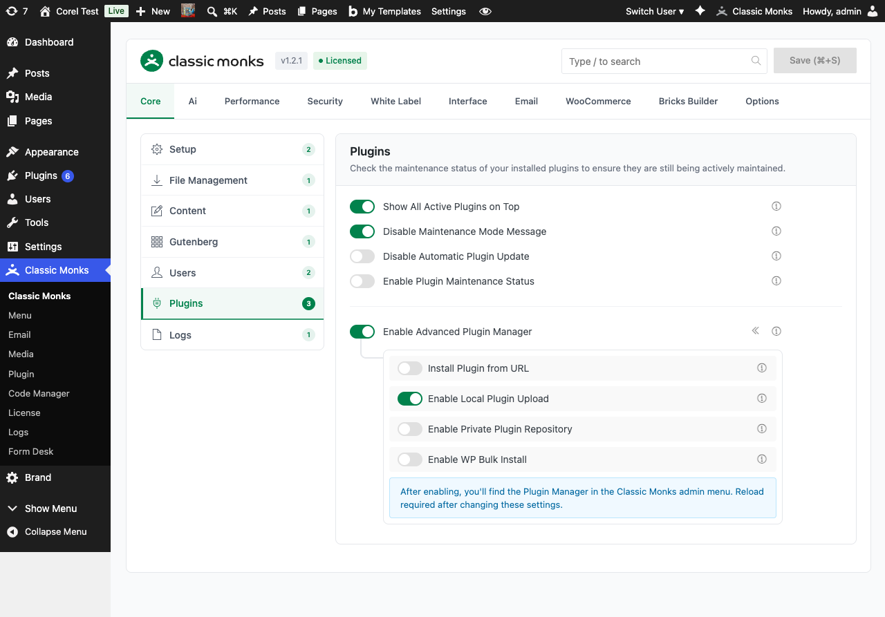

# How to Use the Google Drive Plugin Repository in WordPress

> The Private Plugin Repository turns Google Drive into a plugin distribution source, letting teams install plugins from a shared Drive folder directly through the Classic Monks Plugin Manager.

## Key Takeaways

- Use Google Drive as a centralized plugin distribution source
- Authenticate with Google API to access private or shared drives
- Install plugins from a Drive folder without manual download/upload
- Requires Advanced Plugin Manager enabled
- Best for agencies and teams managing multiple client sites

---

## What Is the Google Drive Plugin Repository?

The Private Plugin Repository is a sub-feature of the Classic Monks Advanced Plugin Manager. It connects your WordPress site to a Google Drive folder and lets administrators browse and install plugins stored in that folder. Authentication uses Google API, with support for both personal Google accounts and Google Workspace shared drives.

## Why You Need It

For agencies and teams, distributing custom plugins across multiple sites is a recurring problem:

- Each developer maintains their own copy
- Updates require manual notification and download
- Version control is ad hoc
- Premium plugin distribution is fragile

Using Google Drive as the distribution source solves each of these:

- **Centralized**: One Drive folder, one source of truth
- **Versioned**: Drive's native file history tracks every change
- **Access-controlled**: Drive's sharing permissions replace custom auth
- **Audit-able**: Drive's activity log shows who installed what and when

---

## How to Set Up the Google Drive Plugin Repository in Classic Monks

### Step 1: Enable the Feature

In the Classic Monks Core tab, Plugins subtab, enable:

- **Enable Advanced Plugin Manager** (master toggle, with the submenu indicator `«` icon that signals it adds the Plugin Manager submenu)
- **Enable Private Plugin Repository** (sub-toggle)



### Step 2: Navigate to the Plugin Manager

Click **Classic Monks > Plugin** in the WordPress admin menu. The Plugin Manager opens with multiple tabs: one for each install method (Install from URL, Local Upload, Google Drive, Author Search, etc.).


### Step 3: Set Up Google API Credentials

In the Plugin Manager, open the **Private Repository** tab. You will need:

1. A Google Cloud project with the Google Drive API enabled
2. OAuth 2.0 credentials (Client ID and Client Secret)
3. A configured OAuth consent screen

The Plugin Manager walks you through creating these credentials in the Google Cloud Console.

### Step 4: Authenticate with Google

Click **Connect to Google Drive**. You will be redirected to Google's OAuth flow. Sign in with the Google account that has access to the Drive folder containing your plugins.

### Step 5: Select the Drive Folder

After authentication, browse your Drive folders. Select the folder that contains the plugin ZIPs you want to make available.

### Step 6: Save Settings

Click **Save Settings** in the Plugin Manager. The Drive folder is now linked.

### Step 7: Install Plugins

When you need to install or update a plugin, open the Plugin Manager's **Private Repository** tab. The Plugin Manager lists all plugin ZIPs in the selected Drive folder. Click **Install** next to the plugin you want.



### Step 8: Activate (If Not Auto-Activated)

If the Plugin Manager does not auto-activate the installed plugin, go to the Plugins page and click **Activate**.

---

## Google Drive Folder Structure

The Plugin Manager expects this structure inside your selected Drive folder:

```
Your Drive Folder/
├── plugin-slug-1.zip          # Each plugin as a ZIP
├── plugin-slug-2.zip
├── another-plugin.zip
└── _archive/                  # Optional archive folder (ignored)
    └── old-plugin.zip
```

Each ZIP should follow standard WordPress plugin structure. The plugin slug is derived from the ZIP filename (without the `.zip` extension).

## Multi-Site Setup

For agencies managing multiple client sites:

1. Create one shared Drive folder per client (or one master folder for your agency)
2. Authenticate each site with the appropriate Google account
3. Use Drive's sharing permissions to control which sites can install which plugins
4. Drive's audit log shows install history across all sites

This pattern works well with Google Workspace, where you can use shared drives for granular access control.

---

## Configuration Options

| Option | Description | Default |
|--------|-------------|---------|
| **Enable Advanced Plugin Manager** | Master toggle for the entire feature set. | Off |
| **Enable Private Plugin Repository** | Enables Google Drive integration. | Off |
| **Google Client ID** | OAuth 2.0 Client ID from Google Cloud Console. | Empty |
| **Google Client Secret** | OAuth 2.0 Client Secret from Google Cloud Console. | Empty |
| **Drive Folder ID** | The Google Drive folder containing plugin ZIPs. | Empty |
| **Auto-activate after install** | Whether to activate plugins immediately after install. | Off |

The Client ID, Client Secret, and Folder ID are configured in the Plugin Manager's Private Repository tab after the master toggle is enabled.

---

## Common Use Cases

### Agency Distributing Premium Plugins

You maintain a private plugin catalog for clients. Store the ZIPs in a shared Drive folder, authenticate each client site, and clients can install from the catalog.

### Internal Team Plugin Library

Your development team maintains internal-use plugins. Store them in a shared Drive folder, all team sites can install and update.

### Staging-to-Production Migration

A staging site has a custom plugin. Upload the plugin ZIP to Drive from staging, install on production through the Private Repository.

### Version-Controlled Plugin Distribution

Use Drive's file versioning as a lightweight plugin repository. Every change is tracked; clients always see the latest version.

---

## Developer Notes

Enable Private Plugin Repository allows installing plugins from Google Drive. No developer hooks are currently exposed.

**Options used:**
| Option | Type | Default |
|--------|------|---------|
| `enable_private_plugin_repository` | Boolean | `false` |
---

## Troubleshooting

### Authentication Fails with "Invalid Client" Error

**Cause:** The Client ID or Client Secret is wrong, or the Google Cloud project's OAuth consent screen is not configured.
**Fix:** Verify the credentials in the Plugin Manager. Check that the Google Cloud project has the Google Drive API enabled and the OAuth consent screen is published (or the test users include your account).

### Drive Folder Does Not Appear After Authentication

**Cause:** The authenticated Google account does not have access to the folder, or the folder does not contain valid plugin ZIPs.
**Fix:** Verify the Drive folder is shared with the authenticated account. Verify the folder contains ZIP files with valid plugin structure.

### "Insufficient Permissions" Error on Install

**Cause:** The Google account that authenticated no longer has access to the Drive folder, or the OAuth token has expired and refresh failed.
**Fix:** Re-authenticate in the Plugin Manager. Verify the Drive folder sharing settings.

### Plugin Installs But Does Not Activate

**Cause:** The plugin's activation requirements are not met, or the plugin has a fatal error.
**Fix:** Check the plugin's requirements. Manually activate to see the specific error.

### "API Rate Limit Exceeded" Error

**Cause:** Too many Drive API calls in a short period (Google's quota).
**Fix:** Wait a few minutes and retry. The Plugin Manager caches Drive folder listings to reduce API calls.

### Plugin Manager Submenu Does Not Appear

**Cause:** Advanced Plugin Manager is not enabled, or `DISALLOW_FILE_MODS` is set.
**Fix:** Enable the master toggle. Remove the `DISALLOW_FILE_MODS` constant if set.

---

## Frequently Asked Questions

### Do I need a Google Workspace account to use this feature?

No. Any Google account works, including personal Gmail accounts and Google Workspace accounts. The Plugin Manager authenticates via Google OAuth, which works with all Google account types. Workspace shared drives are supported for team use.

### What Google API permissions does the Plugin Manager need?

The Plugin Manager requests `drive.readonly` scope, which lets it list and read files in the Drive folder you specify. It does not request write access to your Drive, and it cannot modify or delete files. This is the minimum scope needed to list plugin ZIPs and download them.

### Can I use a Google Drive folder shared with my team?

Yes. The Plugin Manager works with any Drive folder the authenticated account can access, including shared folders and shared drives. The authentication happens once; the access token is stored encrypted in WordPress options. If the team changes folder permissions, re-authenticate to refresh the access.

### What happens if my Google access token expires?

Google OAuth access tokens expire after 60 minutes. The Plugin Manager automatically refreshes the token using the stored refresh token. If the refresh fails (e.g., the user revoked access, the OAuth client was deleted), the Plugin Manager prompts for re-authentication.

### Can I use a shared drive as my plugin repository for a multi-site network?

Yes. This is one of the strongest use cases. Set up one Drive folder with the standard plugin set, then on each site in the network, authenticate with the same Google account. All sites can install from the same shared repository, ensuring version consistency across the network.

## Related Articles

- [How to Manage Plugins in Classic Monks (WordPress)](core-plugins.md)
- [How to Install Plugin from URL in Classic Monks](core-advanced-plugin-manager-install-url.md)
- [How to Upload Plugins Locally in Classic Monks](core-advanced-plugin-manager-local-upload.md)
- [How to Use the WordPress.org Author Search in Classic Monks](core-advanced-plugin-manager-author-search.md)
