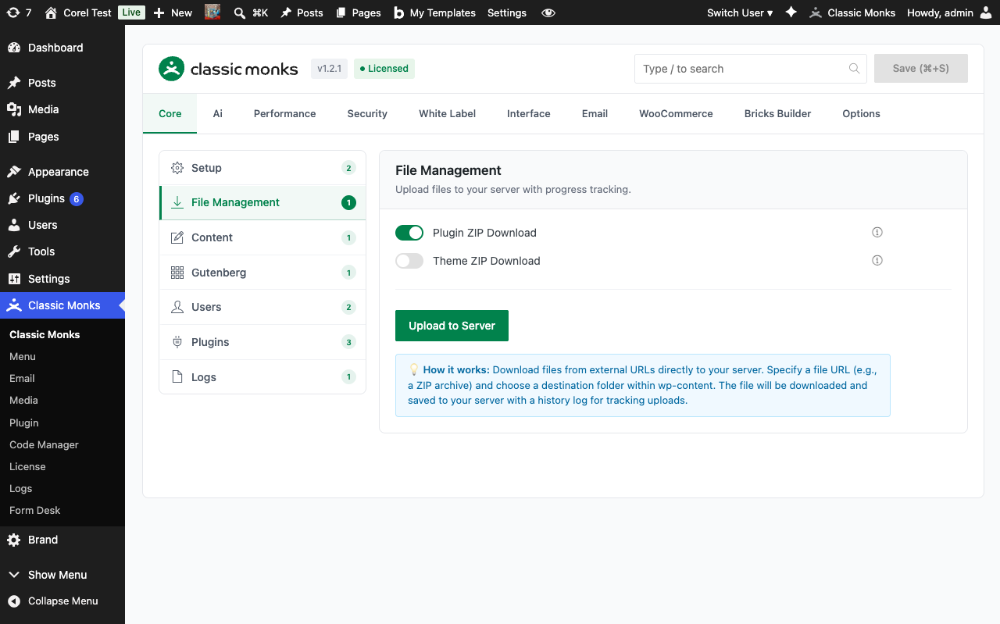

# How to Use the File Downloader in WordPress

> The File Downloader lets you download any installed plugin or theme as a ZIP file directly from the WordPress admin, and upload external files to your server without FTP access.

## Key Takeaways

- Download any installed plugin or theme as a ZIP from the Plugins/Themes pages
- Upload files from external URLs directly to wp-content with progress tracking
- Upload history with per-file delete and access links
- No FTP or server access required

---

## What Is the File Downloader?

The File Downloader is a two-part feature in the Classic Monks Core tab:

- **Plugin and Theme ZIP Downloads**: Adds a download link next to each plugin and theme in the WordPress admin, so you can save a ZIP archive of any installed item.
- **Upload File to Server**: A modal that lets you enter any external URL, browse a directory tree, and download the file directly to your server with real-time progress tracking.

## Why You Need It

Plugin and theme management usually requires FTP, SSH, or a file manager plugin. That means logging into a separate tool, navigating to the right directory, and zipping files manually. For agencies managing many sites, this adds friction to every backup, migration, or handoff.

The File Downloader removes that friction. ZIP downloads work from the same screens you already use to manage plugins. Server uploads happen in the WordPress admin, with a visual directory tree and progress bar.

---

## How to Enable the File Downloader in Classic Monks

### Step 1: Enable Plugin ZIP Download

In the Classic Monks Core tab, **File Management** subtab, toggle on **Plugin ZIP Download**. This adds a download link next to each plugin on the Plugins page.

### Step 2: Enable Theme ZIP Download

Toggle on **Theme ZIP Download**. This adds a download link on the Themes page.

### Step 3: Download a Plugin ZIP

Go to **Plugins > Installed Plugins**. Each plugin row now has a download icon. Click it to download a ZIP archive of that plugin.

### Step 4: Download a Theme ZIP

Go to **Appearance > Themes**. Click the theme details, then click the download link to save a ZIP of the theme.

### Step 5: Upload a File to the Server

Back in the Core tab, **File Management** subtab, click **Upload to Server**. A modal opens with a URL field, directory browser, and upload history.




### Step 6: Enter the File URL

In the modal, paste the URL of the file you want to download (e.g., a ZIP from an external source). The directory tree shows the wp-content folder structure. Click any folder to set it as the upload destination.

### Step 7: Upload

Click **Upload File**. The progress bar shows download progress. When complete, the file appears in the upload history with a link to view and a delete button.

### Step 8: Clear Upload History (Optional)

Click **Clear History** to remove the upload log. This does not delete the uploaded files from the server, only the history records.

---

## Configuration Options

| Option | Description | Default |
|--------|-------------|---------|
| **Plugin ZIP Download** | Adds download links on the Plugins page. | Off |
| **Theme ZIP Download** | Adds download links on the Themes page. | Off |
| **Upload to Server** | Button that opens the upload modal. | Always available |

---

## Upload History

Each upload creates a history entry with:

- **File name**: The name of the uploaded file
- **Folder**: The destination path relative to wp-content
- **Date**: When the upload completed
- **File URL**: Direct link to view the file on the site
- **Delete button**: Removes the file from the server

History persists across sessions. Clear it with the **Clear History** button.

## Plugin ZIP Download Behavior

When you click a plugin's download link:

1. The plugin's directory is zipped in real time (not using a shell zip command, so it works on all hosts)
2. The ZIP is streamed to the browser as a download
3. The ZIP contains the full plugin directory structure

This works for both active and inactive plugins. The download is a read-only operation; it does not affect the running plugin.

## Theme ZIP Download Behavior

Same as plugin downloads, but for themes. The ZIP includes the full theme directory, including any child theme customizations.

---

## Developer Notes

The File Downloader uses standard WordPress hooks and is loaded conditionally:

```php
// Plugin download: adds a download link to each plugin's action links
add_filter('plugin_action_links', 'cm_add_plugin_download_link', 10, 4);

// Theme download: adds a download button via admin_head/admin_footer
add_action('admin_head', 'cm_theme_download_button_style');
add_action('admin_footer', 'cm_theme_download_button_script');
```

**Options used:**
| Option | Type | Default |
|--------|------|---------|
| `enable_plugin_download` | Boolean | `false` |
| `enable_theme_download` | Boolean | `false` |

The upload functionality is handled via AJAX in the download manager. Files are saved to the WordPress uploads directory.

The download and upload handlers use `WP_Filesystem` to ensure compatibility across hosting environments.

---

## Troubleshooting

### Download Link Does Not Appear on Plugins Page

**Cause:** Plugin ZIP Download toggle is off, or the user role lacks the required capability.
**Fix:** Enable the toggle in Core > File Management. Verify the user is an administrator.

### ZIP Download Fails on Large Plugins

**Cause:** PHP memory limit or execution time limit exceeded during ZIP creation.
**Fix:** Increase `memory_limit` and `max_execution_time` in php.ini or wp-config.php. For very large plugins (50MB+), use server-side tools instead.

### Upload Modal Does Not Open

**Cause:** JavaScript error or conflict with another plugin.
**Fix:** Check browser console for errors. Disable other plugins one at a time.

### Upload Fails with Permission Error

**Cause:** WordPress cannot write to the destination folder.
**Fix:** Verify wp-content and the target subfolder have write permissions for the web server user (typically `www-data` or the FTP user).

### Upload Completes But File Is Not Visible

**Cause:** Wrong destination folder, or the file was saved with restrictive permissions.
**Fix:** Check the destination folder in the upload history. Verify the file exists via FTP or the Media Library.

---

## Frequently Asked Questions

### Does the ZIP download include the active state or settings?

No. The ZIP is just the plugin's file system contents (the same files that came with the plugin originally). Active state, settings, and database tables are NOT included. To migrate a fully-configured plugin, use a migration plugin or export/import the relevant options.

### Can I download a theme the same way?

Yes. Theme ZIP Download adds download links to the Themes page. The download includes the theme's file system contents, including any customizations made directly to theme files (not recommended practice, but possible). Child theme customizations stay with the child theme.

### Can the URL upload download files larger than my upload limit?

Yes. URL uploads stream the file to the server rather than going through the PHP upload process. The limit becomes the server's disk space and your hosting's network timeout, not the PHP `upload_max_filesize`. For very large files (1GB+), increase PHP's `max_execution_time` to 600+ seconds.

### Are downloaded files safe to install on another site?

Plugin ZIPs from WordPress.org are the same files the official repository serves, so they're safe. ZIPs from other sources (your own backups, third-party vendors) should be scanned with a malware scanner before installation on production sites. The Plugin Manager does not scan content for malware; it only validates the ZIP structure.

## Related Articles

- [How to Use the Advanced Plugin Manager in Classic Monks](core-advanced-plugin-manager-install-url.md)
- [How to Use the Logs in Classic Monks](core-logs.md)
