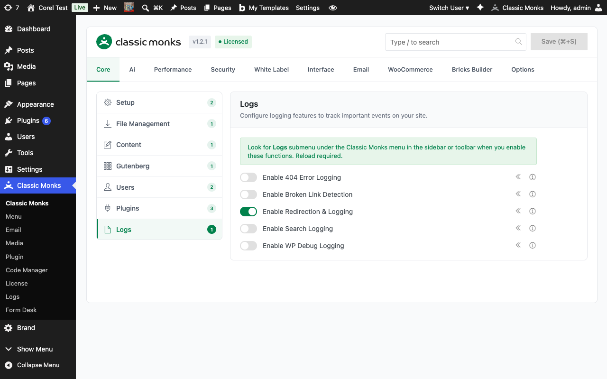
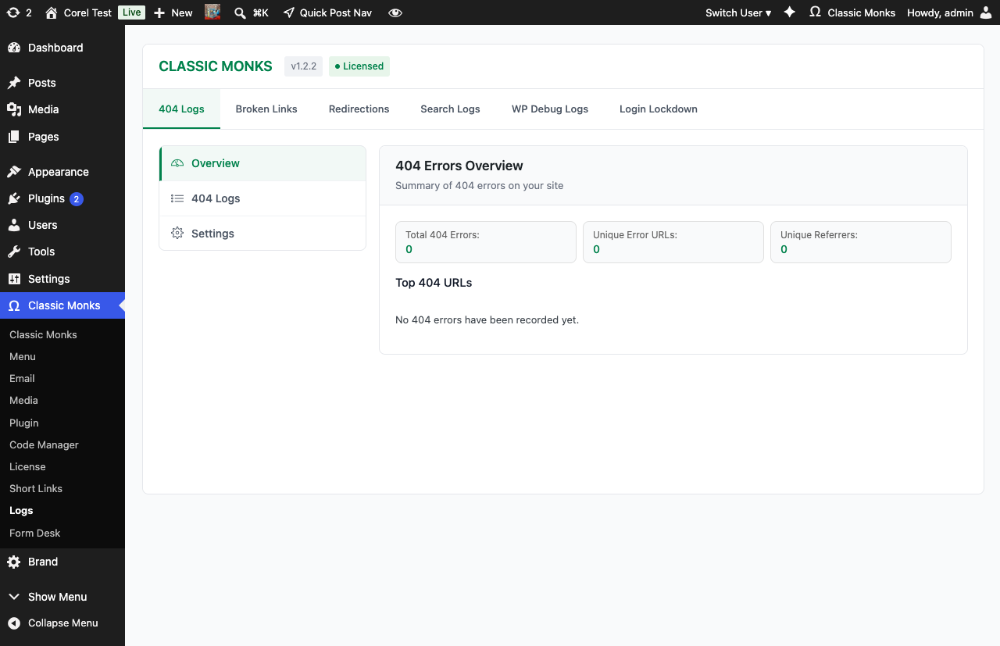
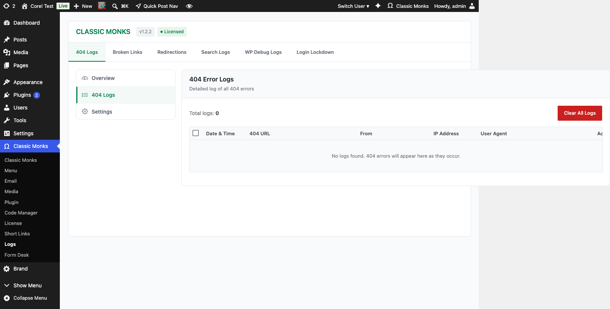
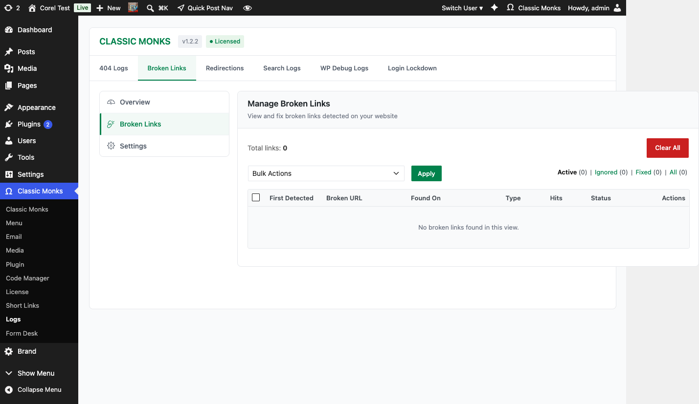
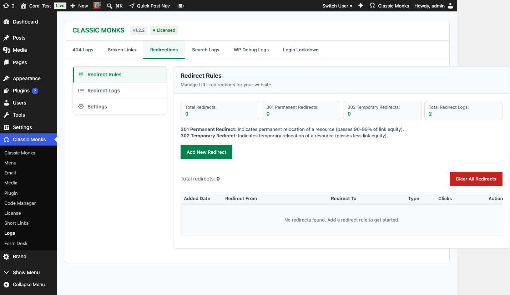
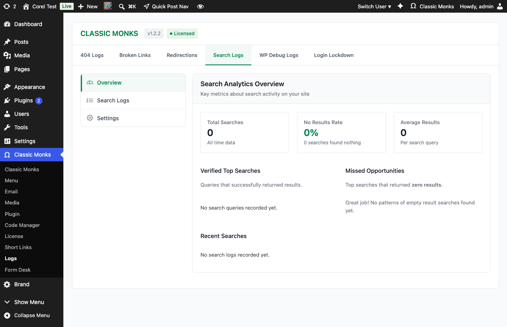
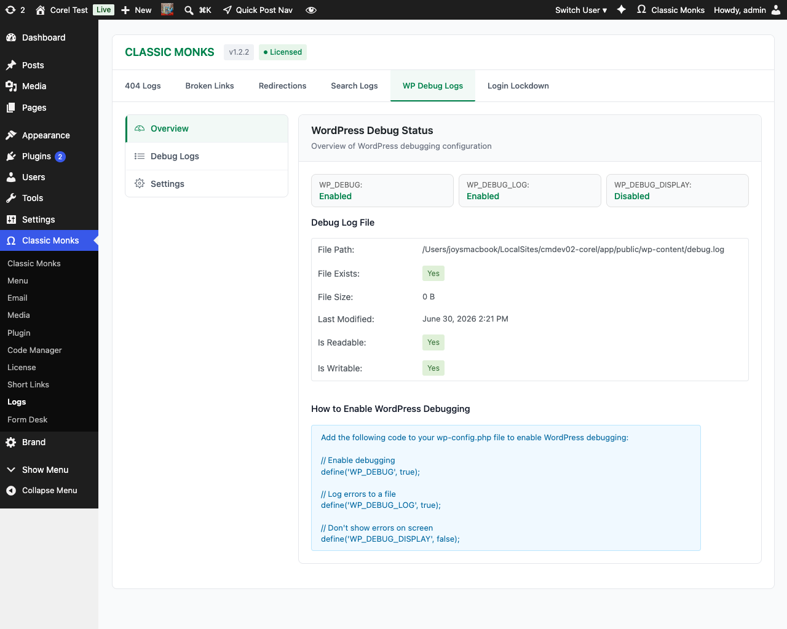

# How to Use Logs in WordPress

> The Logs submenu tracks 404 errors, broken links, redirects, search queries, and WordPress debug output, with a dedicated tab for each log type in the Classic Monks Logs page.

## Key Takeaways

- Track 404 errors with URL, referrer, user agent, and IP
- Detect and manage broken internal and external links
- Log all HTTP redirects with status codes and chain tracking
- Record site search queries for content gap analysis
- View WordPress debug.log from the admin without FTP access

---

## What Are Logs in Classic Monks?

Logs in Classic Monks are five independent tracking features in the Core tab, Logs subtab. Each one captures a specific type of event on your WordPress site and presents it in a dedicated tab under **Classic Monks > Logs**.

## Why You Need It

WordPress's default logging is minimal. By default:

- 404 errors are not tracked
- Broken links are silent
- Redirects happen invisibly
- Search queries are discarded
- WordPress errors require FTP access to debug.log

Classic Monks adds visibility to each of these without requiring separate plugins or external monitoring services.

---

## How to Enable Logs in Classic Monks

### Step 1: Navigate to Settings

Click into the **Classic Monks** plugin settings in your WordPress dashboard.

### Step 2: Go to the Logs Subtab

Click on the **Core** menu, then click the **Logs** subtab.

### Step 3: Enable the Log Types You Want

Toggle on the log types you need. Each adds a corresponding tab to the **Classic Monks > Logs** submenu. A page reload is required after enabling.




### Step 4: Save Changes

Click **Save Changes** and reload the admin.

### Step 5: Access the Logs

Click **Classic Monks > Logs** in the admin menu. The Logs page opens with tabs for each enabled log type.



---

## The Five Log Types

### 404 Error Logging

Captures every 404 error with:

- **URL requested**: The path that returned 404
- **Referrer**: The page that linked to the missing URL
- **User agent**: Browser and OS
- **IP address**: Visitor IP (subject to privacy regulations)
- **Timestamp**: When the error occurred

**Best for:** Identifying broken internal links, finding missing content to restore, planning redirects, SEO cleanup.

**In the Logs page:** The **404** tab shows a table of every captured 404 with the request URL, referrer, user agent, IP, and timestamp. Use the action icons to delete individual entries or bulk-clear.



### Broken Link Detection

Automatically scans content for broken internal and external links, checking link availability and reporting dead links with repair suggestions.

**Best for:** Maintaining site quality, preventing dead link clicks, SEO maintenance, link rot prevention.

**How it works:** Runs a scheduled scan (configurable) that checks each link in your content for HTTP status. Dead links are flagged for review.

**In the Logs page:** The **Broken Links** tab shows the scan status, a list of detected dead links with their source URL and last-checked status, and a button to trigger a manual scan.



### Redirection and Logging

Tracks all HTTP redirects on your site, including:

- Redirect status codes (301, 302, 307, 308)
- Source and destination URLs
- Redirect chain length
- Redirect triggers (manual rules, automatic patterns)

**Best for:** Monitoring redirect chain performance, identifying redirect loops, understanding URL structure changes and their impact.

**In the Logs page:** The **Redirection** tab combines redirect rule management with the redirect activity log. Add or edit rules in one panel and review captured redirects in the other.



### Search Logging

Records all search queries performed on your site, including:

- Search terms
- Result count
- User information (logged-in users only, by default)
- Timestamp
- Click-through on results (if enabled)

**Best for:** Understanding user intent, identifying content gaps, improving site search functionality, guiding content strategy.

**In the Logs page:** The **Search** tab shows every captured search query with the term, result count, user (if logged in), and timestamp. Filter by date range and export the list for analysis.



### WP Debug Logging

Provides an admin interface to view, filter, and manage the WordPress `debug.log` file without FTP access or filesystem navigation.

**Requires:** `WP_DEBUG` and `WP_DEBUG_LOG` must be enabled in `wp-config.php`:

```php
define( 'WP_DEBUG', true );
define( 'WP_DEBUG_LOG', true );
define( 'WP_DEBUG_DISPLAY', false ); // Don't show errors on frontend
```

The Logs page shows the debug.log contents in a readable format with severity indicators.

**Best for:** Quick error identification during development, client debugging without exposing server access.

**In the Logs page:** The **Debug** tab reads the `wp-content/debug.log` file and shows entries with severity, file, line number, and the full message. Use the level filter to hide notices and warnings.



---

## Configuration Options

| Option | Description | Default |
|--------|-------------|---------|
| **Enable 404 Error Logging** | Track 404 errors. Adds 404 tab to Logs. Page reload required. | Off |
| **Enable Broken Link Detection** | Scan for broken links. Adds Broken Links tab to Logs. Page reload required. | Off |
| **Enable Redirection and Logging** | Track redirects. Adds Redirection tab to Logs. Page reload required. | Off |
| **Enable Search Logging** | Record search queries. Adds Search tab to Logs. Page reload required. | Off |
| **Enable WP Debug Logging** | View debug.log in admin. Adds Debug tab to Logs. Page reload required. | Off |

---

## Data Retention

Each log type has different retention characteristics:

| Log Type | Storage | Retention | Cleanup |
|----------|---------|-----------|---------|
| 404 Errors | Custom database table | Configurable | Manual or scheduled |
| Broken Links | Custom database table | Until link is fixed | Auto-removed when fixed |
| Redirects | Custom database table | Configurable | Manual or scheduled |
| Search Queries | Custom database table | Configurable | Manual or scheduled |
| Debug Log | WordPress debug.log file | Until file is cleared | Manual file truncation |

The Logs page includes cleanup tools for each log type (delete individual entries, bulk delete, truncate table).

---

## Performance Considerations

| Log Type | Performance Impact | Notes |
|----------|-------------------|-------|
| 404 Error Logging | Low | Single INSERT on 404 response |
| Broken Link Detection | Medium-High | Scheduled scans hit external URLs |
| Redirection and Logging | Low | Single INSERT on redirect |
| Search Logging | Low | Single INSERT per search |
| WP Debug Logging | None (read-only) | Reading the log file |

For high-traffic sites, the log tables can grow quickly. Configure aggressive cleanup schedules for 404 and search logs to prevent table bloat.

---

## Privacy and Compliance

Each log type captures different data. Compliance considerations:

- **404 Errors**: Captures visitor IP addresses. Subject to GDPR, CCPA, and similar regulations.
- **Search Queries**: Captures user behavior. May be considered personal data.
- **Broken Links**: Does not capture visitor data; only checks link availability.
- **Redirects**: Does not capture visitor data; only logs redirect events.
- **Debug Log**: Captures server-side errors; may include sensitive data in error messages.

For production sites subject to privacy regulations, add a disclosure in your privacy policy and configure log retention to align with your data handling practices.

---

## Common Use Cases

### SEO Audit and Cleanup

Enable 404 Error Logging and Broken Link Detection. After a week, review the captured URLs, identify patterns, and set up redirects for moved content.

### Content Gap Analysis

Enable Search Logging. After a month, review the queries with zero results. These represent content gaps; create posts targeting those queries.

### Redirect Chain Optimization

Enable Redirection and Logging. Audit your existing redirects for chains (A → B → C). Consolidate multi-hop chains into single redirects to improve page load speed.

### Production Error Monitoring

Enable WP Debug Logging in production (with `WP_DEBUG_DISPLAY = false`). Catch errors that would otherwise be invisible to site owners.

### Migration Verification

After migrating a site, enable 404 Error Logging for a week. Any unexpected 404s indicate broken internal links from the migration.

---

## Developer Notes

The Logs system provides 404 tracking, broken link scanning, search logging, and debug log viewing. No developer hooks are currently exposed.

**Options used:**
| Option | Type | Default |
|--------|------|---------|
| `enable_404_logging` | Boolean | `false` |
| `enable_broken_link_scanner` | Boolean | `false` |
| `enable_search_logging` | Boolean | `false` |
| `enable_debug_log_viewer` | Boolean | `false` |

---

## Troubleshooting

### Logs Page Tab Does Not Appear After Enabling

**Cause:** Page reload not performed, or the toggle was not actually enabled.
**Fix:** Reload the admin page. Verify the toggle is on in Core > Logs.

### 404 Log Is Empty Despite 404s

**Cause:** A caching layer is serving a cached 404 response without hitting WordPress.
**Fix:** Configure caching to not cache 404 responses, or check the cache plugin's documentation.

### Broken Link Scan Times Out

**Cause:** Too many links to check, or external sites are slow to respond.
**Fix:** Reduce the scan batch size using the `cm_broken_link_scan_batch_size` filter. Increase PHP's `max_execution_time`.

### Debug Log Tab Is Empty

**Cause:** `WP_DEBUG_LOG` is not enabled, or the log file does not exist yet (no errors to log).
**Fix:** Add `define('WP_DEBUG_LOG', true);` to wp-config.php. Trigger a known error to verify logging works.

### Log Tables Are Too Large

**Cause:** High-traffic site without log cleanup.
**Fix:** Use the cleanup tools in the Logs page. Schedule regular cleanup via cron or a maintenance plugin.

### Search Logging Captures Too Many Queries

**Cause:** Bots and spam searches are inflating the log.
**Fix:** Exclude known bot user agents. Add a minimum query length filter. Limit logging to logged-in users.

---

## Frequently Asked Questions

### Do logs slow down my site?

Each log entry is a single database insert per event, so the overhead is small. 404 logging on a high-traffic site can grow the log table fast. The Logs page includes cleanup tools (delete individual entries, bulk delete, truncate) for managing table size. Configure aggressive retention for high-traffic sites.

### Where is the WP Debug log data stored?

Classic Monks reads from the standard WordPress `debug.log` file in `wp-content/`. The Logs > Debug tab shows the file contents in a readable format with severity indicators. Classic Monks does not write to this file; WordPress does, when `WP_DEBUG_LOG` is enabled. If the file does not exist, the tab shows a notice explaining how to enable debug logging.

### Are search queries logged for logged-out users?

By default, no. Search Logging records queries only from logged-in users to avoid filling the log with bot traffic and anonymous spam searches. You can change this by filtering `cm_search_log_include_anonymous` to return `true` in your theme's `functions.php` or a custom plugin.

### Does the 404 log capture IP addresses?

Yes, when 404 logging is enabled, each entry includes the visitor IP, user agent, referrer, and the requested URL. This is subject to privacy regulations (GDPR, CCPA). If you operate in a regulated jurisdiction, add a disclosure in your privacy policy and configure log retention to align with your data handling practices. Use the cleanup tools to purge logs on a schedule.

### Can I export logs?

The Logs page supports per-tab filtering and clearing. Export is not built into the plugin. For export, query the underlying tables directly (`wp_cm_logs_404`, `wp_cm_logs_search`, etc.) using phpMyAdmin or a query plugin, or use WordPress's built-in export tools for the redirect rules.

## Related Articles

- [How to Use the File Downloader in Classic Monks](core-file-downloader.md)
- [How to Configure AI Advanced Settings in Classic Monks](../ai/ai-advanced.md)
