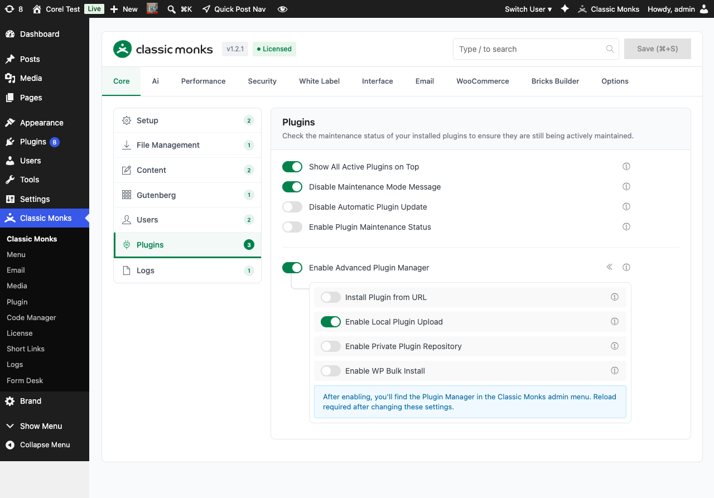

# How to Manage Plugins in WordPress

> Plugin management features in Classic Monks reorder the plugins list, disable automatic updates, show maintenance status with warnings, and gate the Advanced Plugin Manager.

## Key Takeaways

- Show all active plugins at the top of the Plugins page
- Disable automatic plugin updates for full control
- Show plugin maintenance status indicators
- Warn admin when plugins have not been updated for 2+ years
- Enable the Advanced Plugin Manager for URL, local, and Google Drive installations

---

## What Are Plugin Management Features?

The plugin management features in Classic Monks are toggles in the Core tab, Plugins subtab. They control how the Plugins page is organized, whether plugins update automatically, and whether the Advanced Plugin Manager is available.

## Why You Need It

WordPress's default plugin management is functional but limited:

- The plugins list is alphabetical, mixing active and inactive plugins
- Automatic updates can break compatibility with no warning
- Plugins abandoned by their authors are a security risk, but WordPress does not flag them
- Installing plugins from URLs or Google Drive requires FTP or external tools

Classic Monks addresses each of these.

---

## How to Enable Plugin Management Features in Classic Monks

### Step 1: Navigate to Settings

Click into the **Classic Monks** plugin settings in your WordPress dashboard.

### Step 2: Go to the Plugins Subtab

Click on the **Core** menu, then click the **Plugins** subtab.

### Step 3: Enable the Features You Want

Toggle on the plugin management features you need. The Advanced Plugin Manager adds the Plugin submenu to the Classic Monks menu.

### Step 4: Configure Advanced Plugin Manager (If Enabled)

When **Enable Advanced Plugin Manager** is on, the nested options expand with the four installation method toggles. See the related docs:

- [Install Plugin from URL](core-advanced-plugin-manager-install-url.md)
- [Enable Local Plugin Upload](core-advanced-plugin-manager-local-upload.md)
- [Enable Private Plugin Repository (Google Drive)](core-advanced-plugin-manager-google-drive.md)
- [Enable WP Bulk Install (WordPress.org Author Search)](core-advanced-plugin-manager-author-search.md)

### Step 5: Save Changes

Click **Save Changes**. Reload the Plugins page to see the new layout.

---

## The Five Plugin Management Toggles

### Show All Active Plugins on Top

Automatically reorganizes the Plugins list page to display active plugins first, then inactive, regardless of alphabetical order. Reduces time spent searching for currently enabled plugins.

### Disable Maintenance Mode Message

Hides the default WordPress maintenance mode message ("Briefly unavailable for scheduled maintenance. Check back in a minute.") during core, plugin, and theme updates. Prevents visitor confusion and maintains a professional appearance during background maintenance.

### Disable Automatic Plugin Update

Prevents WordPress from automatically updating plugins in the background. Requires manual approval for all plugin updates. Maintains control over plugin versions and prevents compatibility issues from unexpected updates.

### Enable Plugin Maintenance Status

Analyzes plugin update history and displays maintenance indicators in the Plugins list:

- **Actively maintained**: Updated within the last year
- **Outdated**: Updated 1-2 years ago
- **Abandoned**: Updated 2+ years ago

Helps identify potentially insecure or abandoned plugins.

### Show Admin Warnings for Outdated Plugins

Displays admin notices when plugins have not been updated for more than 2 years. Proactive security risk identification. Requires **Enable Plugin Maintenance Status** to be on first.

### Enable Advanced Plugin Manager

Adds the Plugin Manager submenu to the Classic Monks menu. Provides advanced plugin installation methods (URL, local upload, Google Drive, WordPress.org author search). Page reload required.

**Important:** If `DISALLOW_FILE_MODS` is set in `wp-config.php`, the Advanced Plugin Manager is automatically disabled. See the troubleshooting section.

---

## Configuration Options

| Option | Description | Default |
|--------|-------------|---------|
| **Show All Active Plugins on Top** | Reorder Plugins list with active first. | Off |
| **Disable Maintenance Mode Message** | Hide "Briefly unavailable" message. | Off |
| **Disable Automatic Plugin Update** | Stop auto-updates. | Off |
| **Enable Plugin Maintenance Status** | Show maintenance indicators. | Off |
| **Show Admin Warnings for Outdated Plugins** | Admin notice for 2+ year old plugins. | Off |
| **Enable Advanced Plugin Manager** | Add Plugin Manager submenu. | Off |
| **Install Plugin from URL** | Enable ZIP URL installation. | Off |
| **Enable Local Plugin Upload** | Enable local ZIP upload. | Off |
| **Enable Private Plugin Repository** | Enable Google Drive repo. | Off |
| **Enable WP Bulk Install** | Enable author search and bulk install. | Off |

---

## Plugin Maintenance Status Colors

| Indicator | Meaning |
|-----------|---------|
| **Green (Active)** | Updated within the last 12 months |
| **Yellow (Outdated)** | Updated 1-2 years ago |
| **Red (Abandoned)** | Updated 2+ years ago or no longer maintained |

The status is based on the plugin's last update date from the WordPress.org repository.

---

## Recommended Configurations

### Production / Client Site

Enable:
- Disable Automatic Plugin Update (manual control)
- Enable Plugin Maintenance Status
- Show Admin Warnings for Outdated Plugins

### Development Site

Enable:
- Enable Advanced Plugin Manager (for testing plugins)
- Show All Active Plugins on Top (quick visual)

### Agency / Multi-Site Manager

Enable:
- Enable Advanced Plugin Manager
- Enable WP Bulk Install (install multiple plugins at once)
- Enable Plugin Maintenance Status

---

## Developer Notes

The Plugin Management features control how the Plugins page is organized and maintained. No developer hooks are currently exposed.

**Options used:**
| Option | Type | Default |
|--------|------|---------|
| `show_active_plugins_on_top` | Boolean | `false` |
| `disable_maintenance_mode_message` | Boolean | `false` |
| `disable_automatic_plugin_update` | Boolean | `false` |
| `enable_plugin_maintenance_status` | Boolean | `false` |
| `show_admin_warnings_outdated_plugins` | Boolean | `false` |
| `enable_advanced_plugin_manager` | Boolean | `false` |
---

## Troubleshooting

### Plugins List Not Reordering

**Cause:** Another plugin is also reordering the plugins list, or caching is serving an old page.
**Fix:** Disable conflicting plugins. Clear all caching.

### Maintenance Status Indicators Not Showing

**Cause:** The WordPress.org API is unreachable, or the cache is stale.
**Fix:** Test connectivity to api.wordpress.org. Clear the `cm_plugin_maintenance_cache` transient.

### Advanced Plugin Manager Submenu Does Not Appear

**Cause:** `DISALLOW_FILE_MODS` is set in wp-config.php, or the toggle is not enabled.
**Fix:** Remove `define('DISALLOW_FILE_MODS', true);` from wp-config.php, or disable the corresponding Classic Monks Security setting.

### Disable Automatic Plugin Update Does Not Stop Updates

**Cause:** A managed hosting provider (WP Engine, Kinsta, etc.) forces updates at the server level.
**Fix:** Configure auto-updates through the hosting provider's dashboard, or accept that the provider overrides WordPress settings.

### Plugin Manager Warning Says "File modifications are disabled"

**Cause:** `DISALLOW_FILE_MODS` is true. Classic Monks respects this constant and disables plugin management features.
**Fix:** Remove the constant or disable the Classic Monks Security setting that enforces it.

---

## Frequently Asked Questions

### How do I see only active plugins at the top of the Plugins page?

Enable **Show All Active Plugins on Top** in Core > Plugins. The Plugins list reorganizes so active plugins appear first, followed by inactive ones. This is a visual reorder only; it does not change the load order or affect any plugin behavior.

### How do I stop WordPress from auto-updating my plugins?

Enable **Disable Automatic Plugin Update** in Core > Plugins. WordPress will not update any plugin in the background; updates require manual approval from the Plugins page. Note: if your hosting provider (WP Engine, Kinsta, etc.) forces updates at the server level, you must also disable updates in the host's dashboard.

### What does the maintenance status indicator tell me?

For each plugin, the indicator shows whether the plugin is **Actively Maintained** (updated within 12 months, green), **Outdated** (updated 1-2 years ago, yellow), or **Abandoned** (updated 2+ years ago, red). The status comes from the WordPress.org repository and is cached for 12 hours. Use the indicator to spot plugins that may have unpatched security vulnerabilities.

### When is the Advanced Plugin Manager disabled?

The Advanced Plugin Manager is automatically disabled when `DISALLOW_FILE_MODS` is set to `true` in `wp-config.php`. This WordPress constant blocks file modifications site-wide, including plugin installation, updates, and removal. To use the Advanced Plugin Manager, remove the constant (or disable the corresponding Classic Monks Security setting that enforces it).

### How do I install a custom plugin that's not on WordPress.org?

Use the [Advanced Plugin Manager](core-advanced-plugin-manager-install-url.md). Enable the master toggle, then enable one of the four installation methods: Install from URL, Local Upload, Google Drive, or WordPress.org Author Search. See those docs for details on each method.

## Related Articles

- [How to Install Plugin from URL in Classic Monks](core-advanced-plugin-manager-install-url.md)
- [How to Upload Plugins Locally in Classic Monks](core-advanced-plugin-manager-local-upload.md)
- [How to Use the Google Drive Plugin Repository in Classic Monks](core-advanced-plugin-manager-google-drive.md)
- [How to Use the WordPress.org Author Search in Classic Monks](core-advanced-plugin-manager-author-search.md)
