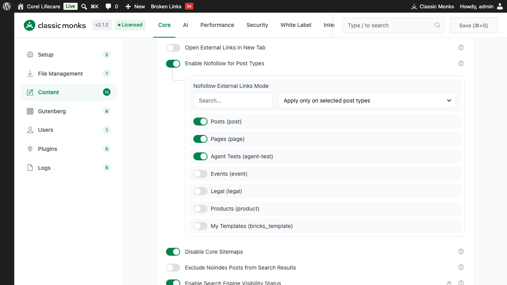
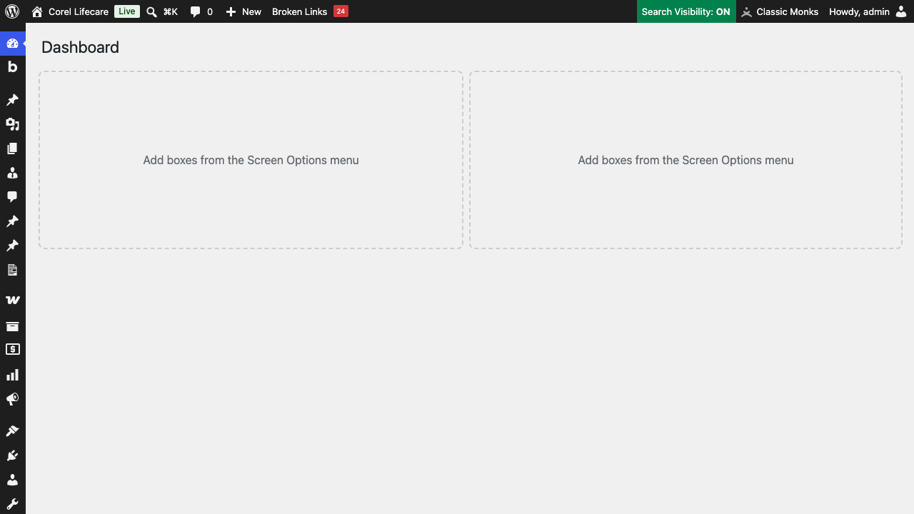

# How to Enable Search Engine Visibility Status in WordPress

> Search Engine Visibility Status adds a **Search Visibility** badge to the WordPress admin bar and automatically flips the core Discourage search engines setting on any URL that does not match your production Live Site URL, so staging and development sites never get indexed.

## Key Takeaways

- Adds a **Search Visibility: ON / OFF** badge to the WordPress admin bar for administrators.
- Takes a **Live Site URL** (your production domain) and compares it against the current site URL.
- When the current site URL does not match the Live Site URL, it enables the core Discourage search engines setting, which makes WordPress output a noindex directive.
- When the current site URL matches the Live Site URL, it ensures indexing is enabled.
- The URL comparison is normalized, so protocol and www are ignored, but subdomains and paths are not.

## What Is the Search Engine Visibility Status feature?

The feature has two parts:

1. **Admin bar badge**: For users with the `manage_options` capability, it shows **Search Visibility: ON** (green) or **Search Visibility: OFF** (red) in the top admin bar. Clicking it opens Settings > Reading.
2. **Automatic core setting flip**: On each page load where the current site URL differs from your configured Live Site URL, the feature turns on the WordPress core setting that discourages search engines from indexing the site, which makes WordPress output a noindex meta tag across the site. When the current URL matches the live URL, it turns that setting off.

It targets the most common SEO disaster: a staging or development site that is publicly reachable and gets indexed, creating duplicate content and hurting the production site's rankings.

## Why You Need It

The classic staging site mistake:

1. A developer creates a staging site at a subdomain like `staging.yoursite.com`.
2. The staging site is publicly reachable and indexing is not disabled.
3. Google indexes the staging pages.
4. Google sees the same content at both `yoursite.com` and `staging.yoursite.com`.
5. Google treats this as duplicate content and can de-rank the production site.

Search Engine Visibility Status prevents this by flipping the core Discourage search engines setting on any URL that does not match the Live Site URL, and by surfacing the current status in the admin bar so the developer can see at a glance whether the site is indexable.

The feature is opt-in. It only acts after you enter a Live Site URL, so sites you have not configured are left untouched.

## How to Enable Search Engine Visibility Status in Classic Monks

### Step 1: Open the plugin settings

In your WordPress dashboard, click **Classic Monks** in the admin sidebar.

### Step 2: Go to the Core tab and Content subtab

Click **Core**, then **Content**.

### Step 3: Enable the toggle

In the **SEO & Visibility** section, turn on **Enable Search Engine Visibility Status**. The nested **Live Site URL** field expands below the toggle.

### Step 4: Enter your Live Site URL

In the **Live Site URL** field, enter your production domain, including the protocol, for example `https://yoursite.com`. Use the same form your site uses when a visitor loads it. The field is a URL input with the placeholder `https://example.com`.

### Step 5: Save Changes

Click **Save Changes**.

### Step 6: Test the badge

Load any page while logged in as an administrator. In the top admin bar, you should see **Search Visibility: ON** (green) on your production site. The badge is clickable and opens Settings > Reading.

## Configuration Options

| Option | Description | Default |
|--------|-------------|---------|
| **Enable Search Engine Visibility Status** | Master toggle. Loads the feature and shows the admin bar badge. | Off |
| **Live Site URL** | Your production domain. The feature only auto-flips the core setting when this is filled in. | Empty |

## How It Works

On each page load (excluding AJAX, cron, and the settings-saved redirect), the feature compares the current site URL against the Live Site URL.

1. It normalizes both URLs: strips the protocol (http or https), strips a leading `www`, strips a trailing slash, and lowercases.
2. It compares the normalized current site URL to the normalized Live Site URL.
3. If they match, it ensures the WordPress core setting `blog_public` is enabled (indexable), so search engines can index the site.
4. If they do not match, it ensures `blog_public` is disabled (discourage), which makes WordPress core output a noindex meta tag across the site.

Because the comparison normalizes protocol and www, switching between http and https or between www and non-www does not trigger a change. A subdomain difference (`staging.yoursite.com` vs `yoursite.com`) or a path difference does, since those are not normalized away.

### Edge Cases

- **Local development** (`localhost`, `127.0.0.1`, `*.local`): these will not match a production Live Site URL, so indexing is discouraged.
- **Staging sites on a subdomain** (`staging.yoursite.com`): discouraged, since the subdomain differs.
- **Production on the same domain as the Live Site URL**: indexable.
- **Live Site URL left empty**: the feature still shows the admin bar badge, but it does not change any core setting.

## Verify It Works

1. On your production site, confirm the admin bar shows **Search Visibility: ON**. Go to **Settings > Reading** and confirm **Discourage search engines from indexing this site** is unchecked.
2. Load the same site from a URL that does not match the Live Site URL (for example, a staging subdomain). Go to **Settings > Reading** and confirm **Discourage search engines from indexing this site** is now checked. WordPress core then outputs a noindex meta tag.
3. Check the page source for the noindex meta tag that WordPress core emits when the Discourage setting is on.

## Troubleshooting

### The admin bar badge is not showing

The badge only appears for users with the `manage_options` capability, and only when the toggle is enabled. Confirm the toggle is on, and confirm you are logged in as an administrator. A custom admin bar plugin or a user role without `manage_options` can hide it.

### The Live Site URL is not being respected

The field is a URL input but there is no strict validation beyond that. Enter the canonical production URL including the protocol. If the site is reachable only with `www`, use the `www` form, since that is what the site reports as its current URL.

### Indexing is being discouraged on production

The Live Site URL does not match the current site URL the way the site is reached. For example, you entered `yoursite.com` but the site is served as `www.yoursite.com`, or on a different path. Confirm the Live Site URL matches the exact URL bar value on production.

### Indexing is not being discouraged on staging

The Live Site URL is empty (so the feature does not act), or it matches the staging URL. Confirm the Live Site URL is set to the production domain and does not match the staging URL.

### The staging site is still indexed by Google

The feature prevents future indexing, it does not retroactively remove already-indexed pages. Use the Google Search Console URL Removal tool for pages that were indexed before the feature was enabled, then confirm the Discourage setting is on.

## Related Articles

- [How to Add Nofollow to External Links in Classic Monks](core-nofollow-external-links.md)
- [How to Enable Nofollow for Post Types in Classic Monks](core-nofollow-post-types.md)
- [How to Disable Core Sitemaps in Classic Monks](core-disable-core-sitemaps.md)
- [How to Exclude Noindex Posts from Search Results in Classic Monks](core-exclude-noindex-from-search.md)