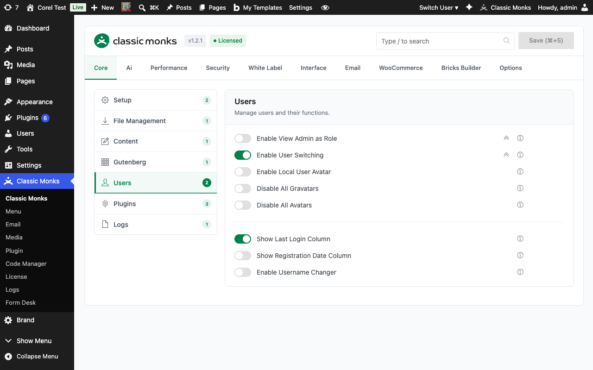

# How to Manage Users in WordPress

> User management features in Classic Monks add local avatars, view-as-role and user switching, login and registration columns, gravatar controls, and username changing.

## Key Takeaways

- Local user avatars replace or supplement Gravatars
- View Admin as Role and User Switching for permission testing
- Show Last Login and Registration Date columns in the Users list
- Disable all Gravatars or all avatars entirely
- Allow users to change their own usernames

---

## What Are User Management Features?

The user management features in Classic Monks are six toggles in the Core tab, Users subtab. They control how user profiles, avatars, and admin access work in WordPress.

## Why You Need It

WordPress's default user management works for simple sites, but content teams and multi-author setups need more control:

- Local avatars: Privacy concerns, branding consistency, and performance gains over Gravatar
- View Admin as Role: Test what a contributor or editor actually sees
- User Switching: Support and troubleshooting without creating new sessions
- Login/Registration columns: User lifecycle tracking
- Gravatar control: Privacy, ad blocker resistance, performance
- Username Changer: Fix typos, rebranding, account management

---

## How to Enable User Management Features in Classic Monks

### Step 1: Navigate to Settings

Click into the **Classic Monks** plugin settings in your WordPress dashboard.

### Step 2: Go to the Users Subtab

Click on the **Core** menu, then click the **Users** subtab.

### Step 3: Enable the Features You Want

Toggle on the user management features you need. Some features (View Admin as Role, User Switching) add admin bar indicators that appear after reload.




### Step 4: Configure Local Avatar (If Enabled)

When **Enable Local User Avatar** is on, an additional panel appears for setting a site-wide default avatar. Upload an image and save.

### Step 5: Save Changes

Click **Save Changes**. Reload to see admin bar indicators.

---

## The Six User Management Features

### Enable View Admin as Role

Adds a dropdown to the admin bar that lets administrators temporarily view the admin and frontend as a different user role. Useful for:

- Testing permission-based features
- Debugging role-specific issues
- Demonstrating the user experience to clients

When active, the admin bar shows the current "view as" role. Switch back to your actual role with a single click.

### Enable User Switching

Adds "Switch to" links in user lists and profiles that let administrators instantly log in as any user and switch back with a single click. Useful for:

- Customer support and troubleshooting
- Testing user-specific functionality
- Verifying content visibility by user

User Switching uses WordPress's authentication system, so the switch is reversible and the original admin session is preserved.

### Enable Local User Avatar

Adds upload functionality to user profile pages so users can store custom avatar images locally instead of relying on Gravatar. Supports a site-wide default avatar that overrides WordPress Gravatar defaults for users who have not uploaded a custom avatar.

**Best for:** Sites with privacy concerns, sites that want consistent branding, sites that want faster page loads (no external Gravatar requests).

**Sub-option:** Default User Avatar (image upload field) appears when the master toggle is on.

### Disable All Gravatars

Completely removes Gravatar functionality from WordPress. No external requests to Gravatar servers, only default avatars are shown. Improves privacy and reduces page load times.

### Disable All Avatars

Removes all avatar functionality, including local avatars and Gravatars. Avatars do not display anywhere on the site. Maximum performance and minimum visual noise.

### Show Last Login Column

Adds a column to the Users admin table showing the date and time of each user's most recent login. Helps identify inactive users for cleanup and assists with security monitoring.

### Show Registration Date Column

Adds a column showing when each user registered. Enables user lifecycle analysis and helps with engagement tracking.

### Enable Username Changer

Allows administrators to change usernames directly from the user profile page, with proper validation, sanitization, and security. No database edits or extra plugins required.

---

## Configuration Options

| Option | Description | Default |
|--------|-------------|---------|
| **Enable View Admin as Role** | Add role-switching dropdown to admin bar. | Off |
| **Enable User Switching** | Add switch-to links for administrators. | Off |
| **Enable Local User Avatar** | Enable local avatar uploads. | Off |
| **Default User Avatar** | Site-wide default avatar (image). | Empty |
| **Disable All Gravatars** | Remove Gravatar entirely. | Off |
| **Disable All Avatars** | Remove all avatar displays. | Off |
| **Show Last Login Column** | Add last login column to Users list. | Off |
| **Show Registration Date Column** | Add registration date column. | Off |
| **Enable Username Changer** | Allow username changes from profile. | Off |

---

## Recommended Configurations

### Privacy-Focused Site

Enable:
- Disable All Gravatars
- Enable Local User Avatar
- Show Last Login Column (security monitoring)

### Multi-Author Content Site

Enable:
- View Admin as Role
- User Switching
- Show Last Login Column
- Show Registration Date Column
- Enable Local User Avatar

### Internal Business Site

Enable:
- Disable All Avatars (no need for profile pictures)
- Show Last Login Column
- Show Registration Date Column
- Enable Username Changer

---

## Developer Notes

The Users subtab provides user management features. The actual hooks used by the plugin:

```php
// Custom avatar: overrides default avatar URL
add_filter('cm_pre_get_avatar_user_id', function($user_id, $id_or_email) {
    // Return custom user ID for avatar lookup
    return $user_id;
}, 10, 2);

// Username changer: controls whether username change is allowed
add_filter('cm_username_changer_allowed', function($allowed, $user) {
    // Return false to prevent username change
    return $allowed;
}, 10, 2);

// Username changer: validates new username
add_filter('cm_username_changer_validate', function($error, $new, $user) {
    // Return WP_Error to reject, null to accept
    return $error;
}, 10, 3);

// Username changer: fires after username is changed
do_action('cm_username_changed', $user_id, $old_login, $new_login);
```

**Options used:**
| Option | Type | Default |
|--------|------|---------|
| `enable_custom_avatar` | Boolean | `false` |
| `enable_username_changer` | Boolean | `false` |
| `enable_user_view_as_role` | Boolean | `false` |
| `enable_user_switching` | Boolean | `false` |
| `enable_last_login_tracking` | Boolean | `false` |

---

## Troubleshooting

### View Admin as Role Dropdown Does Not Appear

**Cause:** The feature is enabled but JavaScript failed to initialize, or the admin bar is hidden.
**Fix:** Check the admin bar is visible (Users > Profile > Show Admin Bar). Verify JavaScript is not blocked.

### User Switch Leaves Me Logged Out

**Cause:** Authentication cookie was cleared between switches.
**Fix:** Log in as administrator again. Avoid clearing cookies while testing.

### Local Avatar Does Not Display

**Cause:** The user has not uploaded an avatar, or the default avatar URL is wrong.
**Fix:** Upload an avatar in Users > Profile. Verify the default avatar URL is a valid image.

### Disable Gravatars Did Not Remove External Requests

**Cause:** A theme or plugin is calling Gravatars directly.
**Fix:** Check the theme's `get_avatar` calls. Add custom CSS to hide the resulting broken images.

### Username Changer Says "Invalid Username"

**Cause:** WordPress username rules apply (alphanumeric, dashes, underscores, certain length).
**Fix:** Use only allowed characters. Check the new username against WordPress's `validate_username` rules.

---

## Frequently Asked Questions

### What's the difference between "View Admin as Role" and "User Switching"?

**View Admin as Role** is read-only: you see what a different role sees, but you stay logged in as yourself. No actual login happens. **User Switching** is a real login: you log in as the target user, with all their permissions. User Switching lets you perform actions as them; View Admin as Role does not.

### Is User Switching safe for production sites?

Yes. User Switching uses WordPress's standard authentication cookies. The original admin session is preserved and can be restored with one click ("Switch back to [original user]"). All switches are logged via the standard action log. To disable User Switching on production if needed, just turn off the toggle.

### How does the local avatar work if a user has both a Gravatar and an uploaded avatar?

The local avatar always takes priority. When "Enable Local User Avatar" is on, the plugin checks for an uploaded avatar first; if none, it falls back to Gravatar, then to the default avatar. With "Disable All Gravatars" also on, the fallback chain is: local avatar, then default avatar (no Gravatar request at all).

### Can I use the Username Changer to fix typos in existing usernames?

Yes. The Username Changer adds a field on the user profile page for changing the username. The change is validated (length, character set, uniqueness), sanitized, and applied to the database. Use it to fix typos, rebrand, or standardize naming conventions. Note that other places (comments, post authorship display) may show the old username in historical content.

### What's the difference between "Disable All Gravatars" and "Disable All Avatars"?

**Disable All Gravatars** removes the external Gravatar service but keeps the avatar system (users can still upload local avatars). **Disable All Avatars** removes all avatar display entirely, including local avatars. The first is for privacy; the second is for visual minimalism.

## Related Articles

- [How to Manage Content in Classic Monks (WordPress)](core-content-management.md)
- [How to Configure AI Advanced Settings in Classic Monks](../ai/ai-advanced.md)
