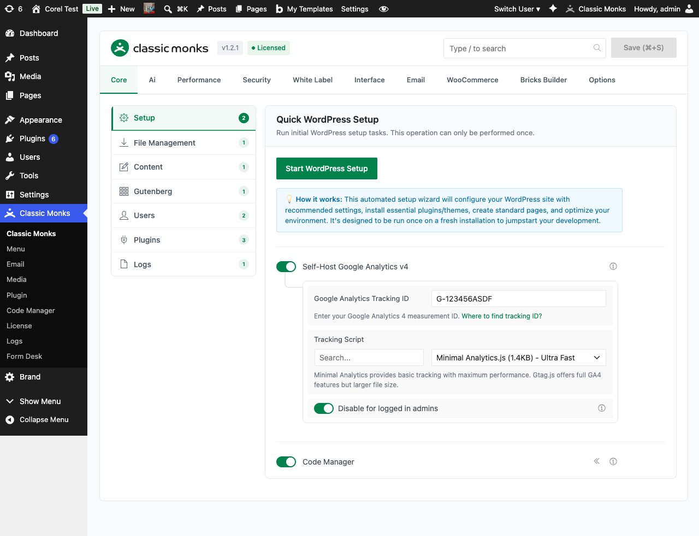

# How to Disable WooCommerce Emails in WordPress

> Disable WooCommerce Emails completely suppresses all WooCommerce transactional emails, including order confirmations, shipping notices, refund notifications, and admin order alerts. The customer still receives order confirmations via the on-screen checkout flow, but no email is sent.

## Key Takeaways

- Single toggle, site-wide effect
- Suppresses ALL WooCommerce emails: order confirmations, shipping notices, refund notifications, admin alerts
- Useful for sites with custom email systems (transactional email services, marketing platforms)
- Useful for sites that want a quieter customer experience
- Password reset emails are separate and controlled by a different feature

## What Is the Disable WooCommerce Emails feature?

WooCommerce sends several types of transactional emails by default:

- **Order confirmation**: Sent to the customer after a successful order
- **Order on-hold**: Sent when an order is placed on hold (e.g., waiting for payment confirmation)
- **Processing order**: Sent when the order moves from on-hold to processing
- **Completed order**: Sent when the order is marked completed
- **Refunded order**: Sent when an order is refunded
- **Cancelled order**: Sent when an order is cancelled
- **Failed order**: Sent when payment fails
- **New order (admin)**: Sent to the site admin for new orders
- **Low stock / no stock (admin)**: Sent when product stock changes
- **Customer note**: Sent when an admin adds a note to an order
- **Customer reset password**: Sent when a customer requests a password reset

The Disable WooCommerce Emails feature suppresses all of these. The on-screen checkout flow and order confirmation pages still show the customer their order details; only the emails are suppressed.

## Why You Need It

For most sites, disabling all WooCommerce emails is a bad idea, customers expect order confirmations. But some sites have specific use cases:

- **B2B sites**: Order confirmations go through a custom sales-team workflow, not customer email
- **Subscription-only sites**: The subscription platform handles its own emails; WooCommerce emails are redundant
- **Headless commerce**: The frontend is a SPA that handles its own confirmations; WooCommerce is the backend
- **Migration to a different system**: During a transition, you might want to suppress WooCommerce emails to avoid duplicate notifications

The feature is also useful in specific scenarios:

- **Testing**: Suppress customer-facing emails during development and QA
- **Compliance**: Some regulated industries (healthcare, finance) require all transactional email to go through a specific compliance system
- **Customer preference**: Some customers (B2B, repeat wholesale) explicitly prefer fewer emails

---

## How to Use Disable WooCommerce Emails in Classic Monks

### Step 1: Navigate to Settings

Click into the **Classic Monks** plugin settings in your WordPress dashboard.

### Step 2: Go to the Email Tab

Click on the **Email** menu, then click the **WooCommerce** subtab.

### Step 3: Enable Disable WooCommerce Emails

Toggle on **Disable WooCommerce Emails**.



### Step 4: Save Changes

Click **Save Changes**.

### Step 5: Test

Place a test order (use a sandbox gateway like Stripe test mode). The order is created. The on-screen checkout shows the order confirmation. No email is sent.

---

## Configuration Options

| Option | Description | Default |
|--------|-------------|---------|
| **Disable WooCommerce Emails** | Master toggle. | Off |

No nested options.

---

## What Gets Suppressed

| Email | Sent when feature off | Sent when feature on |
|-------|----------------------|----------------------|
| Order confirmation (customer) | Yes | **No** |
| Processing order (customer) | Yes | **No** |
| Completed order (customer) | Yes | **No** |
| Refunded order (customer) | Yes | **No** |
| Cancelled order (customer) | Yes | **No** |
| Failed order (customer) | Yes | **No** |
| Order on-hold (customer) | Yes | **No** |
| New order (admin) | Yes | **No** |
| Low stock (admin) | Yes | **No** |
| Out of stock (admin) | Yes | **No** |
| Customer note (customer) | Yes | **No** |
| Customer reset password | Yes | Yes (controlled by [Only Allow Reset Password Email](email-only-allow-reset-password-email.md) feature) |

## What Does NOT Get Affected

- **Customer reset password email**: Controlled separately by the "Only Allow Reset Password Email" feature. This is intentional so customers can still recover their accounts even when all other WooCommerce emails are disabled.
- **WordPress core emails**: New user emails, password change emails, etc. are controlled by separate features in the Notifications subtab.
- **On-screen checkout experience**: The customer still sees the order confirmation page and the order details in their account dashboard. The feature only affects emails.
- **Admin order list in the WordPress dashboard**: Still shows all orders
- **Custom WooCommerce email add-ons**: Plugins that send their own custom WooCommerce emails are not affected (their email-sending code is independent)

---

## Advanced Options (Developers)

This feature registers 3 WordPress hooks in `disable-woocommerce-emails.php`:

**Actions:**

- `plugins_loaded` calls `cm_maybe_disable_woocommerce_emails()` (Conditionally disables WooCommerce emails)

**Filters:**

- `woocommerce_email_classes` calls `cm_disable_woocommerce_emails()` (Removes selected WooCommerce email classes (priority 90))
- `woocommerce_email_classes` calls `apply_filters()` (Customizable filter)

```php
// Hooked in disable-woocommerce-emails.php
add_action( 'plugins_loaded', 'cm_maybe_disable_woocommerce_emails' );
```

The feature modifies WordPress behavior by registering or removing hooks. Disabling it reverses those changes.

## Troubleshooting

### Customers are not receiving order confirmations

**Cause:** The toggle is on (intentionally suppressing all WooCommerce emails).
**Fix:** If you want to re-enable order confirmations, disable the toggle. If you want to keep most emails disabled but enable only order confirmations, disable the toggle, or use WooCommerce's built-in settings (WooCommerce > Settings > Emails) to manage individual email types.

### The customer reset password email is also disabled

**Cause:** The customer reset password email is NOT affected by this feature. If it's not being sent, the issue is elsewhere (e.g., email configuration, password reset flow not being triggered).
**Fix:** The customer reset password email is controlled separately. Verify the password reset flow is working. If you want to keep ONLY the password reset email enabled, enable the "Only Allow Reset Password Email" feature instead.

### New orders are not showing in the admin

**Cause:** The Disable WooCommerce Emails feature only suppresses emails, not admin order management.
**Fix:** Check WooCommerce > Orders in the WordPress admin. The admin order list is independent of email settings.

### WooCommerce admin notifications are still being sent

**Cause:** A custom plugin or theme function is sending its own admin notification.
**Fix:** The Classic Monks feature suppresses WooCommerce's built-in emails only. Custom plugins that send their own admin notifications on new orders are independent. Check the custom plugin's settings or hooks.

### I want to disable some WooCommerce emails but not all

**Cause:** The feature is global (all on or all off).
**Fix:** For selective suppression, use WooCommerce's built-in settings (WooCommerce > Settings > Emails) to disable individual email types one by one. Or use WooCommerce's built-in settings (WooCommerce > Settings > Emails) to disable individual email types one by one.

### I disabled the feature but the email is still being sent

**Cause:** The feature only suppresses emails sent via WooCommerce's standard `WC_Email` system. If a custom plugin is sending the email directly via `wp_mail()` (bypassing WooCommerce's email system), the feature doesn't catch it.
**Fix:** Identify the custom plugin and disable its email sending. Or filter `pre_wp_mail` to suppress the email globally.

---

## Related Articles

- [How to Only Allow Reset Password Email in WordPress](email-only-allow-reset-password-email.md)
- [How to Configure SMTP Settings in WordPress](email-smtp-settings.md)
- [How to Log WordPress Emails in Classic Monks](email-logging.md)
