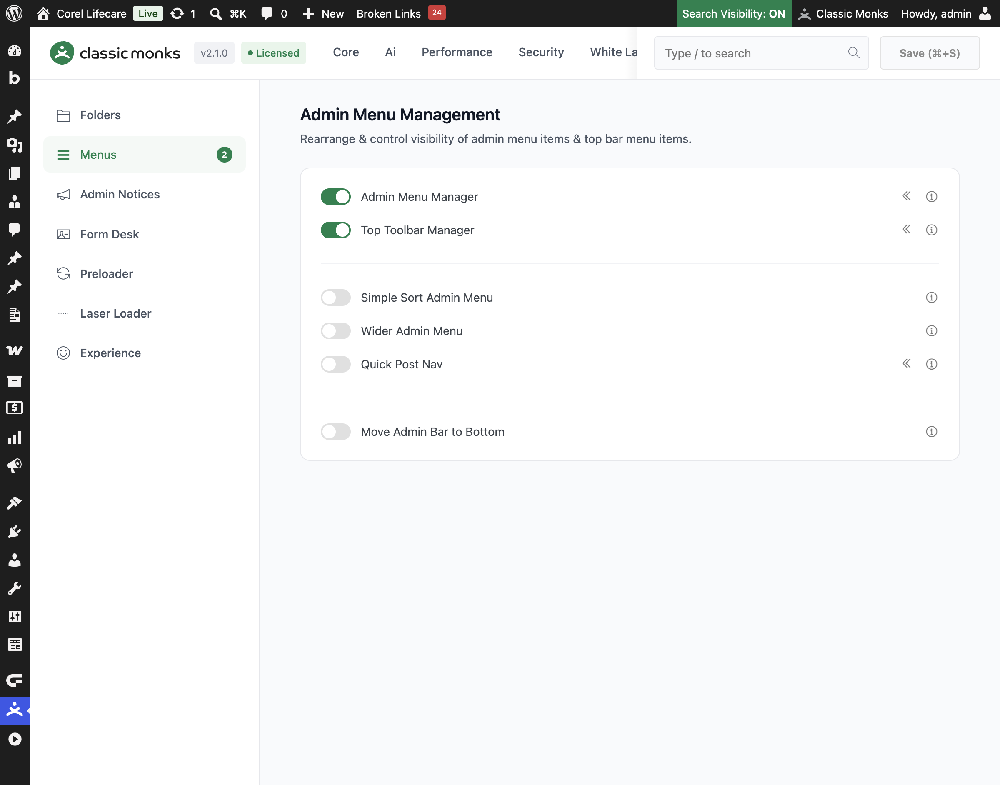
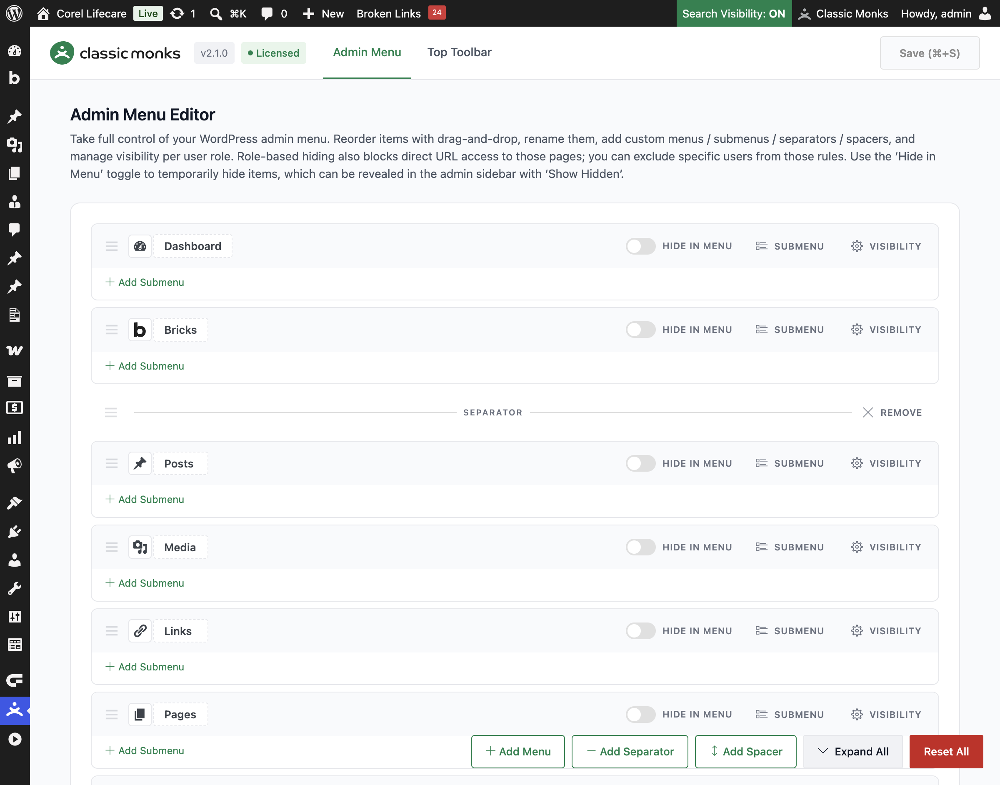
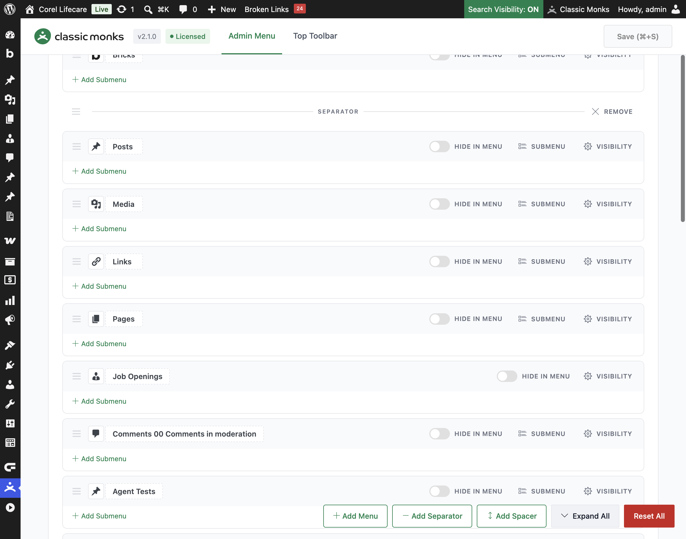

# How to Use the Admin Menu Manager in WordPress

> Reorder, rename, hide, and restyle the WordPress admin sidebar menu in Classic Monks. Drag and drop items, add custom menus, submenus, separators, and spacers, and control which roles see each item.

## Key Takeaways

- Drag and drop to reorder top-level menus and submenus, and click any title to rename it inline.
- Add custom menus and submenus that link to a URL, an admin page, or a label only, with per-item icons and styling.
- Insert visual separators and blank spacers to group menu items.
- Hide items per role or per user, and block direct URL access to hidden pages.
- The **Hide in Menu** toggle temporarily hides items, which you can reveal in the live sidebar with **Show Hidden**.

## What Is the Admin Menu Manager

The Admin Menu Manager is a full visual editor for the WordPress admin sidebar menu. Instead of editing functions or a plugin file, you work directly on a list of your real menu items. You can reorder them, rename them, change their icons, add entirely new entries, and decide exactly which roles see each item.

It is one of three menu tools in the Classic Monks **Interface** tab, under the **Menu Management** subtab. The other two are the **Top Toolbar Manager** (for the admin bar) and **Quick Post Nav** (for quick navigation). The Admin Menu Manager focuses on the left sidebar menu.

## Recommendations Before Enabling

- **Disable conflicting sort tools.** The **Simple Sort Admin Menu** toggle in the same subtab reorders Settings, Appearance, Tools, and Dashboard submenus alphabetically and overrides any custom order you save here. With **Sort Top-Level Menus** on, it also replaces the top-level order and removes custom separators and spacers. Keep only one menu reordering tool active at a time.
- **Test on a staging site first.** Role-based hiding blocks direct URL access, so a misconfigured rule can lock a role out of a page. Verify on a test environment before applying to production.
- **You need the `manage_options` capability.** Only administrators can open the menu editor and save changes.

## Enable the Admin Menu Manager

### Step 1: Open the Interface Tab

In your WordPress dashboard, go to **Classic Monks** and open the **Interface** tab, then the **Menus** subtab.

### Step 2: Turn On Admin Menu Manager

In the **Menu Management** section, toggle on **Admin Menu Manager**.

### Step 3: Save and Reload

Click **Save (⌘+S)**. The feature adds a submenu under **Classic Monks** called **Menu**. A page reload is required before the submenu appears.

### Step 4: Open the Menu Editor

Go to **Classic Monks** then **Menu**, and open the **Admin Menu** tab. The heading is **Admin Menu Editor**.

## Configure the Menu

The editor shows a list of your top-level menu items as rows. Each row has a drag handle, an editable title, a **Hide in Menu** toggle, a **Visibility** or **Settings** button, and an **Add Submenu** button. Submenus sit inside their parent and expand and collapse.

### Reorder Menu Items

Drag any row by its drag handle to a new position. Top-level items move within the main list, and submenu items move within their parent. The order is saved when you click **Save**.

### Rename Menu Items

Click any title to edit it inline. The change applies to the admin sidebar. Click elsewhere to finish editing.

### Change a Menu Icon

For a top-level item, click **Visibility** (or **Settings** for a custom item) to open the options panel. In the **Icon** field, pick a Dashicon from the picker, or paste a `dashicons-*` class or an SVG `data:image/svg+xml` URI. Custom SVG icons are supported for top-level items.

### Hide in Menu (Temporary Visibility)

Each item has a **Hide in Menu** toggle. Turn it on to remove the item from the sidebar. The item stays configured and is not deleted. In the live admin sidebar, a **Show Hidden** toggle (rendered as **Show Menu** / **Hide Menu**) appears so you can reveal hidden items temporarily. This is useful for editing a menu that has many columns or for a quick cleanup.

## Manage Visibility Per Role

The **Visibility** button on any item opens a **Hide from roles** panel. Use it to control which roles see the item.

### Hide from Roles

Turn on **Hide from roles**, then choose a scope:

- **Everyone**: hides the item from all users.
- **Everyone except**: hides the item from everyone except the roles you select. Pick the roles that still see it.
- **Only these roles**: hides the item only from the roles you select.

The panel lists only roles that have the capability required to open that item. For example, a page that requires `edit_posts` only lists roles that have that capability.

### Keep Visible for Specific Users

In the same panel, use **Keep visible for these users** to override the role rules for specific people. Search for a user and add them. This rule overrides the role-based hiding for those users.

### Direct URL Access Is Blocked

Role-based hiding is not cosmetic. When an item is hidden from a role, users of that role cannot open the page directly by URL either. They get a **Sorry, you are not allowed to access this page** message. This applies to top-level pages and to child pages whose parent is hidden.

## Add Custom Menu Items

Use the action bar at the bottom of the editor to add new elements.

### Add Menu

Click **Add Menu** to create a new top-level menu item. Configure it in the **Settings** panel:

- **Title**: the text shown in the sidebar.
- **Target Type**: **URL** links to a destination, or **None (label only)** creates a heading that does not navigate.
- **Target URL**: the destination for a URL item. Use a full URL, an admin path like `admin.php?page=...`, or a site-relative path.
- **Capability**: the required capability to see and open the item. Search from the list of available capabilities.
- **Icon**: a Dashicon or custom SVG for the menu item.

For a label-only item (**Target Type** set to **None**), extra styling options appear:

- **Alignment**: left, center, or right.
- **Title Color**: the text color.
- **Background Color**: the row background.
- **Line Style**: no line, underline, or sideline.

### Add Submenu

Click **Add Submenu** inside any top-level row to add a child item. Set its **Title**, **Target URL**, and **Capability**. Submenus always link to a URL and do not have icons or label styling.

### Add Separator

Click **Add Separator** to insert a divider line between menu items. Drag it to position it.

### Add Spacer

Click **Add Spacer** to insert a blank vertical gap (no divider line) between menu items. Drag it to position it.

### Remove Custom Items

Custom items, separators, and spacers have a **Remove** button. Click it to delete the element. Built-in WordPress items cannot be removed here; use the **Hide in Menu** toggle or role hiding instead.

## Save, Expand, and Reset

- **Save**: the **Save (⌘+S)** button in the top corner saves all changes. The keyboard shortcut is **⌘+S** on macOS and **Ctrl+S** on Windows.
- **Expand All / Collapse All**: toggles all submenu accordions open or closed.
- **Reset All**: restores the default WordPress menu and removes all custom order, renames, hides, custom items, separators, and spacers.

## Verify It Works

After saving, open the WordPress admin sidebar and confirm:

- The reordered items appear in the order you set.
- Renamed titles and custom icons show correctly.
- Custom menus, separators, and spacers are visible in the sidebar.
- If you hid an item from a role, log in as a user of that role and confirm the item is missing and that its URL is blocked.

If a change does not appear, clear any admin or page cache, then reload.

## Examples

### Example 1: Group Related Items with a Separator

You want a cleaner sidebar for a client site. Add **Add Separator** before the **Settings** section and drag it into place. Rename a few verbose plugin titles to shorter ones. Save. The sidebar now reads more clearly and hides low-value plugin names.

### Example 2: Create a Label-Only Section Heading

Add a custom menu item with **Target Type** set to **None (label only)** to create a section label in the sidebar, for example **Internal Tools**. Set its **Alignment** to **left** and choose a **Title Color**. Add submenus under it that link to the tools you want grouped there.

### Example 3: Restrict a Menu to Editors

A client wants the **Events** menu hidden from subscribers. Open the **Events** item, turn on **Hide from roles**, and choose **Only these roles**. Select **Subscriber** and **Customer**. Save. Accounts with those roles no longer see **Events** or open its pages directly.

## Troubleshooting

### The Menu submenu does not appear

**Cause:** The feature toggle is on but the page was not reloaded, or a cache is serving the old menu.
**Fix:** Reload the admin page after saving. Clear any admin or page cache.

### My custom order is overridden

**Cause:** **Simple Sort Admin Menu** is also enabled and sorts the same submenus.
**Fix:** Disable **Simple Sort Admin Menu** (and **Sort Top-Level Menus**) in the Interface tab, then re-save your order. Rename and hide settings still apply while Simple Sort is on; only the order is overridden.

### A role cannot open a page after hiding

**Cause:** Role-based hiding blocks direct URL access, including child pages whose parent is hidden.
**Fix:** Add the affected users to **Keep visible for these users** on the hidden item, or change the hide scope. Log in as that user to confirm the fix.

### Separators or spacers disappear after saving

**Cause:** This was fixed in Classic Monks 2.1.0, but a stale cache or an active sort tool can still interfere.
**Fix:** Update to the latest version, clear caches, and disable **Simple Sort Admin Menu** if it is on.

## Related Articles

- [How to Use the Top Toolbar Manager in WordPress](interface-top-toolbar-manager.md)
- [How to Use Quick Post Nav in WordPress](../white-label/white-label-wl-quick-post-nav.md)
- [How to Use the Interface Tab in Classic Monks: Feature Index](../interface.md)

---

*Tested with WordPress 6.x and Classic Monks 2.1.0.*