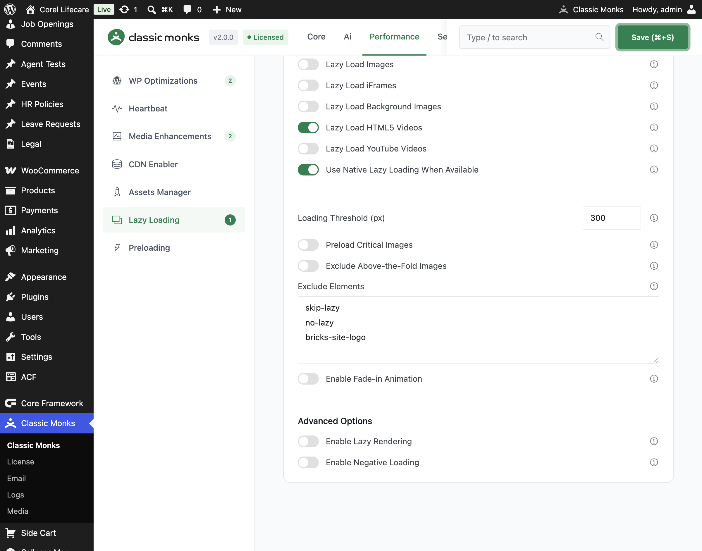

# How to Enable Lazy Loading in WordPress

> Configure Classic Monks lazy loading for images, iFrames, backgrounds, videos, and YouTube embeds. Then tune exclusions, thresholds, animation, lazy rendering, and off-screen unloading without breaking above-the-fold content.

## Before You Enable It

### Disable competing lazy-loading systems

Run one lazy-loading system at a time. Disable lazy loading in your theme, page builder, CDN, and other optimization plugins before enabling Classic Monks. Multiple systems can rewrite the same `src`, `srcset`, background, and iframe attributes and leave content blank.

### Test while logged out

The **Disable for Admin Users** option skips lazy loading for administrators. Test performance in a logged-out private window so you are testing the visitor path, not the admin bypass.

### Protect above-the-fold content

Do not lazy-load your logo, hero image, main featured image, or any image required to render the first viewport. Use **Preload Critical Images**, **Exclude Above-the-Fold Images**, or the exclusion field before measuring the result.

---

## How to Configure Lazy Loading

### Step 1: Open the Lazy Loading settings

In WordPress admin, open **Classic Monks > Performance** and select the **Lazy Loading** subtab.

### Step 2: Enable the master toggle

Enable **Enable Lazy Loading**. The media-specific options become active below it.

### Step 3: Choose the media types

Enable only the content types you need:

- **Lazy Load Images**
- **Lazy Load iFrames**
- **Lazy Load Background Images**
- **Lazy Load HTML5 Videos**
- **Lazy Load YouTube Videos**

Start with images, iFrames, and videos. Add background images after checking your theme and page builder.

### Step 4: Choose native loading behavior

Enable or disable **Use Native Lazy Loading When Available**. Native loading uses the browser's `loading="lazy"` support. Classic Monks also has its own JavaScript loader. Do not assume native loading and JavaScript loading behave identically when diagnosing a conflict.

### Step 5: Set the loading threshold

Set **Loading Threshold (px)**. This controls how early content loads before it enters the viewport:

- Lower values are more aggressive and reduce early requests.
- Higher values begin loading earlier and can reduce visible pop-in while scrolling.
- Start with the default, then increase it only if users see content appear too late.

### Step 6: Configure YouTube and animation

When **Lazy Load YouTube Videos** is enabled, check the available **YouTube Preview Quality** setting. The loader can replace an embed with a lightweight preview and load the iframe when the visitor activates it.

If you want a softer reveal, enable **Enable Fade-in Animation** and set **Animation Duration (ms)**.

### Step 7: Save and test

Click **Save Changes**. Test at least these cases while logged out:

1. A page with images below the fold
2. A page with an iframe or YouTube embed
3. A page with a CSS background image
4. A page with a video element
5. A page with a hero image and logo above the fold

---

## Configure Each Lazy-Loading Option

### Lazy Load Images

Defers image requests until images approach the viewport. Use this for content images below the fold. Keep hero, logo, and featured images excluded or preloaded.

### Lazy Load iFrames

Defers iframe loading for embeds such as maps, forms, and third-party widgets. Check embedded content after enabling it because some providers require the iframe to exist immediately.

### Lazy Load Background Images

Defers background image handling for supported background attributes and content patterns. Test theme and builder sections individually. Do not apply it blindly to hero sections.

### Lazy Load HTML5 Videos

Defers `<video>` elements until they approach the viewport. This is useful for video galleries and below-the-fold media. Keep above-the-fold background video behavior under review because delaying it may change the first visual impression.

### Lazy Load YouTube Videos

Defers YouTube iframe loading and can use a preview image before activation. Check the preview quality setting and test cookie or consent plugins. If your site requires privacy-enhanced embeds, verify the generated embed URL and consent behavior.

### Use Native Lazy Loading When Available

Uses native browser loading behavior where supported. Classic Monks also contains JavaScript behavior and can disable WordPress's native lazy-loading filter when native loading is not selected. Treat this as an implementation choice, not as two independent systems to enable blindly.

### Disable for Admin Users

Skips lazy loading for administrators. Keep this enabled when page builders, live previews, or admin editing need the original markup and media behavior.

---

## Protect Critical Content

### Preload Critical Images

Enable **Preload Critical Images** when the first viewport contains a known LCP image, such as a featured image, site logo, hero image, or banner. Classic Monks adds high-priority preload behavior for detected critical patterns.

Use this together with lazy loading: preload the few critical assets, lazy-load the rest.

### Exclude Above-the-Fold Images

Enable **Exclude Above-the-Fold Images** when the site has hero, logo, featured, or other first-viewport images that should not be lazy-loaded.

### Excluded classes and patterns

Use the **Exclude Elements** field when a specific image or container must bypass lazy loading. The source supports configured excluded classes plus filter-based exclusions for parent selectors and above-the-fold patterns.

If the exclusion field is not enough, developer-level controls include:

- `cm_lazy_exclude_leading_images`
- `cm_lazy_parent_exclusions`
- `cm_above_fold_patterns`

Verify exclusions in the rendered HTML and the browser Network panel. Do not rely only on the visual result.

---

## Lazy Rendering and Off-Screen Unloading

These options are in the same Lazy Loading panel but behave differently from ordinary lazy loading.

### Enable Lazy Rendering

Toggle on **Enable Lazy Rendering** to defer DOM section processing until content enters the viewport. Configure **Lazy Render Selectors** and **Render Delay (ms)**, then choose the content types:

- **Images**
- **iFrames**
- **Videos**
- **Background Images**

Start with a narrow selector and one content type. Broad selectors can break layout scripts that expect the full DOM to be available immediately.

### Enable Negative Loading

Enable **Enable Negative Loading** to release or unload off-screen content after it leaves the viewport. Configure:

- **Memory Threshold (MB)**
- **Unload Threshold (px)**
- **Unload CSS Styles**
- **Unload Images**
- **Unload Videos**
- **Unload iFrames**

Use negative loading on long pages with heavy media. Avoid it when users frequently scroll back and forth or when a third-party widget cannot be safely reinitialized.

---

## Verify the Result

Use a repeatable test instead of judging by feel.

### Browser test

1. Open a logged-out private window.
2. Open DevTools and select the **Network** panel.
3. Reload with the Network panel open.
4. Confirm below-the-fold images and embeds are not requested immediately.
5. Scroll toward the content.
6. Confirm the request starts near the viewport and the content renders correctly.
7. Scroll away and back if negative loading is enabled.
8. Confirm content reloads without layout breakage.

### Performance test

Run the same page through Lighthouse or PageSpeed Insights before and after enabling the feature. Record:

- Total requests
- Transfer size
- LCP
- Largest image request timing
- Total Blocking Time
- Any console errors

Do not reuse benchmark numbers from another plugin. Measure the Classic Monks configuration on the actual site.

---

## Troubleshooting

### Images are blank until scrolling

**Cause:** An above-the-fold image is being lazy-loaded or a second optimization layer is rewriting the markup.
**Fix:** Exclude the image or its parent selector. Disable competing lazy loading. Inspect `src`, `data-src`, `srcset`, and `data-srcset` in the rendered HTML.

### The hero image loads too late

**Cause:** The hero image is treated as a lazy asset.
**Fix:** Enable **Preload Critical Images**, enable **Exclude Above-the-Fold Images**, or add a precise exclusion. Test while logged out.

### YouTube or iframe embeds do not load

**Cause:** The provider, consent plugin, cache layer, or deferred script is blocking iframe initialization.
**Fix:** Disable other iframe lazy loading, test the embed without the consent plugin, and inspect the browser console and Network panel. Check that the iframe receives its real `src` after entering the viewport.

### Background images do not appear

**Cause:** The theme or builder loads the background from an external stylesheet or uses an unsupported selector pattern.
**Fix:** Test the section with background lazy loading disabled. Add the correct exclusion or parent pattern. Check computed styles and the Network panel.

### A page builder breaks in the editor

**Cause:** Lazy loading or lazy rendering is running inside the builder.
**Fix:** Enable **Disable for Admin Users**. Classic Monks also skips several builder preview contexts in its runtime checks.

### Content appears late while scrolling

**Cause:** **Loading Threshold (px)** is too low.
**Fix:** Increase the threshold gradually and retest. Higher values use more early requests but reduce visible pop-in.

### Lazy rendering breaks layout or scripts

**Cause:** The selector is too broad, the render delay is too high, or a script expects off-screen markup to exist immediately.
**Fix:** Disable lazy rendering, then re-enable it with a narrow selector and one content type. Keep ordinary lazy loading enabled separately if it is stable.

### Negative loading breaks widgets or scroll-back behavior

**Cause:** The widget cannot reinitialize after being unloaded, or the user returns to content that was removed.
**Fix:** Disable negative loading for that content type, increase the unload threshold, or exclude the affected container.

### Cache or optimization plugin causes duplicate behavior

**Cause:** Another plugin is deferring, minifying, or rewriting the Classic Monks loader.
**Fix:** Disable the competing feature. If the cache plugin still interferes, exclude the Classic Monks loader and localized settings from script deferral or minification, then retest.

---

## Related Articles

- [How to Enable Intelligent Preloading in WordPress](performance-perf-monks-preload.md)
- [How to Use Selective Media Preload in WordPress](performance-perf-selective-media-preload.md)
- [How to Enable the Assets Manager in WordPress](performance-perf-assets-manager.md)
- [How to Enable CDN Rewrite in WordPress](performance-perf-cdn-rewrite.md)

---

## Developer Notes

The implementation is in `functions/performance/lazy-loading.php` and `assets/js/lazy-loading.js`.

Important source options include:

- `enable_lazy_loading`
- `lazy_load_disable_for_admin`
- `lazy_load_images`
- `lazy_load_iframes`
- `lazy_load_backgrounds`
- `lazy_load_videos`
- `lazy_load_youtube`
- `lazy_load_native`
- `youtube_preview_quality`
- `lazy_load_threshold`
- `lazy_load_animation`
- `lazy_load_animation_duration`
- `preload_critical_images`
- `exclude_above_fold_lazy`
- `lazy_load_excluded_classes`
- `enable_lazy_rendering`
- `lazy_render_selectors`
- `lazy_render_delay`
- `enable_negative_loading`
- `memory_threshold`
- `unload_threshold`
- `unload_styles`
- `unload_invisible`
- `reload_invisible`

The implementation registers `wp_head`, `init`, `wp_enqueue_scripts`, `plugins_loaded`, `the_content`, and media-related WordPress filters. Confirm hook names and option names against the current source before using them in custom code.
