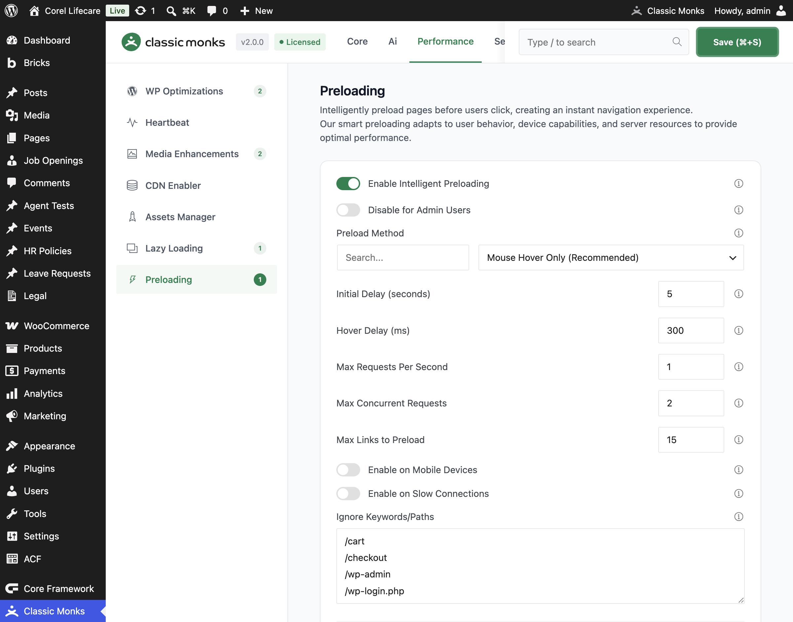

# How to Enable Intelligent Preloading in WordPress

> Intelligent Preloading in Classic Monks preloads likely next pages in the background. Configure when it starts, how many requests it can make, what URLs it ignores, and how it behaves on mobile or slow connections.

## Before You Enable It

Intelligent preloading creates additional network requests before a visitor clicks. Do not enable it blindly on a bandwidth-constrained site.

Before testing:

- Disable competing link preloading systems.
- Exclude checkout, cart, logout, downloads, previews, feeds, API URLs, and static assets from custom rules.
- Test while logged out.
- Confirm your cache and CDN do not treat prefetch requests as page visits or cache pollution.

---

## How to Configure Intelligent Preloading

### Step 1: Open the Preloading settings

In WordPress admin, open **Classic Monks > Performance** and select the **Preloading** subtab.

### Step 2: Enable the master toggle

Enable **Enable Intelligent Preloading**.

### Step 3: Choose the preload trigger

Use **Preload Method** to choose when preloading starts. The source supports a hover-based trigger by default. Use the available UI option that matches your site's navigation behavior.

### Step 4: Set timing and request limits

Configure:

- **Initial Delay (seconds)**
- **Hover Delay (ms)**
- **Max Requests Per Second**
- **Max Concurrent Requests**
- **Max Links to Preload**

Start conservatively. Increase limits only after checking server load and bandwidth.

### Step 5: Configure connection rules

Choose whether to enable:

- **Enable on Mobile Devices**
- **Enable on Slow Connections**

Keep slow-connection preloading off unless you have measured a clear benefit. Preloading on a slow connection can compete with the page the visitor is already viewing.

### Step 6: Configure error and memory limits

Use:

- **Stop on Errors**
- **Error Threshold**
- **Memory Threshold (MB)**

These controls prevent failed or excessive preloads from continuing indefinitely.

### Step 7: Add ignore keywords

Use the **Ignore Keywords/Paths** field to exclude URLs that should never be preloaded. Enter one keyword or path fragment per line or comma-separated.

At minimum, exclude transactional and non-document URLs such as:

- `/cart`
- `/checkout`
- `/wp-admin`
- `/wp-login.php`
- `/logout`
- `/wp-json/`
- `/feed`
- `/ajax`
- `?s=`
- `.css`
- `.js`
- image, video, archive, and download extensions

### Step 8: Save and test

Click **Save Changes**. Test in a logged-out private window with the browser Network panel open.

---

## Configuration Options

| Option | What it controls | Source default |
|---|---|---:|
| **Enable Intelligent Preloading** | Master toggle. | Off |
| **Disable for Admin Users** | Skips preloading for administrators. | On |
| **Preload Method** | Trigger used to start preloading. | Hover |
| **Initial Delay (seconds)** | Delay before the engine starts. | 5 |
| **Hover Delay (ms)** | Time before a hovered link is preloaded. | 300 |
| **Max Requests Per Second** | Request rate limit. | 1 |
| **Max Concurrent Requests** | Number of simultaneous preloads. | 2 |
| **Max Links to Preload** | Maximum links considered at a time. | 15 |
| **Ignore Keywords** | URL fragments excluded from preloading. | Built-in exclusions |
| **Enable on Mobile Devices** | Allows preloading on mobile. | Off |
| **Enable on Slow Connections** | Allows preloading on slow networks. | Off |
| **Stop on Errors** | Stops after preload failures. | On |
| **Error Threshold** | Failure count that triggers the stop rule. | 3 |
| **Memory Threshold (MB)** | Memory limit used by the preloading engine. | 512 |

The saved option keys are implemented in `functions/performance/monks-preload.php`. Verify the displayed value on the current site before tuning production settings.

---

## Intelligent Preloading vs Other Preload Features

### Intelligent Preloading

Preloads likely next pages or links based on navigation behavior. It is request-driven and predictive.

### Critical Image Preloading

Preloads a small number of above-the-fold images for LCP. It belongs in the Lazy Loading workflow and should not be used as a replacement for page preloading.

### Selective Media Preload

Lets you choose media files or URLs per post/page through a **Media Preload Settings** metabox. It is a separate feature with a separate operational workflow. See [How to Use Selective Media Preload in WordPress](performance-perf-selective-media-preload.md).

---

## Verify the Result

### Browser Network test

1. Open a private window while logged out.
2. Open DevTools > **Network**.
3. Reload a page with several internal links.
4. Watch for prefetch/preload requests before clicking.
5. Hover a link or use the configured trigger.
6. Confirm the expected request starts after the configured delay.
7. Click the link and confirm navigation is not broken.
8. Check that checkout, cart, logout, API, and static asset URLs are ignored.

### Server and bandwidth test

Monitor:

- Requests per second
- Concurrent requests
- PHP workers
- CDN cache hit rate
- Transfer volume
- Error rate

Compare the same page before and after enabling the feature. Do not assume a faster navigation experience means lower total resource usage.

---

## Common Use Cases

### High-traffic content sites

Use conservative limits to preload likely article navigation without creating a request spike. Start with hover triggering and a low maximum concurrency.

### Multi-step funnels

Use custom URL rules when the next page is predictable, but exclude cart and checkout state-changing endpoints from generic preloading.

### Mobile-heavy sites

Enable mobile preloading only after measuring bandwidth and cache impact on real mobile connections.

### Slow hosting

Preloading can mask server latency for likely next pages, but it can also compete with the current page. Use low request limits and monitor PHP workers.

---

## Troubleshooting

### Nothing is being preloaded

**Cause:** The master toggle is off, the admin bypass is active, the current context is AMP or a builder, or the trigger has not fired.
**Fix:** Test logged out, confirm the trigger and delays, inspect the Network panel, and verify the current URL is not ignored.

### Too many requests are being generated

**Cause:** Max links, concurrency, or request rate is too high.
**Fix:** Reduce **Max Links to Preload**, **Max Concurrent Requests**, and **Max Requests Per Second**. Add broad but safe ignore keywords.

### Checkout or account pages behave incorrectly

**Cause:** A state-changing URL is being preloaded.
**Fix:** Add `/cart`, `/checkout`, `/my-account`, `/logout`, password-reset paths, and add-to-cart fragments to **Ignore Keywords**.

### Preloading increases bandwidth on mobile

**Cause:** Mobile preloading is enabled.
**Fix:** Disable **Enable on Mobile Devices** or reduce concurrency and max links.

### Preloading continues after errors

**Cause:** **Stop on Errors** is disabled or the error threshold is too high.
**Fix:** Enable **Stop on Errors** and lower **Error Threshold**.

### Cache reports contain unexpected page hits

**Cause:** Prefetch requests are being counted as normal visits or stored by the cache layer.
**Fix:** Inspect request headers and cache rules. Exclude prefetch requests from analytics or adjust cache handling before enabling the feature site-wide.

---

## Related Articles

- [How to Enable Lazy Loading in WordPress](performance-perf-lazy-loading.md)
- [How to Use Selective Media Preload in WordPress](performance-perf-selective-media-preload.md)
- [How to Enable CDN Rewrite in WordPress](performance-perf-cdn-rewrite.md)

---

## Developer Notes

Implementation: `functions/performance/monks-preload.php` and `assets/js/monks-preload.js`.

Important source options include:

- `enable_monks_preload`
- `monks_preload_disable_admins`
- `monks_preload_trigger`
- `monks_preload_delay`
- `monks_preload_hover_delay`
- `monks_preload_max_rps`
- `monks_preload_max_concurrent`
- `monks_preload_max_links`
- `monks_preload_ignore`
- `monks_preload_mobile`
- `monks_preload_slow_connections`
- `monks_preload_stop_on_error`
- `monks_preload_error_threshold`
- `monks_preload_memory_threshold`

The runtime skips AMP, admin contexts when configured, and several non-document URL patterns by default.
