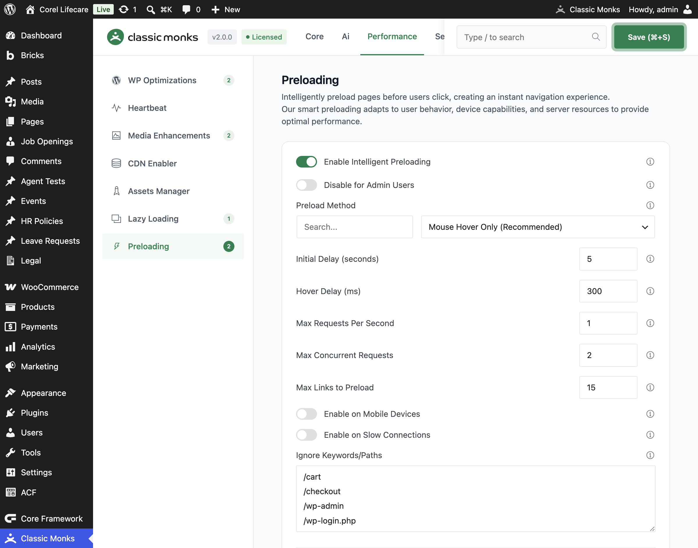

# How to Use Selective Media Preload in WordPress

> Selective Media Preload lets you choose critical media files and optional custom URLs for individual posts and pages. Classic Monks outputs preload tags for those assets so they are available earlier without preloading everything site-wide.

## Key Takeaways

- Separate feature from Intelligent Preloading
- Adds a **Media Preload Settings** metabox to enabled post types
- Supports selected Media Library attachments
- Optional custom URL preloads
- Supports scope modes for selected post types
- Maximum of 10 total media files and URLs per post
- Best used for LCP images and other critical above-the-fold media

## What Is Selective Media Preload?

Selective Media Preload outputs `<link rel="preload">` tags for media you select on individual posts and pages. It is designed for cases where you know the exact asset that should load early, such as a hero image, featured image, logo, or critical video.

This is different from:

- **Lazy Loading**, which defers non-critical resources until they approach the viewport
- **Critical Image Preload**, which detects common above-the-fold patterns
- **Intelligent Preloading**, which predicts likely next pages and preloads links

Selective Media Preload is explicit and page-specific. You choose the assets yourself.

---

## How to Enable Selective Media Preload

### Step 1: Open the Performance settings

In WordPress admin, open **Classic Monks > Performance** and select the **Preloading** subtab.

### Step 2: Enable the feature

Enable **Enable Selective Media Preload**.

### Step 3: Choose the scope mode

Configure **Scope Mode** and choose which post types receive the metabox:

- **Only on selected post types**
- **Except on selected post types**
- **On all post types**

Select the post types that match your content workflow.

### Step 4: Enable custom URLs if needed

Enable **Enable Custom URL Preload Method** if you need to preload an asset that is not in the WordPress Media Library.

Use this for a CDN-hosted image, video, font, or other resource that is safe and appropriate to preload.

### Step 5: Save the settings

Click **Save Changes**.

### Step 6: Open a supported post or page

Edit a post or page whose post type matches your scope settings. Look for the **Media Preload Settings** metabox.

### Step 7: Add critical media

Click **Add Media** and select the files that must load early. Add the largest or most important above-the-fold images first. Use **Clear All** to remove the current selection and rebuild the list.

### Step 8: Add custom URLs (optional)

If custom URL support is enabled, click **Add URL** and enter a complete valid URL. Select the correct resource type through the URL extension and verify that the URL is publicly accessible.

### Step 9: Save the post

Update or publish the post. Classic Monks stores the selected media IDs and URLs as post metadata and outputs preload tags on the frontend.

---

## How to Choose What to Preload

Prioritize assets that affect the first viewport and LCP:

1. Hero image
2. Featured image visible immediately on the page
3. Site logo when it is the LCP element
4. Critical above-the-fold video poster or video
5. A small number of other assets required for the first render

Do not preload every image. The implementation limits the total to 10 items, and the UI recommends keeping the list to approximately 3–5 critical files or URLs.

---

## Configuration Options

| Option | Description | Default |
|---|---|---|
| **Enable Selective Media Preload** | Enables the post-editor metabox and frontend preload output. | Off |
| **Enable Custom URL Preload Method** | Allows custom URLs in addition to Media Library attachments. | Off |
| **Scope Mode** | Controls which post types receive the metabox. | Only on |
| **Selected Post Types** | Post types included or excluded by the scope mode. | Empty |
| **Maximum total items** | Maximum combined media files and custom URLs per post. | 10 |

---

## Verify the Generated Preloads

### Browser test

1. Open the published post in a logged-out private window.
2. View the page source or inspect the document head.
3. Search for `Classic Monks Selective Media Preload`.
4. Confirm each selected asset has a corresponding `<link rel="preload">` tag.
5. Open DevTools > **Network** and reload the page.
6. Confirm the selected asset starts loading early.
7. Confirm non-selected below-the-fold assets are not accidentally preloaded.

### LCP test

Run the page through Lighthouse or PageSpeed Insights before and after adding the preload. Record:

- LCP element
- LCP request start time
- LCP resource priority
- Total transfer size
- Any preload warnings

Only keep the preload if it improves the actual critical rendering path. An unnecessary preload competes with CSS, fonts, or other critical resources.

---

## Troubleshooting

### The metabox is not visible

**Cause:** The feature is disabled, the current post type is outside the configured scope, or the post type is not public.
**Fix:** Enable the feature, check **Scope Mode**, select the current post type, and reload the editor.

### The custom URL field is not visible

**Cause:** **Enable Custom URL Preload Method** is disabled.
**Fix:** Enable it in **Performance > Preloading**, save settings, and reload the editor.

### The preload tag is not in the page source

**Cause:** The post type is not enabled, no media was saved, or the post is not a singular frontend view.
**Fix:** Confirm the post type scope, save the post again, and test the published singular URL.

### The selected image still has lazy-loading behavior

**Cause:** Another optimization layer is rewriting the markup, or the image was not recognized as a selected preload asset.
**Fix:** Check the generated preload tag and the image's loading attributes. Disable competing optimization systems and retest.

### The page became slower after adding preloads

**Cause:** Too many assets are competing for early bandwidth.
**Fix:** Remove non-critical items. Keep only the 3–5 assets that directly affect the first viewport or LCP.

### A custom URL does not preload

**Cause:** The URL is invalid, inaccessible, or the extension does not map to a known media type.
**Fix:** Verify the URL from the server's perspective, use HTTPS, and check the generated `as` and `type` attributes in the page source.

---

## Related Articles

- [How to Enable Lazy Loading in WordPress](performance-perf-lazy-loading.md)
- [How to Enable Intelligent Preloading in WordPress](performance-perf-monks-preload.md)
- [How to Enable the Assets Manager in WordPress](performance-perf-assets-manager.md)

---

## Developer Notes

Implementation: `functions/performance/selective-media-preload.php`.

Relevant options and metadata:

- `enable_selective_media_preload`
- `enable_selective_media_preload_urls`
- `selective_media_preload_mode`
- `selective_media_preload_post_types`
- `_cm_preload_media`
- `_cm_preload_urls`

The feature registers `add_meta_boxes`, `save_post`, `wp_head`, `wp_img_tag_add_loading_attr`, `wp_preload_resources`, and `admin_enqueue_scripts` hooks/filters. It limits the combined media and URL selection to 10 items per post.
