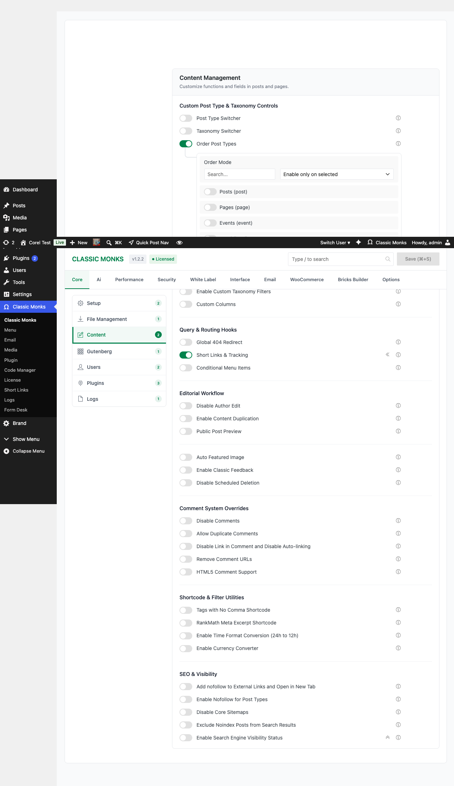
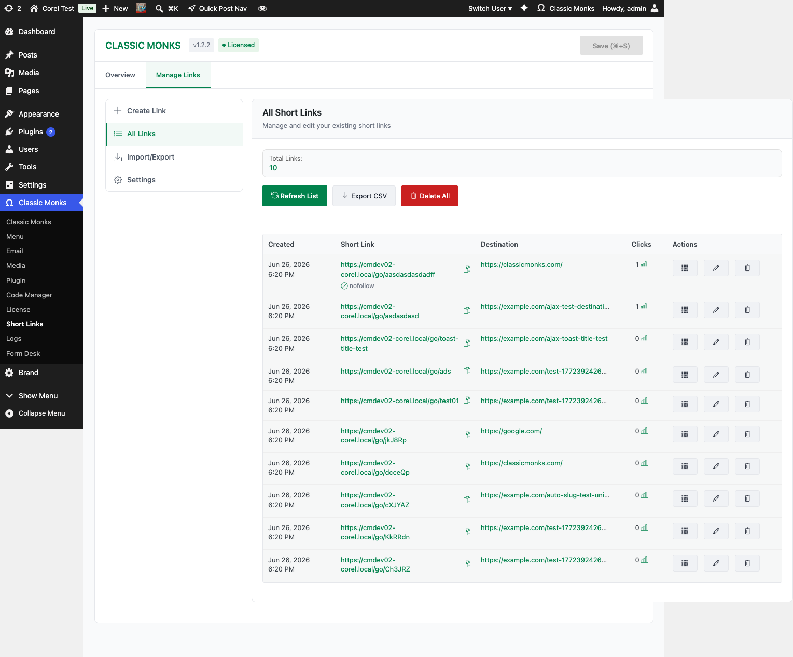
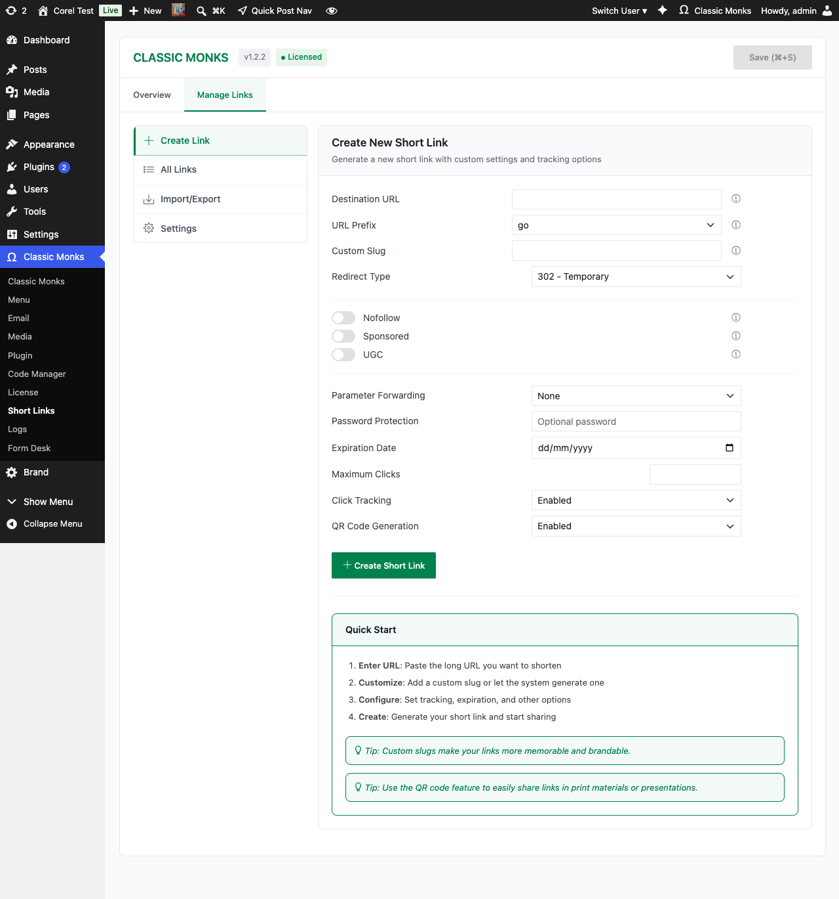

# How to Create Short Links with Click Tracking in WordPress

> Classic Monks includes a built-in short link manager that creates branded short URLs with click tracking, expiration dates, and password protection, no third-party service required.

## Key Takeaways

- Create branded short URLs like yoursite.com/go/offer without external services
- Track clicks with geographic, device, and referrer data
- Set expiration dates and password protection for time-sensitive campaigns

---

## What Is Short Links and Tracking?

The Short Links and Tracking feature in Classic Monks creates a custom post type for managing branded short URLs directly in WordPress. Every short link includes built-in analytics, so you can see who clicked, where they came from, and what device they used.

Unlike third-party shorteners like Bitly or TinyURL, your short links live on your own domain. No redirects through third-party servers, no branding from another company, and full control over your link data.

## Why You Need It

When you share links on social media, email campaigns, or printed materials, long URLs look unprofessional and break across lines. Third-party shorteners solve this but introduce problems: you depend on their uptime, they add a redirect hop that slows your site, and you lose control of your data.

Classic Monks gives you self-hosted short links that are fast, branded, and fully tracked. Your links stay on your domain, load faster without third-party redirects, and all analytics stay in your WordPress database.

---

## How to Enable Short Links in Classic Monks

### Step 1: Navigate to Classic Monks Settings

Click into the **Classic Monks** plugin settings in your WordPress dashboard.

### Step 2: Go to the Core Tab

Click on the **Core** menu.

### Step 3: Open the Content Subtab

Click the **Content** subtab in the left sub-navigation. The Content Management section loads.

### Step 4: Enable Short Links and Tracking

Scroll to find the **Short Links & Tracking** toggle. The toggle has a submenu indicator (the `«` icon) that signals it adds a new submenu to the admin sidebar.



### Step 5: Save Changes

Click **Save Changes**. A new **Short Links** submenu appears under **Classic Monks** in the admin sidebar.

---

## How to Create a Short Link

### Step 1: Open Short Links

Click **Classic Monks > Short Links** in the admin sidebar. The Short Links management page opens with a table of all created links, showing their title, slug, target URL, and click count.



### Step 2: Add New

Click the **Add New** button at the top of the page.

### Step 3: Configure Your Link

The Add New Short Link form opens. Fill in the standard WordPress post fields:



- **Title:** A descriptive name for your reference (e.g., "Black Friday Campaign")
- **Target URL:** The full destination URL where visitors will be redirected (entered in the Custom Fields panel)
- **Short Slug:** The custom path after your domain (e.g., `go/offer` creates `yoursite.com/go/offer`) — entered in the Custom Fields panel

### Step 4: Set Optional Restrictions

In the Classic Monks meta box below the editor, set:

- **Expiration Date:** Set a date after which the link stops working
- **Password Protection:** Require a password to access the link

### Step 5: Publish

Click **Publish**. Your short link is now active and redirecting visitors to the target URL.

---

## How to View Click Analytics

### Step 1: Open Short Links

Click **Classic Monks > Short Links** in the admin sidebar.

### Step 2: Select a Link

Click on any short link to view its analytics dashboard.

### Step 3: Review the Data

You'll see:

- **Total Clicks:** Aggregate click count over time
- **Clicks Over Time:** A chart showing click trends (daily, weekly, monthly)
- **Geographic Data:** Where your clicks are coming from (country, city)
- **Device Data:** Desktop, mobile, or tablet breakdown
- **Referrer Data:** Which sites or campaigns are driving clicks

---

## Configuration Options

| Option | Description | Default |
|--------|-------------|---------|
| **Title** | Internal reference name for the link | Required |
| **Target URL** | Full destination URL | Required |
| **Short Slug** | Custom path segment | Auto-generated |
| **Expiration Date** | Date when the link stops redirecting | None |
| **Password** | Require a password to access the link | None |
| **Active/Inactive** | Enable or disable the redirect | Active |

---

## Tips for Using Short Links

### Campaign Tracking

Create unique short links for each marketing channel to track performance:
- `yoursite.com/go/fb-offer` for Facebook ads
- `yoursite.com/go/email-newsletter` for email campaigns
- `yoursite.com/go/print-flyer` for print materials

### Branded Social Sharing

Use short links in social media posts for cleaner, more professional URLs:
- Instead of: `yoursite.com/2026/06/01/amazing-product-review-best-things-ever/`
- Use: `yoursite.com/go/review`

### Time-Sensitive Promotions

Set expiration dates on links for limited-time offers. When the date passes, the link automatically stops redirecting. No manual cleanup needed.

### Password-Protected Content

Use password protection for exclusive content like client previews, affiliate resources, or early access pages.

---

## Advanced Options (Developers)

### Programmatic Link Creation

Create short links via the REST API:

```php
// Create a short link programmatically
$link = wp_insert_post([
    'post_type'   => 'cm_short_link',
    'post_status' => 'publish',
    'post_title'  => 'My Campaign',
    'meta_input'  => [
        'cm_short_link_target'     => 'https://yoursite.com/destination',
        'cm_short_link_slug'       => 'go/campaign',
        'cm_short_link_expiry'     => '2026-12-31',
        'cm_short_link_password'   => '',
    ],
]);
```

### Filter Click Data

Access click analytics programmatically:

```php
// Get click count for a specific link
$click_count = get_post_meta($link_id, 'cm_short_link_clicks', true);

// Get geographic data
$geo_data = get_post_meta($link_id, 'cm_short_link_geo_data', true);
```

### Custom Redirect Logic

Add custom logic before the redirect fires:

```php
// Redirect mobile users to a different URL
add_action('cm_short_link_redirect', function($link_id, $target_url) {
    if (wp_is_mobile()) {
        $mobile_url = get_post_meta($link_id, 'cm_short_link_mobile_target', true);
        if ($mobile_url) {
            wp_redirect($mobile_url);
            exit;
        }
    }
}, 10, 2);
```

---

## Troubleshooting

### Short Link Shows 404

**Cause:** The slug conflicts with an existing WordPress rewrite rule, or permalinks need to be flushed.
**Fix:** Go to **Settings > Permalinks** and click **Save Changes** to flush rewrite rules. Choose a unique slug that doesn't conflict with existing pages or posts.

### Click Count Not Updating

**Cause:** Page caching is serving a cached version that skips the click tracking.
**Fix:** Exclude short link URLs from your caching plugin, or add a no-cache header for the redirect endpoint. If using a CDN, purge the cache after creating new links.

### Password Protection Not Working

**Cause:** The password form isn't rendering due to a theme or plugin conflict.
**Fix:** Check that your theme isn't overriding the password form template. Try switching to a default theme temporarily to isolate the issue.

---

## Related Articles

- [How to Add Code Snippets in WordPress](code-manager.md)
- [How to Set Up the AI Agent in Classic Monks](ai/ai-agent.md)
- [How to Enable Email Logging and SMTP](email/email-logging.md)
