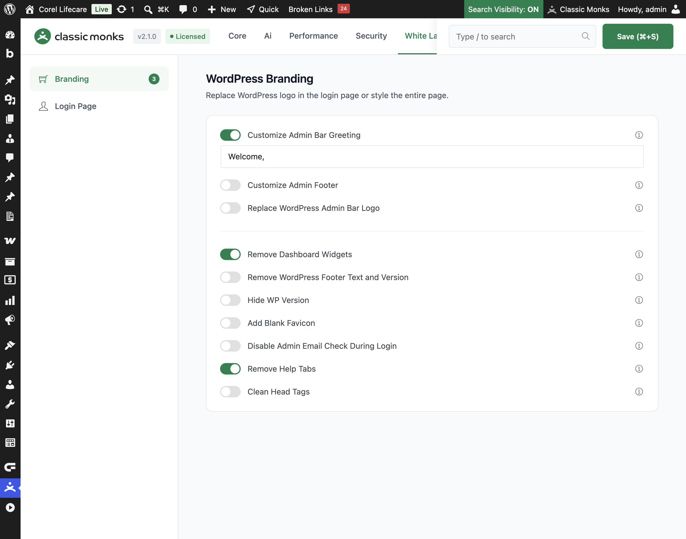

# How to Customize the Admin Bar Greeting in WordPress

> The WordPress admin bar shows a "Howdy" greeting next to your name. Classic Monks lets you replace it with your own text, or remove it entirely, for a cleaner and more branded admin experience.

## Key Takeaways

- Replace the default "Howdy" greeting with your own text.
- Leave the greeting empty to remove it entirely.
- The change applies to the admin bar on every admin page.
- A simple toggle with a text input, no nested options.

## What Is the Admin Bar Greeting

The admin bar greeting is the "Howdy" text that appears at the top right of the WordPress admin bar, next to your user name. Classic Monks lets you replace it with your own text, such as "Welcome," or a brand name, or remove it entirely. It is a white-label option in the **White Label** tab.

## Customize the Admin Bar Greeting

### Step 1: Open the Branding Settings

In your WordPress dashboard, go to **Classic Monks**, open the **White Label** tab, then the **Branding** subtab.

### Step 2: Turn On Customize Admin Bar Greeting

In the **Branding** subtab, toggle on **Customize Admin Bar Greeting**.

### Step 3: Set the Greeting Text

In the **Custom Greeting** field, enter the text you want to show in place of "Howdy". The default is **Welcome,**. Leave the field empty to remove the greeting text entirely.

### Step 4: Save and Test

Click **Save (⌘+S)**. Check the admin bar at the top of any admin page to confirm the new greeting appears.

## Verify It Works

After saving, open any admin page and confirm:

- The admin bar shows your custom greeting instead of "Howdy".
- The greeting is followed by your user name.
- If the field is empty, the greeting text is removed entirely.

If the greeting does not change, confirm the toggle is on, the text is entered, and the changes were saved.

## Examples

### Example 1: Use a Branded Greeting

A client wants a branded admin. Set the greeting to **Welcome,** (the default) so the admin bar reads "Welcome, [Client Name]". The admin feels more personal and less WordPress-branded.

### Example 2: Remove the Greeting

A site wants a minimal admin bar. Toggle on **Customize Admin Bar Greeting** and leave the field empty. The "Howdy" text disappears, leaving only the user name.

### Example 3: Use a Friendly Greeting

A team wants a friendly tone. Set the greeting to **Hi there,** so the admin bar reads "Hi there, [Name]". The change applies to everyone who uses the admin.

### A consistent greeting across the team

For a team that wants a consistent, professional admin, a set greeting such as "Welcome," gives every user the same experience. It removes the random-feeling default and makes the admin feel intentional.

## Troubleshooting

### The greeting does not change

**Cause:** The toggle is off, or the changes were not saved.
**Fix:** Confirm **Customize Admin Bar Greeting** is on, enter the text, and click **Save (⌘+S)**.

### The greeting shows but the text is empty

**Cause:** The greeting field is empty, which removes the text.
**Fix:** Enter text in the field, or leave it empty if you want to remove the greeting.

### The greeting is not empty but I want to remove it

**Cause:** The field still has text.
**Fix:** Clear the field and save to remove the greeting entirely.

## Recommendations Before Enabling

- **Pick a neutral or brand greeting.** The greeting appears for every user, so choose text that fits the whole team, not just you.
- **Test the empty state.** If you leave the greeting empty, confirm the user name still shows correctly in the admin bar.
- **Keep it short.** A long greeting takes space in the admin bar. Use one or two words.

## Common Use Cases

### White-label the admin for a client

When you build a site for a client, the default "Howdy, [Name]" greeting reveals the WordPress admin. Replacing it with a branded or neutral greeting, such as "Welcome," makes the admin feel like part of the client's product rather than a generic WordPress screen.

### Remove the greeting for a minimal admin

Some teams prefer a clean admin bar with no greeting text. Leaving the greeting field empty removes the "Howdy" text entirely, leaving only the user name. This suits a minimal, uncluttered admin for power users.

### Use a friendly greeting for a team

For an internal team, a friendly greeting such as "Hi there," sets a welcoming tone. The change applies to every user who logs in, giving the whole admin a consistent, human feel.

## Troubleshooting

## Related Articles

- [How to Customize the Admin Footer in WordPress](white-label-wl-admin-footer.md)
- [How to Replace the WordPress Admin Bar Logo in WordPress](white-label-wl-admin-logo.md)
- [How to Use the White Label Tab in Classic Monks: Feature Index](../white-label.md)

---

*Written by Joy. Last updated August 4, 2026. Tested with WordPress 6.x and Classic Monks 2.1.0.*

<!-- schema: Article, TechArticle -->
<!-- schema: BreadcrumbList -->