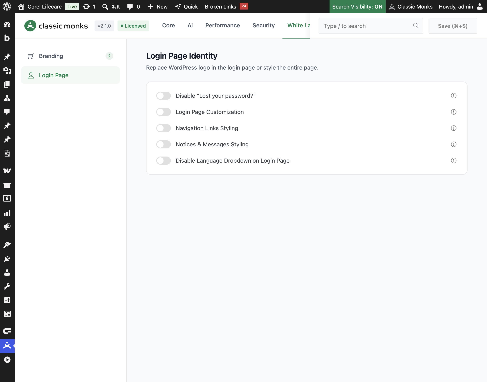

# How to Customize the WordPress Login Page

> The default WordPress login page is plain and unbranded. Classic Monks lets you replace the logo, set a background image or video, style the login form, and control the navigation links so the login page matches your brand.

## Key Takeaways

- Replace the default WordPress logo with your own, and control its size, position, and appearance.
- Set the login background to a color, an image, or a video, with layout options for split backgrounds.
- Style the login form with colors, padding, border, and shadow.
- Customize or hide the navigation links and style error, success, and info notices.
- Disable the "Lost your password?" link and the language dropdown for a cleaner login page.

## What Is Login Page Customization

Login Page Customization is a group of options in the Classic Monks **White Label** tab that change the appearance of the WordPress login page. It is the first thing a client or user sees when they log in, so making it match your brand leaves a professional impression. The feature covers the logo, the background (color, image, or video), the login form, the navigation links, and the notices.

It is one of the white-label features in Classic Monks. The related features are **Custom Login Logo**, **Login Form Styling**, **Navigation Links Styling**, and **Notices & Messages Styling**, which group under the **Login Page Customization** master toggle.

## Recommendations Before Enabling

- **Use a high-quality background image.** The search result guidance for background images applies here: use a sharp, brand-aligned image. Compress it so the login page loads fast.
- **Mute background videos.** Browsers block videos with audio from autoplaying. If you use a video background, keep **Mute Video** on so it plays automatically.
- **Test on a staging site.** Login page changes affect everyone who logs in, so verify on a test environment before applying to production.

## Enable Login Page Customization

### Step 1: Open the White Label Tab

In your WordPress dashboard, go to **Classic Monks** and open the **White Label** tab, then the **Login Page** subtab.

### Step 2: Turn On Login Page Customization

In the **Login Page** subtab, toggle on **Login Page Customization**. This reveals the logo, background, and form styling options.

### Step 3: Add a Custom Logo

Toggle on **Custom Login Logo**, then either upload a logo with the **Upload Logo** button or paste a logo URL into the **Login Logo URL** field. Set the logo width, height, max width, and max height in pixels. Use **Center Logo** to keep the logo horizontally centered, and set the padding, margin, border radius, and background color as needed.

### Step 4: Set the Background

Choose a **Background Type** from **Color**, **Image**, or **Video**.

- **Color**: pick a background color for the login page.
- **Image**: upload a background image and set its repeat, position, and size. Use **Layout Position** to choose **Default (Full Background)**, **Left Background / Right Form**, or **Right Background / Left Form** for a split layout.
- **Video**: upload a background video and set its size to **Auto**, **Cover**, or **Contain**. Toggle **Mute Video** and **Loop Video** to control playback.

### Step 5: Style the Login Form

Toggle on **Login Form Styling** to change the form appearance. Set the form background color, text color, border radius, and padding. Set the input border color, and the button background and text colors. Under **Form Border**, set the width, style, and color. Toggle **Enable Form Shadow** and set the shadow color for a subtle depth effect.

### Step 6: Save and Test

Click **Save (⌘+S)**. Open the login page in a private browser window to confirm the logo, background, and form styling appear correctly.

## Configure Navigation Links and Notices

### Navigation Links Styling

Toggle on **Navigation Links Styling** to control the links below the login form. Toggle **Hide "Back to Site" Link** to remove the link back to your site, and set the **Link Color** and **Link Hover Color** to match your brand.

### Notices & Messages Styling

Toggle on **Notices & Messages Styling** to style the messages that appear on the login page. Set the background, text, and border colors for **Error Notices**, **Success Notices**, and **Info Messages**.

### Disable "Lost your password?"

Toggle on **Disable "Lost your password?"** to hide the password recovery link and prevent the password reset flow on the login page.

### Disable Language Dropdown

Toggle on **Disable Language Dropdown on Login Page** to remove the language switcher from the login page for a cleaner appearance.

## Verify It Works

After saving, open the login page in a private browser window and confirm:

- The custom logo appears in place of the default WordPress logo.
- The background color, image, or video displays correctly.
- The login form uses your chosen colors, padding, border, and shadow.
- The navigation links and notices match your styling.
- The "Lost your password?" link and language dropdown are hidden if you disabled them.

If a change does not appear, clear any page cache and reload.

## Examples

### Example 1: Brand the Login Page for a Client

An agency builds a client site and wants the login page to match the client's brand. Toggle on **Login Page Customization**, upload the client's logo, set **Background Type** to **Image** with a brand-colored image, and style the form with the client's colors. Toggle on **Navigation Links Styling** and hide the "Back to Site" link for a clean look. The client sees a branded login page instead of the default WordPress one.

### Example 2: Use a Video Background for a Modern Look

A product company wants a modern login page. Set **Background Type** to **Video**, upload a short brand video, and keep **Mute Video** and **Loop Video** on so it plays automatically and continuously. Set the video size to **Cover** so it fills the screen. The login page now has a dynamic, on-brand background.

### Example 3: Split Layout With Form on the Right

A site wants a split login layout. Set **Background Type** to **Image**, upload a background image, and choose **Layout Position** of **Left Background / Right Form**. The image fills the left side and the login form sits on the right, which works well on desktop and collapses on mobile.

## Troubleshooting

### The background video does not play

**Cause:** The video has audio, and browsers block autoplay with sound.
**Fix:** Toggle on **Mute Video** so the video plays automatically. Verify the video URL is correct.

### The custom logo does not appear

**Cause:** The logo URL is empty, or the logo toggle is off.
**Fix:** Confirm **Custom Login Logo** is on and the **Login Logo URL** field has a valid image URL. Clear any page cache.

### The form changes do not apply

**Cause:** **Login Form Styling** is off, or the values are not saved.
**Fix:** Confirm **Login Form Styling** is on, set the values, and click **Save (⌘+S)**.

### The "Lost your password?" link still shows

**Cause:** The **Disable "Lost your password?"** toggle is off.
**Fix:** Toggle it on and save. The link hides and the password reset flow is disabled.

## Frequently Asked Questions

### How do I customize the WordPress login page?

Open **Classic Monks**, go to the **White Label** tab, then the **Login Page** subtab. Toggle on **Login Page Customization** to reveal the logo, background, and form styling options, then make your changes and save.

### How do I change the logo on the login page?

Toggle on **Custom Login Logo** and upload a logo with the **Upload Logo** button or paste a logo URL into the **Login Logo URL** field. Set the logo size and position, then save.

### How do I add a background image to the WordPress login page?

Set **Background Type** to **Image**, upload a background image, and set its repeat, position, and size. Use **Layout Position** to choose a full or split background layout.

### Can I use a video as the WordPress login background?

Yes. Set **Background Type** to **Video**, upload a background video, and set its size, mute, and loop options. Keep **Mute Video** on so browsers allow autoplay.

### How do I hide the "Lost your password?" link?

Toggle on **Disable "Lost your password?"** in the **Login Page** subtab. This hides the recovery link and disables the password reset flow on the login page.

## Related Articles

- [How to Add a Custom Login Logo in WordPress](white-label-wl-login-logo.md)
- [How to Style the Login Form in WordPress](white-label-wl-login-form-styling.md)
- [How to Use the White Label Tab in Classic Monks: Feature Index](../white-label.md)

---

*Written by Joy. Last updated August 4, 2026. Tested with WordPress 6.x and Classic Monks 2.1.0.*

<!-- schema: Article, TechArticle -->
<!-- schema: BreadcrumbList -->