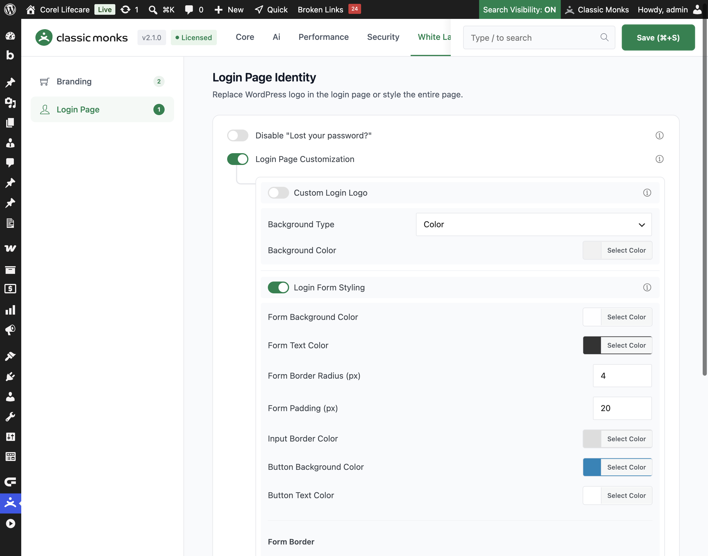

# How to Style the Login Form in WordPress

> The default WordPress login form is plain. Classic Monks lets you change the form background, text, and button colors, plus the border radius, padding, border, and shadow, so the login form matches your brand.

## Key Takeaways

- Customize the login form background, text, input, and button colors.
- Set the form border radius and padding for a tailored shape.
- Add a border with a custom width, style, and color.
- Add a soft shadow to lift the form off the background.
- All changes are part of the **Login Page Customization** group.

## What Is Login Form Styling

Login Form Styling is a white-label option in the Classic Monks **White Label** tab that changes the appearance of the login form on the login page. It is part of the **Login Page Customization** group. It controls the form's background, text, input, and button colors, plus the border radius, padding, border, and shadow.

It is separate from the **Custom Login Logo** and **Navigation Links Styling** options. This guide covers the login form itself.

## Recommendations Before Enabling

- **Match the button color to your brand.** The login button is the primary action, so use a brand color that stands out from the form background.
- **Keep text readable.** Ensure the text color contrasts with the form background color, especially for the submit button.
- **Test on mobile.** Check that the form padding and border radius look right on a phone screen.

## Style the Login Form

### Step 1: Open the Login Page Settings

In your WordPress dashboard, go to **Classic Monks**, open the **White Label** tab, then the **Login Page** subtab. Toggle on **Login Page Customization** to reveal the form styling options.

### Step 2: Turn On Login Form Styling

In the **Login Form Styling** section, toggle on **Login Form Styling**.

### Step 3: Set the Form Colors

Use the color pickers to set:

- **Form Background Color**: the login form background, default `rgba(255, 255, 255, 0.8)`.
- **Form Text Color**: the text inside the form, default `#333333`.
- **Input Border Color**: the border of the username and password fields, default `#dddddd`.
- **Button Background Color**: the login button background, default `#0085ba`.
- **Button Text Color**: the text on the login button, default `#ffffff`.

### Step 4: Set the Form Shape

- **Form Border Radius (px)**: rounds the form corners, default 4.
- **Form Padding (px)**: space inside the form around its content, default 20.

### Step 5: Set the Form Border

Under **Form Border**, set the border width, style, and color:

- **Border Width (px)**: the border thickness, default 1.
- **Border Style**: **None**, **Solid**, **Dashed**, or **Dotted**.
- **Border Color**: the border color, default `#dddddd`.

Select **None** for the border style to remove the border entirely.

### Step 6: Add a Form Shadow

Toggle on **Enable Form Shadow** to add a shadow, then set the **Shadow Color** (default `rgba(0,0,0,0.1)`). The shadow lifts the form off the background for a subtle depth effect.

### Step 7: Save and Test

Click **Save (⌘+S)**. Open the login page in a private browser window to confirm the form styling appears.

## Verify It Works

After saving, open the login page and confirm:

- The form uses the background, text, input, and button colors you set.
- The border radius and padding match your values.
- The border width, style, and color apply.
- The form shadow appears when enabled.
- The styling is consistent across the login page.

If the form changes do not apply, confirm **Login Form Styling** is on and you clicked **Save (⌘+S)**.

## Examples

### Example 1: Brand the Login Form for a Client

An agency wants the login form to match the client's brand. Set the **Form Background Color** to white, the **Button Background Color** to the client's brand color, and the button text to white. Increase the border radius to 8px for a modern look. The login form now matches the brand.

### Example 2: A Subtle Shadow for Depth

A site wants the login form to stand out from the background. Toggle on **Enable Form Shadow** and set the shadow color to a soft gray. The form lifts off the background with a subtle depth effect.

### Example 3: A Borderless Minimal Form

A minimalist site wants a clean login form. Under **Form Border**, set the **Border Style** to **None** and set the padding to 24px. The form has no border and a generous inner space.

## Troubleshooting

### The form changes do not apply

**Cause:** **Login Form Styling** is off, or the changes were not saved.
**Fix:** Confirm the toggle is on and click **Save (⌘+S)**. Clear any page cache.

### The form border does not disappear

**Cause:** The **Border Style** is set to a value other than **None**.
**Fix:** Set **Border Style** to **None** and save.

### The shadow is too strong

**Cause:** The **Shadow Color** is too dark or has too much opacity.
**Fix:** Use a lighter shadow color or reduce the opacity, then save.

### The button color does not match

**Cause:** The **Button Background Color** or **Button Text Color** is not set as expected.
**Fix:** Re-check both color pickers and save.

## Related Articles

- [How to Customize the WordPress Login Page](white-label-wl-login-customization.md)
- [How to Add a Custom Login Logo in WordPress](white-label-wl-login-logo.md)
- [How to Use the White Label Tab in Classic Monks: Feature Index](../white-label.md)

---

*Written by Joy. Last updated August 4, 2026. Tested with WordPress 6.x and Classic Monks 2.1.0.*

<!-- schema: Article, TechArticle -->
<!-- schema: BreadcrumbList -->