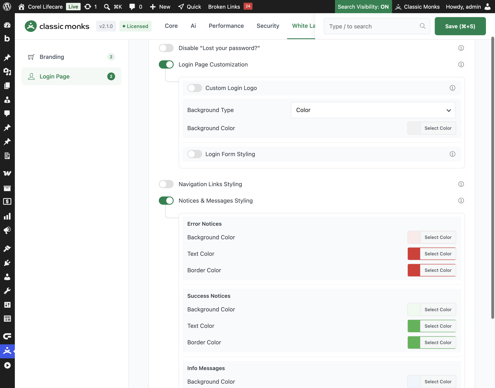

# How to Style Login Notices in WordPress

> The messages that appear on the WordPress login page, such as errors for a wrong password or success messages after a reset, can be styled to match your brand. Classic Monks lets you set the background, text, and border colors for error, success, and info notices.

## Key Takeaways

- Style error, success, and info notices on the login page with brand colors.
- Set the background, text, and border color for each notice type.
- Works independently, without the **Login Page Customization** master toggle.
- Notices keep their clear visual distinction between error, success, and info.

## What Is Notices & Messages Styling

Notices & Messages Styling is a white-label option in the Classic Monks **White Label** tab that styles the messages on the login page. It is an independent option: it works on its own, without the **Login Page Customization** master toggle. It controls the background, text, and border colors of three notice types: **Error Notices**, **Success Notices**, and **Info Messages**.

It is separate from **Login Form Styling** and **Navigation Links Styling**. This guide covers the login page notices.

## Recommendations Before Enabling

- **Keep the notice colors distinct.** Error, success, and info notices should stay visually different so users can tell them apart at a glance.
- **Use accessible contrast.** Ensure the text color contrasts with the notice background so the message is readable.
- **Match your brand without breaking meaning.** You can use brand colors, but keep errors red, success green, and info blue for clarity.

## Style the Login Notices

### Step 1: Open the Login Page Settings

In your WordPress dashboard, go to **Classic Monks**, open the **White Label** tab, then the **Login Page** subtab.

### Step 2: Turn On Notices & Messages Styling

In the **Notices & Messages Styling** section, toggle on **Notices & Messages Styling**. This option works on its own; you do not need the **Login Page Customization** master toggle.

### Step 3: Style Error Notices

Under **Error Notices**, set the background, text, and border colors for error messages. Defaults are a light red background (`#fbeaea`), red text (`#dc3232`), and red border (`#dc3232`).

### Step 4: Style Success Notices

Under **Success Notices**, set the background, text, and border colors for success messages. Defaults are a light green background (`#edfaef`), green text (`#46b450`), and green border (`#46b450`).

### Step 5: Style Info Messages

Under **Info Messages**, set the background, text, and border colors for info messages. Defaults are a light blue background (`#f0f6fc`), blue text (`#2271b1`), and blue border (`#2271b1`).

### Step 6: Save and Test

Click **Save (⌘+S)**. Test the login page by entering a wrong password (to see an error notice) and resetting a password (to see a success or info notice).

## Verify It Works

After saving, trigger each notice type on the login page and confirm:

- Entering a wrong password shows an error notice with your error colors.
- A successful password reset shows a success notice with your success colors.
- Other messages show the info colors.

If a notice does not use your colors, confirm **Notices & Messages Styling** is on and the changes were saved.

## Examples

### Example 1: Match Notices to Your Brand

A site wants its login notices to blend with the brand. Set the error, success, and info colors to muted versions of the brand palette while keeping each type distinct. The login page stays on-brand while obvious.

### Example 2: High-Contrast Errors

A security-conscious site wants errors to stand out. Set the **Error Notices** background to a bright red and text to white. Errors are unmissable, which helps users notice a failed login.

### Example 3: Soft, Rounded Success Notices

A friendly brand wants a softer success look. Set the success notice background to a pastel green and text to a dark green. Success messages feel calm and positive.

## Troubleshooting

### The notice colors do not change

**Cause:** **Notices & Messages Styling** is off, or the changes were not saved.
**Fix:** Confirm the toggle is on, set the colors, and click **Save (⌘+S)**.

### Error and success notices look the same

**Cause:** The colors for the two notice types are too similar.
**Fix:** Set clearly different colors for error and success notices, then save.

### A notice uses the default color

**Cause:** The specific notice type (error, success, or info) was not changed.
**Fix:** Set the colors for that notice type under its section and save.

## Related Articles

- [How to Customize the WordPress Login Page](white-label-wl-login-customization.md)
- [How to Style Navigation Links on the WordPress Login Page](white-label-wl-login-nav-styling.md)
- [How to Use the White Label Tab in Classic Monks: Feature Index](../white-label.md)

---

*Written by Joy. Last updated August 4, 2026. Tested with WordPress 6.x and Classic Monks 2.1.0.*

<!-- schema: Article, TechArticle, HowTo -->
<!-- schema: BreadcrumbList -->