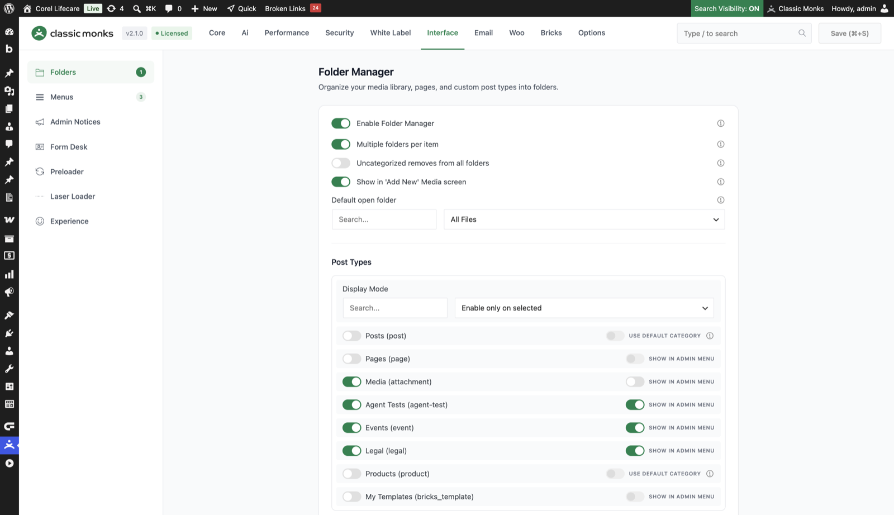
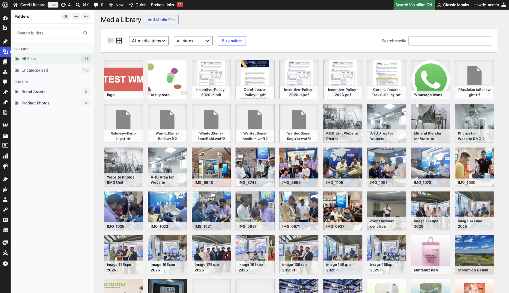
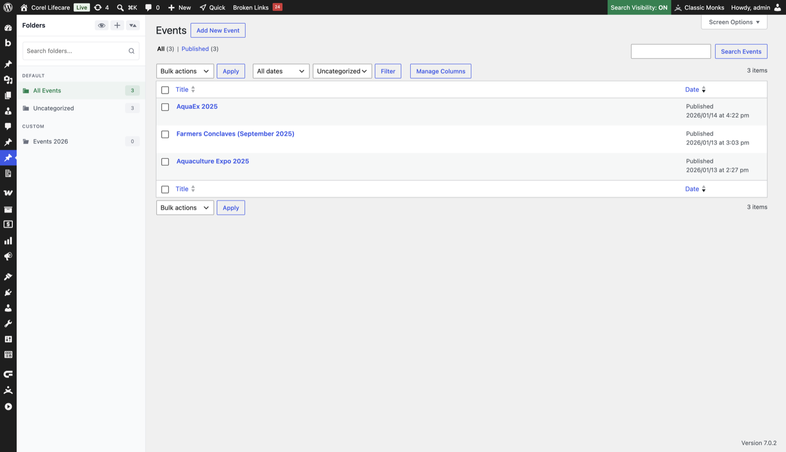
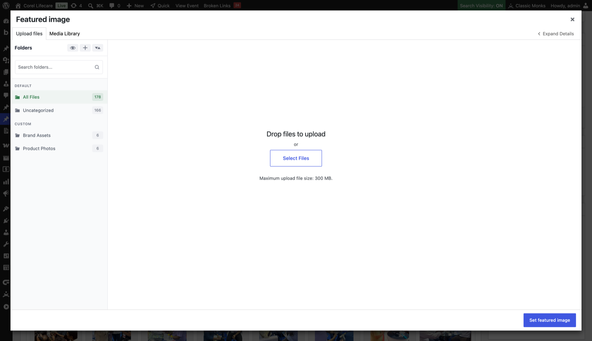

# How to Use the Folder Manager in WordPress

> Folder Manager in Classic Monks organizes WordPress media, posts, and custom post type pages into virtual folders. Add a sidebar folder tree for drag-and-drop organization, folder colors, CPT filtering, and folder-aware media modals.

## Key Takeaways

- Organizes the Media Library and any enabled post type, including posts, pages, custom post types, and WooCommerce products
- Virtual folders are stored as taxonomy terms, so files are never moved on the server
- The folder sidebar appears everywhere media is picked: Media Library, the editor media modal, the featured image picker, and page builder popups
- Works with drag-and-drop, a right-click context menu, folder colors, and a folder filter on CPT list screens
- Advanced features attach to the folder context menu: ZIP download, duplication, gallery shortcode, quick inspect, and image watermarking

## What Is the Folder Manager feature?

The default WordPress Media Library is a flat list. For sites with hundreds or thousands of files, finding the right image or document becomes slow. Folder Manager adds a virtual folder system to the Media Library and, optionally, to your content types.

Folder Manager is not limited to media. Once enabled for a post type, the same folder tree appears on the post list screen, so posts, pages, custom post type entries, and products can be organized and filtered by folder too.

The folders are virtual. They do not create directories on the server. Organization is stored in the database as taxonomy terms, which means:

- Files and posts are not moved on the server
- The folder structure is independent of the file or post structure
- One item can exist in multiple folders (when enabled)
- Deleting a folder does not delete the items inside it

## Where Folder Manager Appears

Folder Manager touches every screen where you browse or choose content:

| Surface | What you get |
|---|---|
| Media Library | Folder sidebar on the left, click to filter, drag items into folders |
| CPT and post list pages | Folder sidebar plus a folder filter dropdown above the list table |
| Post and CPT editor | The featured image picker modal shows the folder sidebar, so you can pick by folder |
| Editor "insert media" modal | Same sidebar when adding images to content |
| Media > Add New screen | Optional folder dropdown shown during upload |
| Page builders | Bricks, Elementor, Beaver Builder, Oxygen, and Divi get the folder sidebar in their media popups |
| Customizer | Folder-aware media modal when setting theme images |

## Why You Need It

A flat Media Library becomes painful once a site grows past a few hundred files, and the same applies to content types with many entries. Folder Manager helps with:

- **Navigation**: click a folder instead of scrolling a flat list of files or posts
- **Organization**: group media by client, project, season, or type; group CPT entries by category, year, or campaign
- **Collaboration**: multiple editors can see the same structure and know where items live
- **Reusability**: knowing which images belong to which project prevents accidental deletion
- **Workflow**: uploads can be filed into the folder you have open, and CPT entries can be filtered by folder from the list screen

---

## Enable Folder Manager

### Step 1: Open the Folders settings

Go to **Classic Monks** in the WordPress admin sidebar, open the **Interface** tab, and click the **Folders** subtab.

### Step 2: Turn on the master toggle

Toggle on **Enable Folder Manager**. Nested options expand automatically.

### Step 3: Configure sub-options

Set the media and post type options described below.

### Step 4: Save Changes

Click **Save Changes** (or press `Cmd+S` / `Ctrl+S`). Folder Manager activates immediately; no page reload is required.

## Configure Folder Manager

### Media folder options

| Option | Behavior | Default |
|---|---|---|
| **Enable Folder Manager** | Master toggle for the whole feature. | Off |
| **Multiple folders per item** | Allow one file or post to belong to more than one folder. | On |
| **Uncategorized removes from all folders** | When an item is dragged into "Uncategorized", it is removed from every folder instead of just staying uncategorized. | Off |
| **Show in 'Add New' Media screen** | Adds a folder dropdown to the Media > Add New upload screen. The selected folder persists for future uploads. | On |
| **Default open folder** | The view Media Library opens to: All Files, Uncategorized, or Last Opened. | All Files |

### Post type options

The **Post Types** section controls which content types get folders.

**Display Mode** sets the selection logic:

- **Enable only on selected** (default): folders appear only on the post types you check
- **Enable except on selected**: folders appear on every public post type except the ones you check
- **Enable on all post types**: folders appear on every public post type

Each public post type gets its own row with a toggle, including posts, pages, custom post types, and products. The attachment (media) post type is always enabled.

Two extra controls appear per post type when relevant:

- **Show in Admin Menu**: adds a "Folders" submenu under the post type menu for quick folder management. This appears for post types without a native category taxonomy, and it is hidden for WooCommerce products (which already show Product Categories).
- **Use Default Category**: available for Posts and Products. When enabled, Folder Manager reuses the native Category (posts) or Product Category (products) taxonomy instead of creating a separate folder taxonomy, so folders and existing categories stay in sync.

When a custom taxonomy is created, it is named after the post type, for example `cm_folder_event` for an "Events" post type. Media folders always use `cm_media_folders`.

### Advanced features

Four optional features attach to the folder context menu:

| Toggle | Adds to context menu |
|---|---|
| **Folder Download (ZIP)** | "Download ZIP" to download a folder and its contents |
| **Folder Duplication** | "Duplicate" to copy a folder structure (not the files inside) |
| **Gallery Shortcode** | Gallery builder that inserts a `[cm_foldermanager_gallery]` shortcode for a folder |
| **Quick Inspect** | "Inspect" hover mode that reveals which folders an item belongs to |

Image watermarking, when enabled, also appears as a folder-level action.

---

## Use Folders in the Media Library

Once enabled, the Media Library shows the folder tree on the left side.

### Create a folder

Click the **create** icon at the top of the sidebar, type a name, and press Enter. You can also right-click the sidebar and choose **New Folder**.

### Move files into folders

Drag any file from the grid and drop it onto a folder. With **Multiple folders per item** on, a file can live in several folders at once. Dragging onto **Uncategorized** removes existing folder assignments when the "Uncategorized removes from all folders" option is enabled.

### Use the context menu

Right-click a folder for: Rename, Delete, Move, color picker, sort alphabetically, Download ZIP, Duplicate, Gallery Builder, Inspect, and Apply Watermark (when those features are enabled). Folders can also be dragged to reorder or to nest as subfolders.

### Filter and search

Click a folder to show only its contents. The search box at the top of the sidebar filters the tree by folder name. The search inside the Media Library filters within the currently selected folder.

### Upload into the current folder

Uploads are filed automatically into the folder you have selected in the sidebar. The same applies to uploads from a media modal, which is covered below.

---

## Use Folders on Custom Post Type Pages

When a post type is enabled, its list screen gets the same folder sidebar and a folder filter dropdown above the table.

- The sidebar shows virtual views (All Posts / Uncategorized) plus your custom folders, with item counts
- The dropdown filter shows **All [Post Type] Folders** and **Uncategorized**, and filters the table instantly
- Drag a post row onto a folder to assign it; drag it to a folder to move it between folders
- Clicking a folder in the sidebar filters the list to that folder only
- Posts and products with **Use Default Category** enabled reuse the native category taxonomy, so existing categories appear as folders

If **Show in Admin Menu** is checked for the post type, a **Folders** submenu appears under the post type menu in the admin sidebar. It opens the taxonomy screen for managing folder names, descriptions, slugs, and hierarchy.

---

## Use the Featured Image Picker Modal

The folder sidebar travels with the media modal, including the featured image picker. Open any post or CPT editor, click **Set featured image**, and the picker opens with the folder tree on the left.

From the picker you can:

- Switch folders to browse only the images you organized for that content
- Upload a new file into the folder currently selected in the modal sidebar
- Pick an existing image, which is then assigned as the featured image

The same sidebar appears in every media modal, so inserting images into content, picking images in the customizer, or choosing media inside page builders (Bricks, Elementor, Beaver Builder, Oxygen, Divi) all stay folder-aware. Folder clicks inside the modal filter the library in third-party media modals too, such as Meta Box.

---

## What Gets Affected

- The Media Library, CPT list pages, and editor media modals show the folder UI
- Uploads are filed into the selected folder automatically
- Media search works within a selected folder
- Folder operations cover create, rename, delete, move, recolor, reorder, sort, download, duplicate, gallery, and inspect

## What Does NOT Get Affected

- The file system: nothing is moved on the server
- File URLs and file names: unchanged
- Post URLs, slugs, and permalinks: unchanged
- Other media management plugins: folder assignment is stored in its own taxonomy and does not overwrite other plugins' data

---

## Troubleshooting

### The folder tree is not appearing

**Cause:** The toggle is off, or the post type is not enabled for folders.
**Fix:** Verify **Enable Folder Manager** is on in Interface > Folders. For a CPT list page, confirm the post type is checked (or the Display Mode includes it). Disable other media management plugins to rule out a conflict.

### Folders are missing on my custom post type page

**Cause:** The CPT is not in the enabled list for the current Display Mode.
**Fix:** In Interface > Folders > Post Types, check the post type, or switch Display Mode to "Enable on all post types". Remember that the default mode is "Enable only on selected".

### Files are not being moved to the folder

**Cause:** Drag-and-drop or the AJAX move failed.
**Fix:** Check the browser console for JavaScript errors. Folder moves use AJAX; if the request fails, items stay put. Reload and try again.

### The featured image picker has no folder sidebar

**Cause:** Folder Manager is off, or a plugin conflict prevents modal injection.
**Fix:** Verify the master toggle, then test the modal again. If it still fails, disable other media plugins to isolate the conflict.

### The folder tree is empty

**Cause:** No folders have been created yet.
**Fix:** Create a folder with the sidebar create button, or right-click the sidebar and choose **New Folder**.

### I can't find a file after moving it to a folder

**Cause:** The file is inside a folder and the filter is scoped.
**Fix:** Click **All Files** in the sidebar to see everything, or click the folder name to see only its contents.

### The folder dropdown does not show on a CPT list screen

**Cause:** The post type is not enabled, or filtering is handled by another plugin.
**Fix:** Confirm the post type is enabled in settings, and check for filter conflicts with other plugins that add dropdowns to the same list screen.

---

## Related Articles

- [How to Use Folder Download in WordPress](interface-folder-download.md)
- [How to Use Folder Duplication in WordPress](interface-folder-duplication.md)
- [How to Use the Gallery Shortcode in WordPress](interface-gallery-shortcode.md)
- [How to Use Quick Inspect in WordPress](interface-quick-inspect.md)

---

*Written by Joy. Last updated August 5, 2026. 8 min read.*
