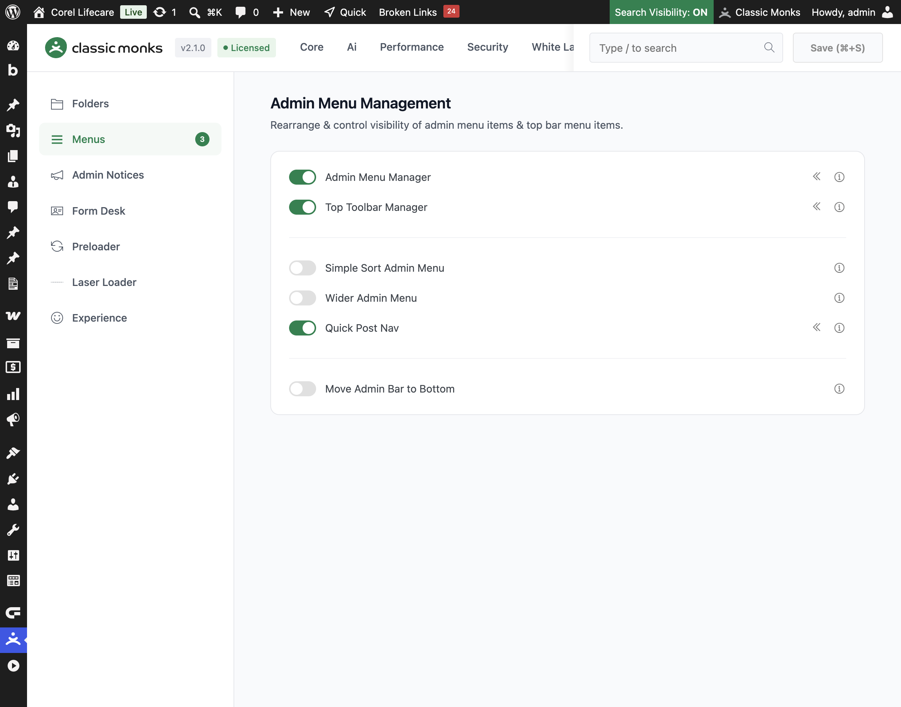
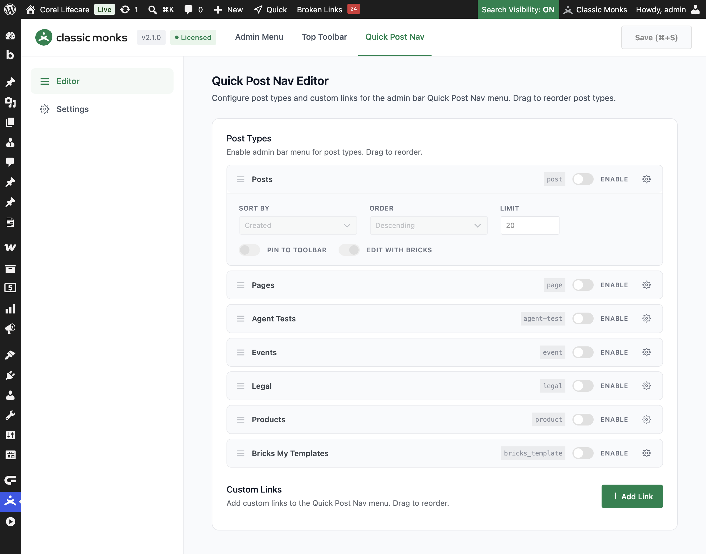
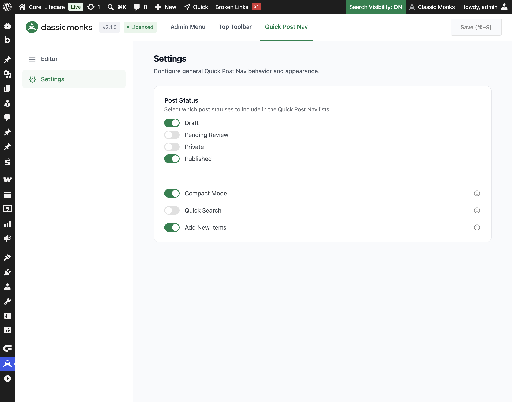

# How to Use Quick Post Nav in WordPress

> Add a quick navigation menu to the WordPress admin bar in Classic Monks. Jump straight to any post, page, or custom post type, add custom links, and control which statuses appear.

## Key Takeaways

- Add a **Quick** menu to the admin bar with one entry per enabled post type, listing recent posts for instant editing.
- Enable post types, drag to reorder them, and set per-type sort order, limit, hierarchy, and builder links.
- Add custom links to the Quick Post Nav menu for frequently used destinations.
- Use **Compact Mode** to group everything into one menu, or **Pin to Toolbar** to keep individual post types visible.
- Add a **Quick Search** box to filter posts, and choose which post statuses appear.

## What Is Quick Post Nav

Quick Post Nav adds a navigation menu to the WordPress admin bar that lets you jump directly to any post, page, or custom post type without going back to the list screen. Each enabled post type appears as a submenu with its recent posts, so you can open an editor or a specific post in one click.

It is one of three menu tools in the Classic Monks **Interface** tab, under the **Menu Management** subtab. The other two are the **Admin Menu Manager** (for the left sidebar menu) and the **Top Toolbar Manager** (for the admin bar). Quick Post Nav adds a fast way to reach content from the admin bar.

## Recommendations Before Enabling

- **You need at least the `edit_posts` capability.** The menu only appears to users who can edit posts, and each post type only shows to users who can edit that type.
- **Toolbar items are context-aware.** The menu appears in the admin bar on both the frontend and backend, so you can reach content from anywhere in the site.
- **Set a limit to keep the menu fast.** Each post type lists its recent posts; a large site with many posts can make the menu long. Use the per-type **Limit** to cap the count.

## Enable Quick Post Nav

### Step 1: Open the Interface Tab

In your WordPress dashboard, go to **Classic Monks** and open the **Interface** tab, then the **Menus** subtab.

### Step 2: Turn On Quick Post Nav

In the **Menu Management** section, toggle on **Quick Post Nav**.

### Step 3: Save and Reload

Click **Save (⌘+S)**. The feature adds a submenu under **Classic Monks** called **Menu**. A page reload is required before the submenu appears.

### Step 4: Open the Quick Post Nav Editor

Go to **Classic Monks** then **Menu**, and open the **Quick Post Nav** tab. It has two subtabs: **Editor** and **Settings**.

## Configure the Editor

The **Editor** subtab has two sections: **Post Types** and **Custom Links**.

### Enable Post Types

Under **Post Types**, each registered post type appears as a row with an **Enable** toggle. Turn it on to add that post type to the Quick Post Nav menu. Drag rows to reorder how the post types appear in the menu.

### Set Post Type Options

Open the options panel on a post type row to configure:

- **Sort By**: sort posts by **Created** (post date), **Title**, or **Menu Order**.
- **Order**: **Ascending** or **Descending**.
- **Limit**: the maximum number of posts to show in the menu (1 to 100). Leave empty to show all.
- **Show Hierarchical**: for hierarchical post types, show the parent and child structure.
- **Pin to Toolbar**: when **Compact Mode** is on, keep this post type visible directly in the admin bar instead of grouping it inside the **Quick** menu.
- **Edit with Bricks** (when Bricks Builder is active): add an **Edit with Bricks** link to each post.

### Add Custom Links

Under **Custom Links**, click **Add Link** to add a custom menu entry. Enter a **Title** and a **URL**. Drag rows to reorder, and use the trash button to remove a link. Custom links appear in the Quick Post Nav menu under a **Custom Links** group.

## Configure the Settings

The **Settings** subtab controls the general behavior of the menu.

### Post Status

Choose which post statuses appear in the post type lists: **Draft**, **Pending Review**, **Private**, **Published**. Posts of the selected statuses show in the menu, with a status label next to non-published posts.

### Compact Mode

Turn on **Compact Mode** to group all post type lists into one **Quick** menu in the admin bar. Use **Pin to Toolbar** on individual post types to keep them visible outside the grouped menu. Turn it off to show each post type as its own top-level admin bar item.

### Quick Search

Turn on **Quick Search** to add a search input to each post type menu. Type to filter the posts in that menu.

### Add New Items

Turn on **Add New Items** to show an **Add New** link at the top of each post type menu, so you can create a new post without leaving the admin bar.

### Show Language

When Polylang is active, turn on **Show Language** to display a language indicator next to each post in the menu.

## Verify It Works

After saving, open the admin bar on the frontend or backend of your site and confirm:

- The **Quick** menu (or individual post type menus) appears with the enabled post types.
- Each post type lists its recent posts, and clicking a post opens its editor.
- Custom links appear in the **Custom Links** group.
- Post statuses, search, and add-new links behave as configured.

If the menu does not appear, confirm the feature is enabled and that you have the `edit_posts` capability.

## Examples

### Example 1: Quick Access to Recent Pages

Enable **Pages** and set **Sort By** to **Created** and **Limit** to **15**. Turn on **Compact Mode**. The admin bar now shows a **Quick** menu with a **Pages** submenu listing your 15 most recent pages, so you can open any page in one click.

### Example 2: Add a Common Admin Link

Under **Custom Links**, click **Add Link**, enter **Settings** as the title and `options-general.php` as the URL. Save. The Quick Post Nav menu now includes a **Custom Links** group with a direct link to WordPress Settings.

### Example 3: Group Everything in One Menu

A client only needs a few post types. Enable **Posts** and **Pages**, turn on **Compact Mode** and **Pin to Toolbar** for **Posts**, and leave **Quick Search** on. The admin bar shows a single **Quick** menu with pinned **Posts** visible, plus a search box to filter.

## Troubleshooting

### The Quick Post Nav menu does not appear

**Cause:** The feature is off, the user does not have the `edit_posts` capability, or the admin bar is not showing.
**Fix:** Confirm the toggle is on, the user can edit posts, and the admin bar is visible. Reload the page after saving.

### A post type is missing from the menu

**Cause:** The post type is not enabled in the editor, or the current user cannot edit that post type.
**Fix:** Enable the post type in the **Editor** subtab and confirm the user has the matching capability.

### The menu is too long

**Cause:** Each post type lists its recent posts with no limit, or many post types are enabled.
**Fix:** Set a **Limit** on each post type and turn on **Compact Mode** to group the lists.

### A post type does not show in Compact Mode

**Cause:** In **Compact Mode**, all post types are grouped inside the **Quick** menu by default.
**Fix:** Turn on **Pin to Toolbar** for the post type you want to keep visible in the admin bar.

## Related Articles

- [How to Use the Admin Menu Manager in WordPress](interface-admin-menu-manager.md)
- [How to Use the Top Toolbar Manager in WordPress](interface-top-toolbar-manager.md)
- [How to Use the Interface Tab in Classic Monks: Feature Index](../interface.md)

---

*Tested with WordPress 6.x and Classic Monks 2.1.0.*