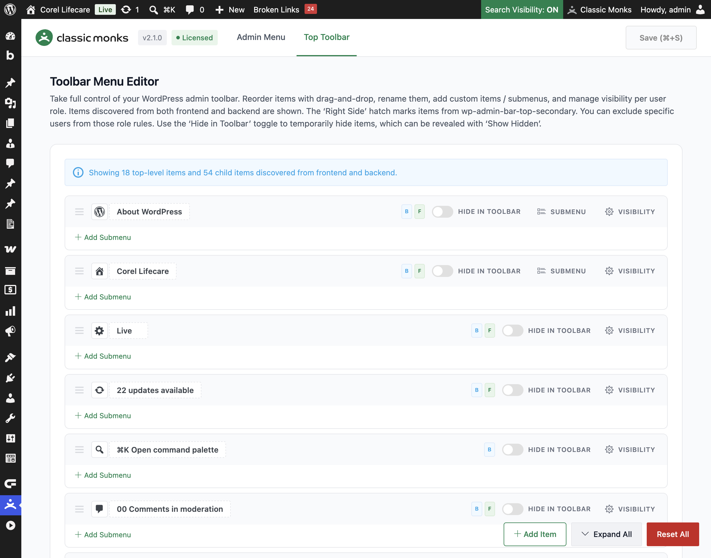
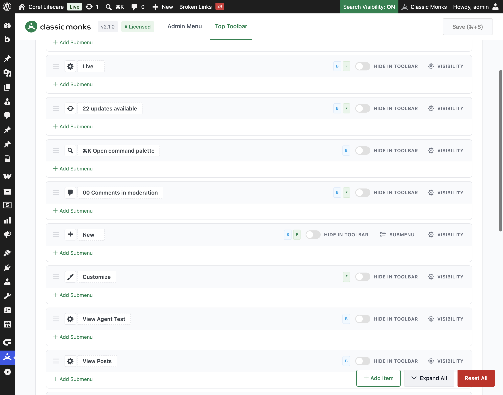

# How to Use the Top Toolbar Manager in WordPress

> Reorder, rename, hide, and restyle the WordPress admin toolbar (the dark bar at the top of the screen) in Classic Monks. Add custom toolbar items, move items between the left and right sides, and control which roles see each item.

## Key Takeaways

- Drag and drop to reorder toolbar items, and click any title to rename it inline.
- Add custom toolbar items and submenus that link to a URL or an admin page.
- Move items between the left and right sides of the toolbar with a dedicated section marker.
- Hide items per role or per user, with a **Show Hidden** toggle in the toolbar itself.
- Toolbar items are discovered from both the frontend and backend, so you can edit items that only appear on the front end.

## What Is the Top Toolbar Manager

The Top Toolbar Manager is a visual editor for the WordPress admin toolbar (also called the admin bar). It is the dark bar that appears at the top of the screen when you are logged in, on both the frontend and the admin. Instead of editing a plugin file, you work directly on a sortable list of your real toolbar items.

It is one of three menu tools in the Classic Monks **Interface** tab, under the **Menu Management** subtab. The other two are the **Admin Menu Manager** (for the left sidebar menu) and **Quick Post Nav** (for quick navigation). The Top Toolbar Manager focuses on the top bar.

## Recommendations Before Enabling

- **Test on a staging site first.** Role-based hiding can hide a toolbar button from a role, so verify on a test environment before applying to production.
- **You need the `manage_options` capability.** Only administrators can open the toolbar editor and save changes.
- **Items are discovered as you browse.** The editor shows items captured from both the frontend and backend. If an item is missing, visit the frontend and backend of your site, then refresh the editor.

## Enable the Top Toolbar Manager

### Step 1: Open the Interface Tab

In your WordPress dashboard, go to **Classic Monks** and open the **Interface** tab, then the **Menus** subtab.

### Step 2: Turn On Top Toolbar Manager

In the **Menu Management** section, toggle on **Top Toolbar Manager**.

### Step 3: Save and Reload

Click **Save (⌘+S)**. The feature adds a submenu under **Classic Monks** called **Menu**. A page reload is required before the submenu appears.

### Step 4: Open the Toolbar Editor

Go to **Classic Monks** then **Menu**, and open the **Top Toolbar** tab. The heading is **Toolbar Menu Editor**.

## Configure the Toolbar

The editor shows a list of your toolbar items as rows. Each row has a drag handle, an editable title, a **Hide in Toolbar** toggle, a **Visibility** or **Settings** button, and an **Add Submenu** button. Submenus sit inside their parent and expand and collapse.

A context notice at the top tells you how many top-level and child items were discovered, for example **Showing 18 top-level items and 54 child items discovered from frontend and backend**.

### Reorder Toolbar Items

Drag any row by its drag handle to a new position. Top-level items move within the main list, and submenu items move within their parent. The order is saved when you click **Save**.

### Rename Toolbar Items

Click any title to edit it inline. The change applies to the toolbar. The existing icon is preserved when you rename an item.

### Change a Toolbar Icon

For a top-level item, click **Visibility** (or **Settings** for a custom item) to open the options panel. In the **Icon** field, pick a Dashicon from the picker, or paste a `dashicons-*` class or an SVG `data:image/svg+xml` URI.

### Move Items Between Left and Right Sides

The toolbar has a **Right Side** section marker in the editor. Items below this marker appear on the right side of the toolbar (WordPress `wp-admin-bar-top-secondary`), and items above it appear on the left. Drag an item across the marker to move it between the two sides. Items on the right side show a **Right** badge.

### Hide in Toolbar (Temporary Visibility)

Each item has a **Hide in Toolbar** toggle. Turn it on to remove the item from the toolbar. The item stays configured and is not deleted. In the live toolbar, a **Show/Hide Hidden Items** toggle (an eye icon) appears so you can reveal hidden items temporarily.

## Manage Visibility Per Role

The **Visibility** button on any item opens a **Hide from roles** panel. Use it to control which roles see the item.

### Hide from Roles

Turn on **Hide from roles**, then choose a scope:

- **Everyone**: hides the item from all users.
- **Everyone except**: hides the item from everyone except the roles you select. Pick the roles that still see it.
- **Only these roles**: hides the item only from the roles you select.

Unlike the admin menu, the toolbar panel lists all roles because toolbar items are visible to any logged-in user by default.

### Keep Visible for Specific Users

In the same panel, use **Keep visible for these users** to override the role rules for specific people. Search for a user and add them. This rule overrides the role-based hiding for those users.

## Add Custom Toolbar Items

Use the action bar at the bottom of the editor to add new elements.

### Add Item

Click **Add Item** to create a new top-level toolbar item. Configure it in the **Settings** panel:

- **Title**: the text shown in the toolbar.
- **Target URL**: the destination. Use a full URL, an admin path like `admin.php?page=...`, or a site-relative path. Leave it empty to use the item as a dropdown parent only.
- **Icon**: a Dashicon or custom SVG for the item.

### Add Submenu

Click **Add Submenu** inside any toolbar item to add a child item. Set its **Title** and **Target URL**. Child items do not have icons.

### Remove Custom Items

Custom toolbar items and submenus have a **Remove** button. Click it to delete the element. Built-in WordPress items cannot be removed here; use the **Hide in Toolbar** toggle or role hiding instead.

## Save, Expand, and Reset

- **Save**: the **Save (⌘+S)** button in the top corner saves all changes. The keyboard shortcut is **⌘+S** on macOS and **Ctrl+S** on Windows.
- **Expand All / Collapse All**: toggles all submenu accordions open or closed.
- **Reset All**: restores the default toolbar and removes all custom order, renames, hides, custom items, and submenus.

## Verify It Works

After saving, open the toolbar on the frontend and backend of your site and confirm:

- The reordered items appear in the order you set.
- Renamed titles and custom icons show correctly.
- Custom toolbar items and submenus are visible.
- Items you moved to the right side appear on the right of the toolbar.
- If you hid an item from a role, log in as a user of that role and confirm the item is missing.

If a change does not appear, clear any admin or page cache, then reload.

## Examples

### Example 1: Clean Up the Toolbar for a Client

A client sees a cluttered toolbar. Drag the items you want to keep to the top, rename verbose item titles to short labels, and use **Hide in Toolbar** on items the client does not need. Save. The toolbar now shows only the actions the client uses.

### Example 2: Add a Quick Link to a Custom Page

Add a custom toolbar item with the title **Reports** and a **Target URL** pointing to your admin reports page. Pick a chart icon. Add a submenu under it for a second report page. Save. The toolbar now has a Reports menu with both links.

### Example 3: Move a Button to the Right Side

You want the **Howdy** menu on the right but a custom item on the left. Drag the custom item above the **Right Side** marker and the **Howdy** menu below it. Save. The custom item appears on the left of the toolbar and the account menu stays on the right.

## Troubleshooting

### The Menu submenu does not appear

**Cause:** The feature toggle is on but the page was not reloaded, or a cache is serving the old menu.
**Fix:** Reload the admin page after saving. Clear any admin or page cache.

### A toolbar item is missing from the editor

**Cause:** The item only appears on the frontend or the backend, and you have not visited that context yet.
**Fix:** Visit both the frontend and backend of your site while logged in, then refresh the toolbar editor. New items are discovered as you browse.

### A hidden item does not reveal with Show Hidden

**Cause:** The **Show Hidden** toggle only appears in the toolbar when at least one item uses **Hide in Toolbar**.
**Fix:** Confirm at least one item has the **Hide in Toolbar** toggle on, then look for the eye icon in the toolbar.

### A renamed toolbar item loses its icon

**Cause:** Some plugins use complex icon markup that a rename cannot preserve.
**Fix:** Re-set the icon in the **Visibility** panel after renaming the item.

## Related Articles

- [How to Use the Admin Menu Manager in WordPress](interface-admin-menu-manager.md)
- [How to Use Quick Post Nav in WordPress](interface-quick-post-nav.md)
- [How to Use the Interface Tab in Classic Monks: Feature Index](../interface.md)

---

*Tested with WordPress 6.x and Classic Monks 2.1.0.*