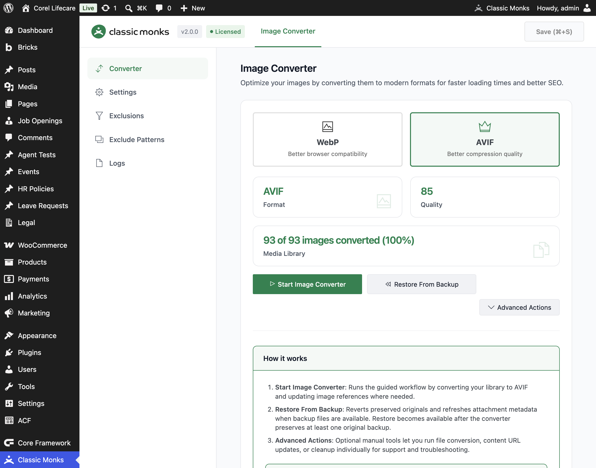
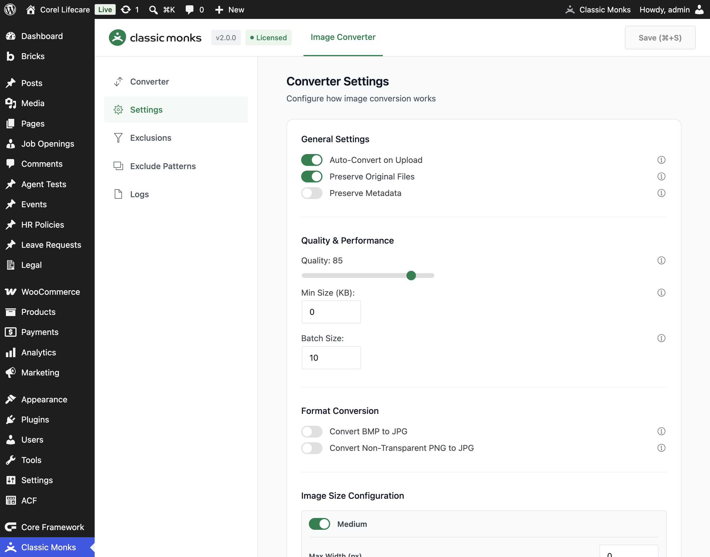

# How to Use Image Converter in WordPress

> Convert your WordPress Media Library to WebP or AVIF with Classic Monks, while controlling quality, backups, image sizes, exclusions, upload behavior, and rollback.

## Key Takeaways

- Output format is WebP or AVIF, not arbitrary format-to-format conversion
- The guided workflow converts files and updates attachment references
- Original files can be preserved for rollback
- Conversion supports quality, batch size, minimum file size, resizing, and crop controls
- New uploads can be converted automatically
- Exclusions, filename patterns, conversion logs, and restore tools are built in
- AVIF requires server support through Imagick or GD

## What Image Converter Does

Image Converter processes WordPress image attachments and creates WebP or AVIF output files. It updates the attachment's file path, MIME type, metadata, GUID, and generated size references when conversion succeeds.

The converter can also process new uploads automatically. It preserves original files by default, which gives you a rollback path if the output is not suitable. If you disable original preservation, the source file may be deleted after a successful conversion and cannot be restored by the converter.

The feature is not a generic image editor. It does not expose arbitrary JPEG-to-PNG or PNG-to-JPEG output selection. The output target is selected between **WebP** and **AVIF**.

---

## Before You Convert Anything

### Confirm server support

The converter requires at least one server image-processing library:

- Imagick
- GD

AVIF additionally requires AVIF support in the installed library. If AVIF is selected but the server does not support it, Classic Monks displays a warning and falls back to WebP or refuses the conversion path depending on the processing stage.

### Back up the site

Preserved originals are useful, but they are not a replacement for a site backup. Back up the uploads directory and database before a large conversion run.

### Start with a small test

Do not start with the whole Media Library. Test several representative files first:

- JPEG photograph
- Transparent PNG
- Large hero image
- Existing WebP or AVIF file
- Image with multiple generated sizes

Check the frontend, Media Library metadata, and image URLs before converting the full library.

### Decide whether to preserve originals

Keep **Preserve Original Files** enabled until the converted output has been verified. Disabling it reduces disk usage but removes the safety net for rollback.

---

## How to Enable and Run Image Converter

### Step 1: Open the Image Converter

In WordPress admin, open **Classic Monks > Performance** and select the **Media Enhancements** subtab.

Enable **Image Converter**, then click **Save Changes** if the settings page indicates unsaved changes.

### Step 2: Open the Converter subtab

The Image Converter page has five subtabs:

1. **Converter**
2. **Settings**
3. **Exclusions**
4. **Exclude Patterns**
5. **Logs**

Start in **Converter**.

### Step 3: Choose the output format

Choose one of the format cards:

- **WebP**: Better browser compatibility
- **AVIF**: Better compression quality, but requires server AVIF support

Switching formats requires reconverting the images for consistency. Confirm the format change when prompted.

### Step 4: Review the conversion status

The Converter panel shows:

- **Format**
- **Quality**
- **Media Library** progress

The Media Library status displays the number of converted images, total images, and completion percentage.

### Step 5: Run the guided workflow

Click **Start Image Converter**. This is the recommended path for most sites. It converts the files and updates image references where needed.

The progress panel shows processed items and completion percentage. Do not close the browser or run another conversion workflow against the same Media Library at the same time.

### Step 6: Verify the result

After completion:

1. Open several converted attachments in the Media Library.
2. Confirm the attachment MIME type and generated metadata.
3. Open pages that use converted images.
4. Inspect the rendered image URL and `srcset`.
5. Check the browser Network panel for the expected WebP or AVIF response.
6. Compare file size and visible quality.

### Step 7: Restore originals if necessary

If **Preserve Original Files** was enabled and you need to roll back, click **Restore From Backup**. The button becomes available when restorable originals exist.

Restore only after confirming the conversion should be reversed. Check the Media Library and frontend again after restoration.

---

## Configure Converter Settings

Open the **Settings** subtab.

### General Settings

| Setting | What it does | Source default |
|---|---|---:|
| **Auto-Convert on Upload** | Converts new image uploads automatically. | On |
| **Preserve Original Files** | Keeps the original JPG/PNG files after conversion. | On |
| **Preserve Metadata** | Keeps EXIF and other embedded metadata. | Off |

Preserving metadata can increase file size and retain information you may not want to publish. Keep it off unless the metadata is required.

### Quality and performance

| Setting | What it does | Source default |
|---|---|---:|
| **Quality** | Controls output quality from 0 to 100. Lower values produce smaller files. | 85 |
| **Min Size (KB)** | Skips images smaller than the selected size. `0` converts all eligible images. | 0 |
| **Batch Size** | Number of images processed in each batch. Valid range is 1 to 50. | 10 |

Start with quality 80–85 and compare representative files. Do not choose a quality value based only on a generic recommendation. Check the actual visual output and file sizes.

### Format Conversion

| Setting | What it does | Source default |
|---|---|---:|
| **Convert BMP to JPG** | Converts BMP files to JPG before further processing. | Off |
| **Convert Non-Transparent PNG to JPG** | Converts PNG files without transparency to JPG. Transparent PNG files remain unchanged by this rule. | Off |

### Image Size Configuration

The settings panel lists registered WordPress image sizes. For each size you can configure:

- Enable or disable the size
- **Max Width (px)**
- **Max Height (px)**
- **Crop to exact dimensions**

A value of `0` means no constraint for that dimension. These settings affect generated converted sizes and can change the number and dimensions of files produced.

Click **Reset Defaults** only when you intentionally want to restore the converter's default settings and registered size configuration.

---

## Exclude Images from Conversion

Open the **Exclusions** subtab.

1. Click **Select Images**.
2. Choose attachments that must remain in their original format.
3. Review them in the **Excluded Images** list.
4. Remove an image from the list when it should be eligible for conversion again.

Use exclusions for:

- Images with a format-dependent workflow
- Files used by external systems that expect the original extension
- Images where conversion produces a larger or visibly worse result
- Assets that should not be modified during a migration

---

## Exclude Images by Filename Pattern

Open **Exclude Patterns** to create rules that automatically skip files.

### Add a pattern

1. Choose **Pattern Type**:
   - **Starts with (Prefix)**
   - **Ends with (Suffix)**
   - **Contains**
   - **Regular Expression**
2. Enter the **Pattern** value.
3. Click **Preview** to see how many images match.
4. Review the preview list.
5. Click **Add Pattern** only after the preview is correct.
6. Review the **Active Patterns** list.

Examples:

| Pattern type | Example | Use |
|---|---|---|
| Starts with | `temp_` | Skip temporary files |
| Ends with | `_backup` | Skip backup variants |
| Contains | `original` | Skip files containing a known marker |
| Regular Expression | A tested regex | Skip a complex naming pattern |

Preview regular expressions against the real Media Library before adding them. A broad pattern can exclude more images than intended.

---

## Advanced Actions

The **Converter** subtab includes an **Advanced Actions** menu. Use these tools only when you understand the consequence of each operation:

- **Convert Files Only**: Runs file conversion without the complete guided workflow
- **Update Content URLs**: Updates image URLs stored in post content
- **Cleanup Unused Image Files**: Removes unused image files

The cleanup action is destructive. Confirm that you have a backup and that the files are genuinely unused before running it.

Use the guided **Start Image Converter** workflow for normal conversion. Use Advanced Actions for one-off maintenance or troubleshooting.

---

## Review Conversion Logs

Open the **Logs** subtab to review conversion activity.

- Click **Refresh Logs** to load the latest entries.
- Click **Clear Logs** to remove the recorded conversion log.

Use the logs to identify skipped files, unsupported formats, failed conversions, larger-output skips, and cleanup results.

---

## Verify Image Optimization

Use a repeatable before-and-after test:

1. Record the original file size, dimensions, and format for a sample.
2. Convert the sample.
3. Record the output file size, dimensions, and format.
4. Open the image at the actual display size and inspect quality.
5. Check the page source and `srcset` for the converted file.
6. Run Lighthouse or PageSpeed Insights on a representative page.
7. Record LCP, total image transfer size, image requests, and layout shift.

Do not claim a fixed percentage reduction. Savings vary by source format, image content, quality, dimensions, and output format.

---

## Troubleshooting

### AVIF is unavailable

**Cause:** The server's Imagick or GD installation does not expose AVIF support.
**Fix:** Check the warning in the Converter panel. Use WebP or install server-side AVIF support through the hosting environment. Confirm with the server administrator before changing PHP extensions.

### No image library is available

**Cause:** Neither Imagick nor GD is loaded.
**Fix:** Install or enable one of the supported PHP image libraries, then reload the Converter page.

### Conversion is skipped because the output is larger

**Cause:** The converter compares the converted file with the original and keeps the original when the output would be larger, unless forced.
**Fix:** Check the Logs subtab. Try a different quality or target format. Do not force conversion simply to change the file extension.

### Original files cannot be restored

**Cause:** **Preserve Original Files** was disabled, or no backup was created.
**Fix:** Restore from a site or uploads backup. The in-plugin restore workflow only works when the converter has preserved originals.

### Conversion fails for individual images

**Cause:** The source file may be corrupt, unsupported, unreadable, or too large for the available memory.
**Fix:** Check Logs, test the file in an image editor, verify file permissions, and retry with a smaller batch size. Large images may be deferred to background processing.

### New uploads are not converted

**Cause:** **Auto-Convert on Upload** is disabled, or the file is excluded by an image exclusion or pattern.
**Fix:** Check the setting, Exclusions tab, and Exclude Patterns tab. Confirm the server has GD or Imagick.

### The frontend still serves the old format

**Cause:** Cached HTML, stale attachment metadata, CDN cache, or content URLs that were not updated.
**Fix:** Run **Update Content URLs** if required, regenerate or refresh attachment metadata, purge page/CDN caches, and inspect the final `src` and `srcset` values.

### Cleanup removed a file that was still needed

**Cause:** **Cleanup Unused Image Files** was run without reviewing the result.
**Fix:** Restore from a filesystem backup. Treat cleanup as destructive and run it only after a backup and manual review.

---

## Related Articles

- [How to Enable Lazy Loading in WordPress](performance-perf-lazy-loading.md)
- [How to Use Selective Media Preload in WordPress](performance-perf-selective-media-preload.md)
- [How to Use the Assets Manager in WordPress](performance-perf-assets-manager.md)
- [How to Use the Media Replacement Feature in WordPress](performance-perf-media-replace.md)

---

## Developer Notes

Implementation files are under:

`functions/media/image-converter/`

Important hooks include:

- `wp_handle_upload`
- `add_attachment`
- `wp_update_attachment_metadata`
- `big_image_size_threshold`
- `thumbnail_size_w`
- `thumbnail_size_h`
- `after_setup_theme`
- `block_editor_settings_all`
- `wp_calculate_image_srcset`

The converter also exposes AJAX actions for conversion, progress, exclusions, restore, cleanup, logs, and settings. Verify nonce and capability requirements in `class-image-converter-ajax.php` before integrating custom tooling.
