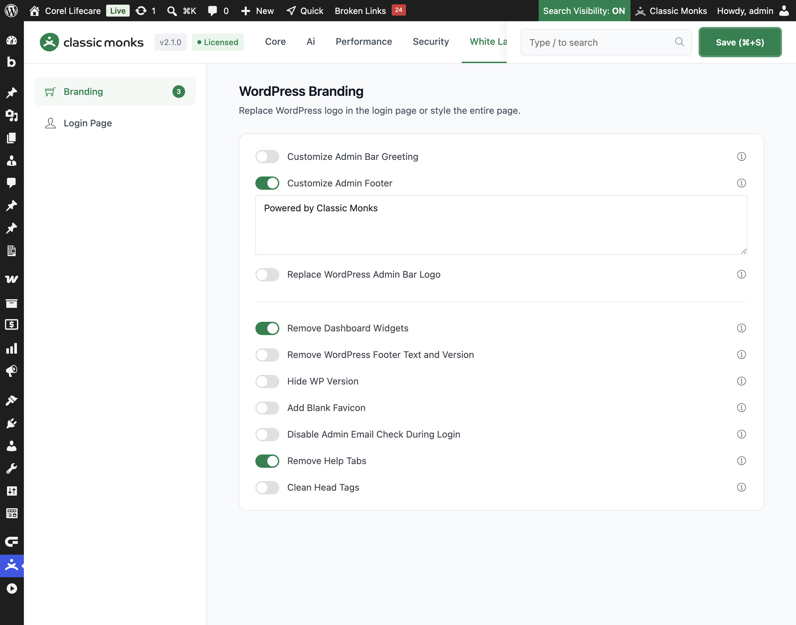

# How to Customize the Admin Footer in WordPress

> The WordPress admin footer shows a default message and version number. Classic Monks lets you replace it with your own text, such as your agency name or a support link, for a branded admin experience.

## Key Takeaways

- Replace the default WordPress admin footer text with your own message.
- Add your agency name, brand, or a support message.
- The change applies to the footer on every admin page.
- A simple toggle with a text area, no nested options.

## What Is the Admin Footer

The admin footer is the small text area at the bottom of the WordPress admin screens. By default it shows a "Thank you for creating with WordPress" message and the version number. Classic Monks lets you replace it with your own text, which is useful for white-labeling the admin for a client.

It is a white-label option in the **White Label** tab. It is separate from **Remove WordPress Footer Text and Version**, which hides the footer entirely.

## Customize the Admin Footer

### Step 1: Open the Branding Settings

In your WordPress dashboard, go to **Classic Monks**, open the **White Label** tab, then the **Branding** subtab.

### Step 2: Turn On Customize Admin Footer

In the **Branding** subtab, toggle on **Customize Admin Footer**.

### Step 3: Enter Your Footer Text

In the **Custom Footer** text area, enter the text you want to show in the admin footer. The default is **Powered by Classic Monks**. You can add HTML, such as a link to your agency's support page.

### Step 4: Save and Test

Click **Save (⌘+S)**. Check the bottom of any admin page to confirm the custom footer appears.

## Verify It Works

After saving, open any admin page and confirm:

- The admin footer shows your custom text instead of the default WordPress message.
- Any HTML in the footer, such as a link, renders correctly.
- The footer appears consistently across admin pages.

If the footer does not change, confirm the toggle is on, the text is entered, and the changes were saved.

## Examples

### Example 1: Add Your Agency Name

An agency wants clients to see its name in the admin. Set the footer to **Designed by [Agency Name]**. The client sees the agency's branding in the admin footer.

### Example 2: Add a Support Link

A support team wants clients to reach help easily. Set the footer to **Need help? Contact support** with a link to the support page. Clients can click the link from any admin page.

### Example 3: A Branded Tagline

A company wants a branded admin. Set the footer to the company's tagline. The admin footer reinforces the brand on every page.

## Troubleshooting

### The footer does not change

**Cause:** The toggle is off, or the changes were not saved.
**Fix:** Confirm **Customize Admin Footer** is on, enter the text, and click **Save (⌘+S)**.

### The footer is empty

**Cause:** The footer text area is empty, so nothing shows.
**Fix:** Enter text in the footer area and save.

### HTML in the footer does not render

**Cause:** The HTML is not valid, or the footer text contains unescaped characters.
**Fix:** Check the HTML syntax and save. Use simple tags like `<a>` and `<strong>`.

## Common Use Cases

### White-label the admin for a client

When you build a site for a client, the default admin footer shows a WordPress message. Replacing it with your agency name or a support message makes the admin look like a custom product rather than a stock WordPress install.

### Add a support link for clients

A support team can add a link to their help or support page in the admin footer. Clients can reach support from any admin screen, which reduces support tickets and improves the client experience.

### Reinforce the brand on every page

The admin footer appears on every admin screen. Setting it to a brand tagline or message reinforces the brand continuously, which is useful for agencies and companies that want consistent branding.

## Troubleshooting

## Related Articles

- [How to Customize the Admin Bar Greeting in WordPress](white-label-wl-admin-greeting.md)
- [How to Remove the WordPress Footer Text and Version](white-label-wl-remove-footer-text.md)
- [How to Use the White Label Tab in Classic Monks: Feature Index](../white-label.md)

---

*Written by Joy. Last updated August 4, 2026. Tested with WordPress 6.x and Classic Monks 2.1.0.*

<!-- schema: Article, TechArticle -->
<!-- schema: BreadcrumbList -->