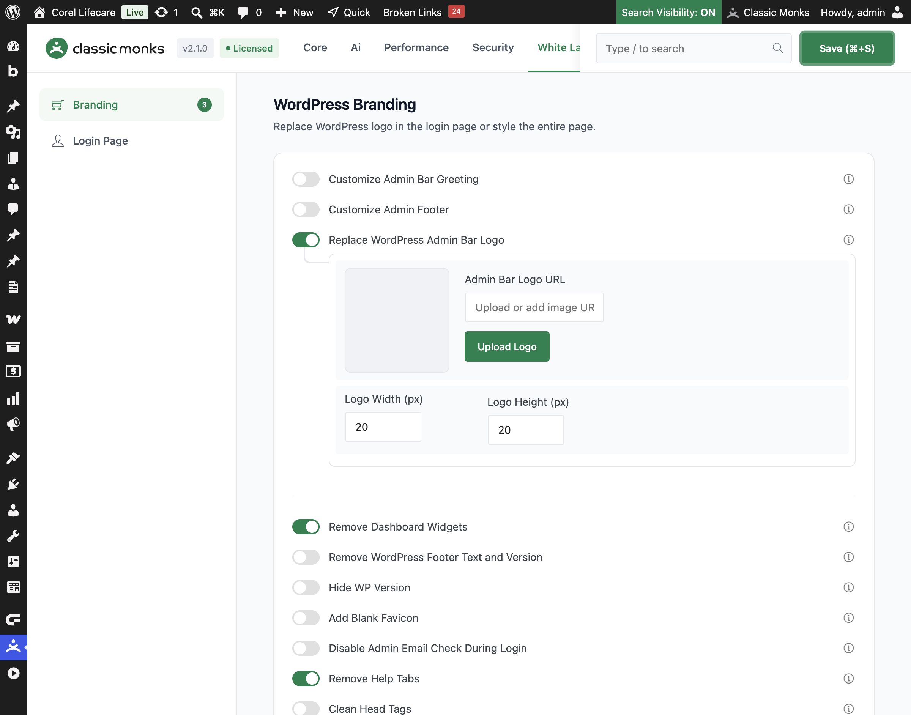

# How to Replace the WordPress Admin Bar Logo in WordPress

> The WordPress logo in the admin bar (top left) is the default WordPress icon. Classic Monks lets you replace it with your own image, sized to fit your brand, so the admin bar matches your site.

## Key Takeaways

- Replace the default WordPress logo in the admin bar with your own image.
- Set the logo URL and its width and height in pixels.
- The logo links to your site and opens in a new tab.
- A simple toggle with a logo URL and size fields.

## What Is the Admin Bar Logo

The admin bar logo is the WordPress icon at the top left of the admin bar, shown on every admin page. Classic Monks lets you replace it with your own image. You set the logo URL and the width and height, and the logo links to your site. It is a white-label option in the **White Label** tab.

It is separate from the **Custom Login Logo**, which replaces the login page logo. This guide covers the admin bar logo.

## Replace the Admin Bar Logo

### Step 1: Open the Branding Settings

In your WordPress dashboard, go to **Classic Monks**, open the **White Label** tab, then the **Branding** subtab.

### Step 2: Turn On Replace WordPress Admin Bar Logo

In the **Branding** subtab, toggle on **Replace WordPress Admin Bar Logo**.

### Step 3: Add Your Logo

Either click **Upload Logo** and pick an image from your media library, or paste an image URL into the **Admin Bar Logo URL** field. A preview appears in the **Admin Logo Preview** area.

### Step 4: Set the Logo Size

- **Logo Width (px)**: the logo width, default 20.
- **Logo Height (px)**: the logo height, default 20.

### Step 5: Save and Test

Click **Save (⌘+S)**. Check the top left of the admin bar to confirm the custom logo appears.

## Verify It Works

After saving, open any admin page and confirm:

- The admin bar shows your custom logo instead of the WordPress icon.
- The logo uses the width and height you set.
- Clicking the logo opens your site in a new tab.

If the logo does not appear, confirm the toggle is on, the logo URL is valid, and the size values are set.

## Examples

### Example 1: Add Your Client's Logo

An agency wants the client's admin bar to show the client's logo. Upload the client's logo and set the width and height to 20px. The admin bar shows the client's brand instead of WordPress.

### Example 2: Use a Larger Logo

A company wants a larger, more visible admin bar logo. Set the width and height to 28px. The logo is more prominent in the admin bar.

### Example 3: A Centered Brand Logo

A site wants its logo to clearly show the brand. Upload a logo with a transparent background and set the width and height to match. The logo blends with the admin bar.

## Troubleshooting

### The logo does not appear

**Cause:** The toggle is off, or the logo URL is empty.
**Fix:** Confirm **Replace WordPress Admin Bar Logo** is on and paste a valid image URL. Save.

### The logo is distorted

**Cause:** The width and height do not match the logo's aspect ratio.
**Fix:** Adjust the width and height to match the logo's natural proportions.

### The logo is too large or small

**Cause:** The width or height values are not set as expected.
**Fix:** Set the width and height to the desired size, then save.

## Common Use Cases

### White-label the admin bar for a client

The WordPress logo in the admin bar is a clear WordPress signal. Replacing it with the client's logo makes the admin bar look like part of the client's product, which is a core part of white-labeling.

### Add a small brand mark for a team

An internal team can replace the WordPress logo with a small brand mark. The logo appears at the top left of every admin screen, reinforcing the brand without taking up space.

### Match the logo to your site

A site that uses a custom logo can reuse it in the admin bar. Setting the logo URL and a matching size keeps the admin and the site visually consistent.

## Troubleshooting

## Related Articles

- [How to Customize the Admin Bar Greeting in WordPress](white-label-wl-admin-greeting.md)
- [How to Add a Custom Login Logo in WordPress](white-label-wl-login-logo.md)
- [How to Use the White Label Tab in Classic Monks: Feature Index](../white-label.md)

---

*Written by Joy. Last updated August 4, 2026. Tested with WordPress 6.x and Classic Monks 2.1.0.*

<!-- schema: Article, TechArticle -->
<!-- schema: BreadcrumbList -->