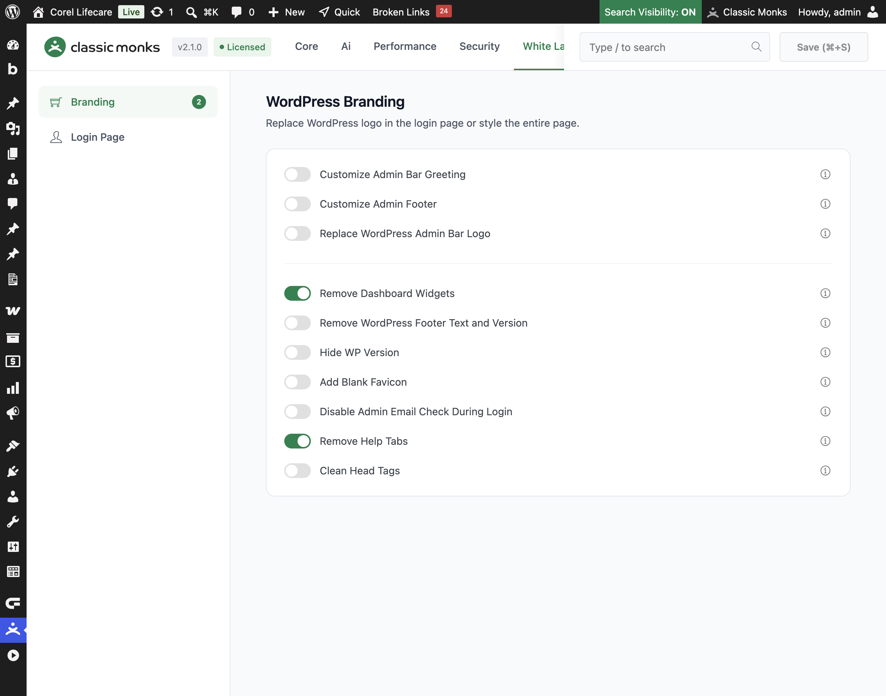

# How to Disable the Language Dropdown on the Login Page

> The WordPress login page shows a language dropdown that lets users switch the login page language. Classic Monks lets you remove it for a cleaner, more branded login page.

## Key Takeaways

- Remove the language switcher dropdown from the login page.
- A cleaner login page for a branded experience.
- Works independently, without the **Login Page Customization** master toggle.
- A simple toggle, no nested options.

## What Is the Language Dropdown

The WordPress login page shows a language dropdown that lets users switch the language of the login page. For sites that use one language, this dropdown is unnecessary. Disable Language Dropdown is a white-label option in the Classic Monks **White Label** tab that removes it from the login page for a cleaner appearance.

## Disable the Language Dropdown

### Step 1: Open the Login Page Settings

In your WordPress dashboard, go to **Classic Monks**, open the **White Label** tab, then the **Login Page** subtab.

### Step 2: Turn On Disable Language Dropdown on Login Page

In the **Login Page** subtab, toggle on **Disable Language Dropdown on Login Page**.

### Step 3: Save and Test

Click **Save (⌘+S)**. Open the login page in a private browser window to confirm the language dropdown is gone.

## Verify It Works

After saving, open the login page and confirm:

- The language dropdown is no longer visible on the login page.
- The login page looks cleaner.

If the dropdown still shows, confirm the toggle is on and the changes were saved.

## Examples

### Example 1: A Cleaner Login for a Single-Language Site

A site uses one language. Toggle on **Disable Language Dropdown on Login Page**. The language switcher is removed, leaving a cleaner login page.

### Example 2: A Branded Login Page

An agency wants a clean, branded login page for a client. Toggle on **Disable Language Dropdown on Login Page** to remove the language switcher. The login page looks more professional.

### A clean login for a regional site

A regional site that serves one language can remove the language dropdown. The login page is cleaner and more focused for the audience.

### A cleaner login for a brand

A brand with a specific login page design can remove the language dropdown to keep the design clean. The login page stays true to the brand without extra UI elements.

### A simpler login for a business site

A business site that serves one language and one region can remove the language dropdown. The login page is simpler and users are not offered a choice they do not need.

### A consistent login for a multilingual brand

Even a multilingual brand might want a single login language. If the login page is part of a specific brand design, removing the language dropdown keeps the login page consistent and on-brand for all users.

## Troubleshooting

### The dropdown still shows

**Cause:** The toggle is off, or the changes were not saved.
**Fix:** Confirm the toggle is on and click **Save (⌘+S)**. Clear any page cache.

### I want to keep the language switcher

**Cause:** The dropdown lets users switch login language.
**Fix:** Leave **Disable Language Dropdown on Login Page** off to keep the switcher.

## Recommendations Before Enabling

- **Use it for single-language sites.** If your site uses one language, the language dropdown is unnecessary.
- **Keep it for multilingual sites.** If your site serves multiple languages, keep the dropdown so users can switch the login language.
- **Test on the login page.** Open the login page in a private window to confirm the dropdown is gone.

## Common Use Cases

### A cleaner login for a single-language site

For a site that uses one language, the language dropdown is unnecessary. Removing it gives a cleaner login page.

### White-label the login page

An agency that white-labels the login page for a client can remove the language switcher. This makes the login page look more professional and on-brand.

### Keep the login focused

Removing the language dropdown keeps users focused on logging in. This is useful for a clean, minimal login experience.

## Troubleshooting

## Related Articles

- [How to Customize the WordPress Login Page](white-label-wl-login-customization.md)
- [How to Use the White Label Tab in Classic Monks: Feature Index](../white-label.md)

---

*Written by Joy. Last updated August 4, 2026. Tested with WordPress 6.x and Classic Monks 2.1.0.*

<!-- schema: Article, TechArticle -->
<!-- schema: BreadcrumbList -->