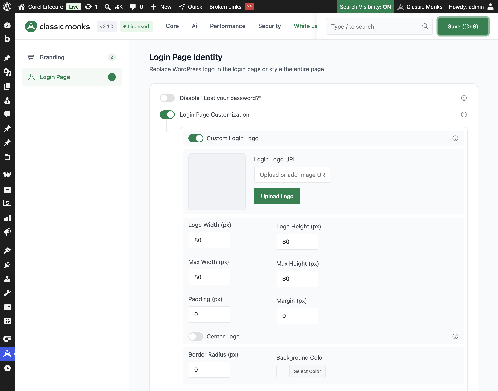

# How to Add a Custom Login Logo in WordPress

> The default WordPress login page shows the WordPress logo. Classic Monks lets you replace it with your own logo and control its size, position, padding, and background so the login page matches your brand.

## Key Takeaways

- Replace the default WordPress logo with your own image on the login page.
- Set the logo width, height, max dimensions, padding, and margin in pixels.
- Center the logo horizontally with one toggle.
- Add a border radius and background color to match your brand.
- The login logo also links to your site and shows your site name.

## What Is the Custom Login Logo

The Custom Login Logo is a white-label option in the Classic Monks **White Label** tab that replaces the default WordPress logo on the login page with your own image. It is part of the **Login Page Customization** group. When you set a custom logo, the login logo also links to your site instead of wordpress.org, and the title shows your site name instead of WordPress.

It is separate from the **Custom Login Logo** for the admin bar and dashboard. This guide covers the login page logo only.

## Recommendations Before Enabling

- **Use a transparent PNG** so the logo blends with the login background. A square or wide logo works best at the default 80px size.
- **Keep the file size small.** The login page should load fast. Compress the logo before uploading.
- **Test on all devices.** Check that the logo is not cut off on mobile screens.

## Add a Custom Login Logo

### Step 1: Open the Login Page Settings

In your WordPress dashboard, go to **Classic Monks**, open the **White Label** tab, then the **Login Page** subtab. Toggle on **Login Page Customization** to reveal the logo options.

### Step 2: Turn On Custom Login Logo

In the **Custom Login Logo** section, toggle on **Custom Login Logo**.

### Step 3: Add Your Logo

Either click **Upload Logo** and pick an image from your media library, or paste an image URL into the **Login Logo URL** field. A preview appears in the **Login Logo Preview** area.

### Step 4: Set the Logo Size

Use the number fields to control the logo dimensions:

- **Logo Width (px)**: the logo width, default 80.
- **Logo Height (px)**: the logo height, default 80.
- **Max Width (px)**: the maximum width the logo can display at, default 80.
- **Max Height (px)**: the maximum height the logo can display at, default 80.

### Step 5: Position and Style the Logo

- **Center Logo**: toggle on to keep the logo horizontally centered. When off, the margin applies on all sides; when on, the horizontal margin is automatic to center it.
- **Padding (px)**: space between the logo edge and its border, default 0.
- **Margin (px)**: space around the logo, default 0.
- **Border Radius (px)**: rounds the logo corners, default 0.
- **Background Color**: a color behind the logo (accepts hex values), useful for logos that need a contrasting tile.

### Step 6: Save and Test

Click **Save (⌘+S)**. Open the login page in a private browser window to confirm the logo appears and links to your site.

## Verify It Works

After saving, open the login page and confirm:

- Your logo appears in place of the default WordPress logo.
- The logo uses the width, height, padding, and margin you set.
- The logo is centered when **Center Logo** is on.
- The logo border radius and background color apply.
- Clicking the logo goes to your site, not wordpress.org.

If the logo does not appear, confirm **Custom Login Logo** is on, the logo URL is valid, and the image file loads.

## Examples

### Example 1: Brand a Client Login Page

An agency wants the client's login page to show the client's logo. Upload the client's transparent PNG, set the width and height to 120px, and toggle on **Center Logo**. The client sees a branded login page instead of the WordPress logo.

### Example 2: A Logo With a Rounded Tile

A company wants its logo on a rounded colored tile. Set **Background Color** to the brand color, **Border Radius** to 8px, and the logo width and height to 64px. The logo appears as a branded tile above the login form.

### Example 3: Keep the Logo Small and Left-Aligned

A site wants a small, left-aligned logo. Set the width and height to 60px, leave **Center Logo** off, and set the margin to 20px. The logo sits on the left with breathing room around it.

## Troubleshooting

### The logo does not appear

**Cause:** **Custom Login Logo** is off, the logo URL is empty, or the image file fails to load.
**Fix:** Confirm the toggle is on, paste a valid image URL, and verify the image file loads in a browser.

### The logo is cut off

**Cause:** The max width or max height is smaller than the logo file's natural size.
**Fix:** Increase **Max Width (px)** and **Max Height (px)**, or use a smaller logo file.

### The logo is not centered

**Cause:** **Center Logo** is off.
**Fix:** Toggle on **Center Logo** and save.

### Clicking the logo goes to wordpress.org

**Cause:** The logo URL or title filters are overridden by another plugin.
**Fix:** Disable other login customization plugins to find the conflict.

## Related Articles

- [How to Customize the WordPress Login Page](white-label-wl-login-customization.md)
- [How to Style the Login Form in WordPress](white-label-wl-login-form-styling.md)
- [How to Use the White Label Tab in Classic Monks: Feature Index](../white-label.md)

---

*Written by Joy. Last updated August 4, 2026. Tested with WordPress 6.x and Classic Monks 2.1.0.*

<!-- schema: Article, TechArticle -->
<!-- schema: BreadcrumbList -->