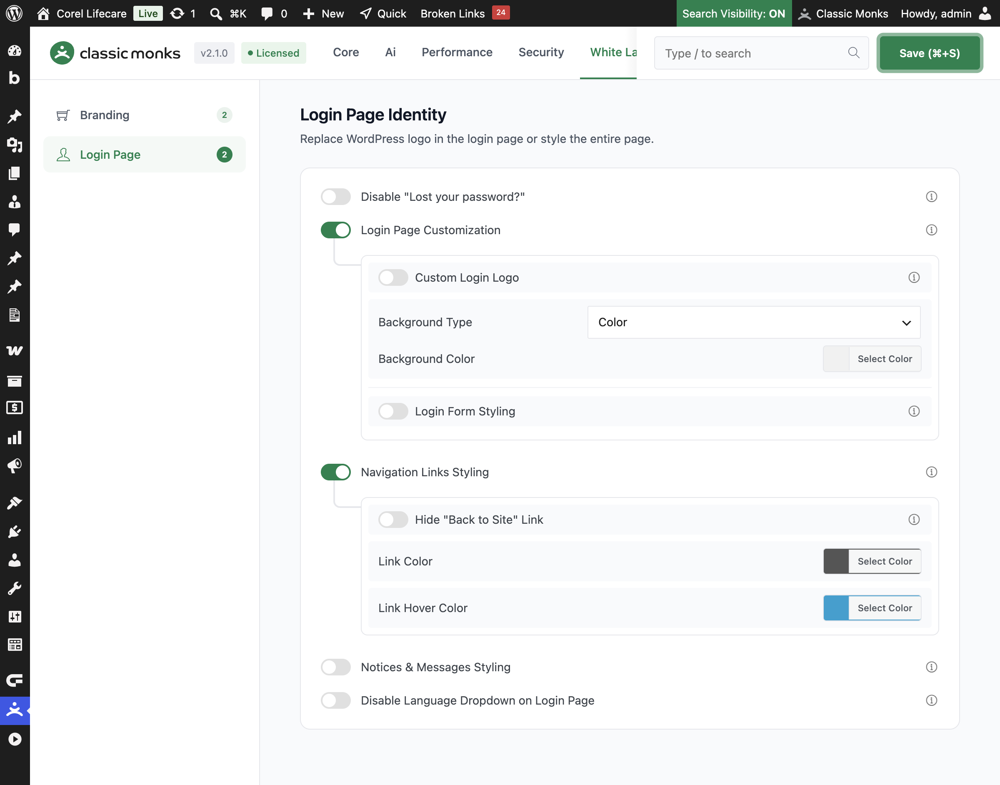

# How to Style Navigation Links on the WordPress Login Page

> The links below the WordPress login form, including the "Back to Site" link, can be styled to match your brand. Classic Monks lets you change the link color and hover color, or hide the link entirely.

## Key Takeaways

- Change the color and hover color of the "Back to Site" link on the login page.
- Hide the link entirely for a cleaner login page.
- Works independently, without the **Login Page Customization** master toggle.
- Applied by the same login page style hook as the other login styling options.

## What Is Navigation Links Styling

Navigation Links Styling is a white-label option in the Classic Monks **White Label** tab that controls the links below the login form. It is an independent option: it works on its own, without the **Login Page Customization** master toggle. It changes the color of the "Back to Site" link, its hover color, or hides the link entirely.

It is separate from the **Login Form Styling** and **Login Page Customization** options. This guide covers the navigation links below the login form.

## Recommendations Before Enabling

- **Use a readable link color.** The link sits below the login form, often on a colored background. Ensure the color contrasts with that background.
- **Keep the hover color distinct.** Choose a hover color that is clearly different from the base link color so users notice the interaction.
- **Only hide the link when it makes sense.** The "Back to Site" link helps users return to your site. Hide it only when a better navigation path exists on the login page.

## Style the Navigation Links

### Step 1: Open the Login Page Settings

In your WordPress dashboard, go to **Classic Monks**, open the **White Label** tab, then the **Login Page** subtab.

### Step 2: Turn On Navigation Links Styling

In the **Navigation Links Styling** section, toggle on **Navigation Links Styling**. This option works on its own; you do not need the **Login Page Customization** master toggle.

### Step 3: Set the Link Colors

Use the color pickers to set:

- **Link Color**: the color of the "Back to Site" link, default `#555555`.
- **Link Hover Color**: the color when the user hovers over the link, default `#00a0d2`.

### Step 4: Hide the Link (Optional)

Toggle on **Hide "Back to Site" Link** to hide the link below the login form.

### Step 5: Save and Test

Click **Save (⌘+S)**. Open the login page in a private browser window to confirm the link styling and visibility.

## Verify It Works

After saving, open the login page and confirm:

- The "Back to Site" link uses the color you set.
- The link changes to the hover color when you hover over it.
- The link is hidden when **Hide "Back to Site" Link** is on.

If the link styling does not apply, confirm **Navigation Links Styling** is on and the changes were saved.

## Examples

### Example 1: Match the Link to Your Brand

A site wants the "Back to Site" link to match its brand colors. Set **Link Color** to the brand's primary color and **Link Hover Color** to a darker shade. The link now blends with the brand.

### Example 2: Hide the Link for a Clean Login

An agency wants a minimal login page for a client. Toggle on **Hide "Back to Site" Link**. The link disappears, leaving a cleaner login form.

### Example 3: A Subtle Hover Effect

A site wants a subtle interaction. Set the **Link Color** to a muted gray and **Link Hover Color** to a bright accent color. The link is subtle until the user hovers, then it stands out.

## Troubleshooting

### The link color does not change

**Cause:** **Navigation Links Styling** is off, or the change was not saved.
**Fix:** Confirm the toggle is on, set the colors, and click **Save (⌘+S)**.

### The link is hidden but I still see it

**Cause:** **Hide "Back to Site" Link** is off, or another plugin is rendering its own link.
**Fix:** Confirm **Hide "Back to Site" Link** is on and save. Disable other login customization plugins to find a conflict.

### The hover color does not apply

**Cause:** The hover color is not set, or a plugin overrides it.
**Fix:** Set the **Link Hover Color** and save. Check for conflicting plugins.

## Related Articles

- [How to Customize the WordPress Login Page](white-label-wl-login-customization.md)
- [How to Style Login Notices in WordPress](white-label-wl-login-notices-styling.md)
- [How to Use the White Label Tab in Classic Monks: Feature Index](../white-label.md)

---

*Written by Joy. Last updated August 4, 2026. Tested with WordPress 6.x and Classic Monks 2.1.0.*

<!-- schema: Article, TechArticle -->
<!-- schema: BreadcrumbList -->